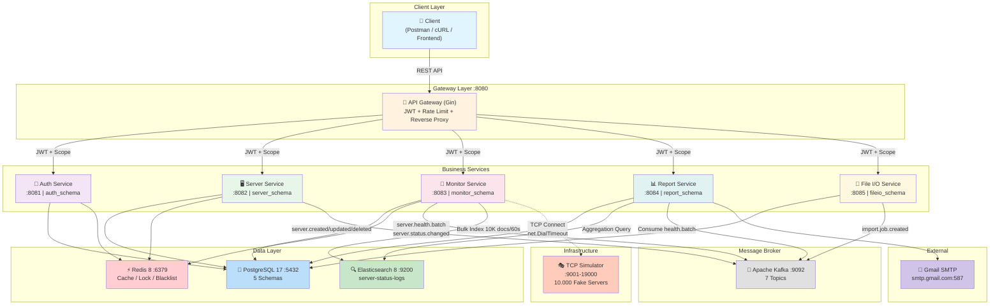
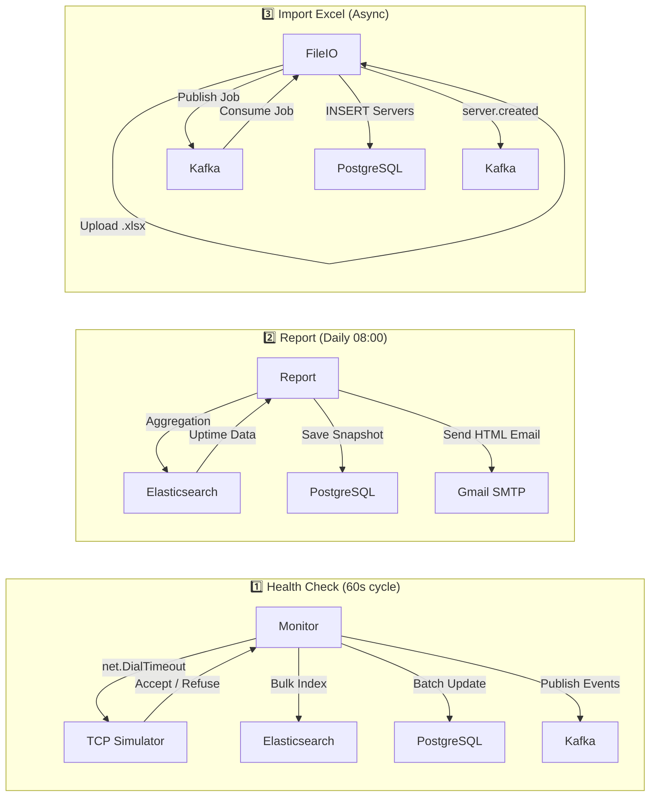

# 🏗️ System Architecture Diagram — VCS-SMS

> **Ngày tạo:** 09/06/2026
> **Mô tả:** Sơ đồ kiến trúc tổng quan hệ thống VCS Server Management System.

---

## High-Level System Architecture

---

## Service Communication Matrix

| From → To | Auth | Server | Monitor | Report | FileIO | TCP Sim | Kafka | PG | Redis | ES | SMTP |
|-----------|:---:|:------:|:-------:|:------:|:------:|:-------:|:-----:|:--:|:-----:|:--:|:----:|
| **API Gateway** | ✅ | ✅ | ✅ | ✅ | ✅ | ❌ | ❌ | ❌ | ✅ | ❌ | ❌ |
| **Auth** | — | ❌ | ❌ | ❌ | ❌ | ❌ | ❌ | ✅ | ✅ | ❌ | ❌ |
| **Server** | ❌ | — | ❌ | ❌ | ❌ | ❌ | ✅(P) | ✅ | ✅ | ❌ | ❌ |
| **Monitor** | ❌ | ❌ | — | ❌ | ❌ | ✅(TCP) | ✅(P) | ✅(R) | ✅ | ✅ | ❌ |
| **Report** | ❌ | ❌ | ❌ | — | ❌ | ❌ | ✅(C) | ✅ | ✅ | ✅ | ✅ |
| **FileIO** | ❌ | ❌ | ❌ | ❌ | — | ❌ | ✅(P+C) | ✅(RW) | ❌ | ❌ | ❌ |
| **TCP Simulator** | ❌ | ❌ | ❌ | ❌ | ❌ | — | ❌ | ❌ | ❌ | ❌ | ❌ |

> **Legend:** P = Producer | C = Consumer | R = Read-only | RW = Read/Write

---

## Data Flow Summary

---

## Key Design Decisions

| # | Decision | Rationale |
|---|----------|-----------|
| 1 | **TCP Simulator Pool** | 1 Go container quản lý 10K TCP listeners, mở/đóng port theo Math Engine. Monitor ping TCP thật 100% |
| 2 | **Self-built API Gateway (Gin)** | Full control JWT, Rate Limiting, Reverse Proxy. Nhẹ hơn Kong/Traefik |
| 3 | **Shared Postgres, Separate Schemas** | 1 DB vật lý, 5 schemas riêng. Loose coupling + nhẹ máy |
| 4 | **Monorepo** | 1 docker-compose.yml, shared libs, quản lý tập trung |
| 5 | **Design First** | DB Schema → OpenAPI → Sequence → Code |
