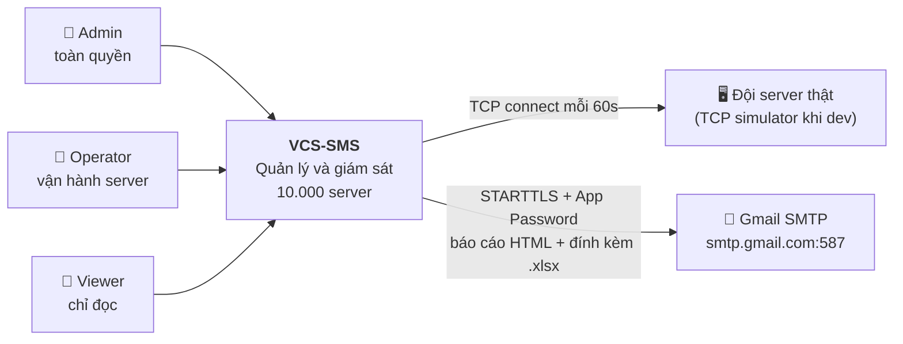
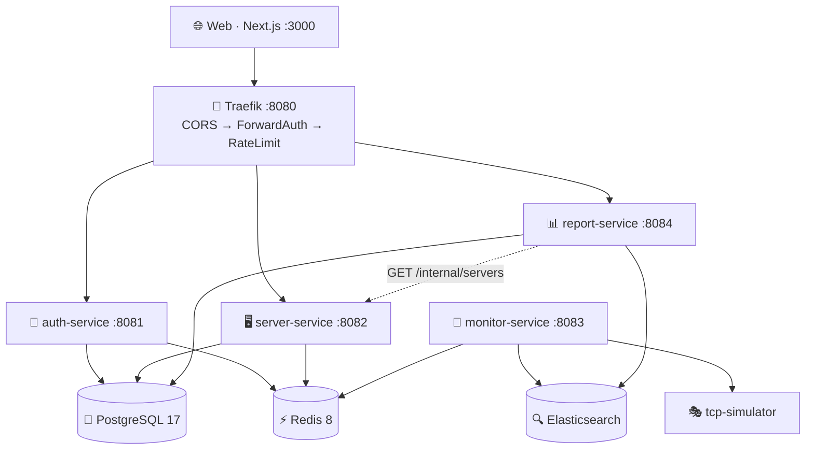
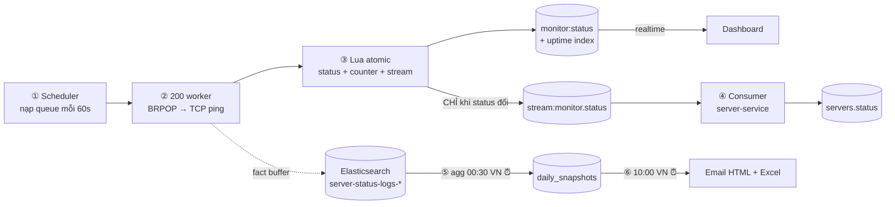
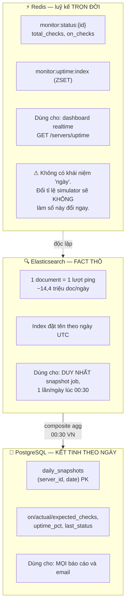

# 🏗️ Sơ đồ kiến trúc — VCS-SMS

> Cập nhật: 21/07/2026 — viết lại theo mã nguồn thực tế trong `server-management-system/`.

---

## 1. System Context — hệ thống nhìn từ bên ngoài

---

## 2. Container — 10 container, ai nói chuyện với ai

Traefik xác thực mọi request bằng ForwardAuth (`GET /internal/verify` của auth-service)
rồi mới định tuyến `/auth`, `/servers`, `/reports`. Redis chia hai không gian khoá:
`db0` cho auth (blacklist, brute-force), `db1` cho monitor + cache + projection.

> **Điểm mấu chốt:** monitor-service **không** có PostgreSQL và **không** có endpoint
> public. Nó không gọi HTTP tới server-service — toàn bộ trao đổi giữa hai bên đi qua
> Redis (server-service ghi target, monitor ghi status + stream, server-service consume
> stream). Xem §3.

---

## 3. Vòng đời một lượt đo — từ TCP ping tới email

**Vì sao tách kết quả thành hai đường (stream ↔ fact)?**

Đường **stream** phải *chính xác* (trạng thái hiện tại của server), nên dùng Redis Stream có consumer group, ACK và version guard. Đường **fact** chỉ cần *đủ tốt* (số liệu thống kê); mất vài fact chỉ làm coverage giảm — vì thế `FactBuffer` được phép **drop** khi ES sập, thay vì phình bộ nhớ đến chết.

---

## 4. Ba tầng dữ liệu uptime — đừng nhầm lẫn

| | Redis | Elasticsearch | PostgreSQL |
|---|---|---|---|
| Phạm vi thời gian | trọn đời | mỗi lượt ping | mỗi ngày |
| Ai ghi | Lua script (monitor) | FactBuffer (monitor) | Snapshot job (report) |
| Ai đọc | dashboard | snapshot job | báo cáo + email |
| Mất dữ liệu thì sao | mất số đếm, không khôi phục được | coverage giảm | báo cáo bị TỪ CHỐI |

---

## 5. Bốn cơ chế bảo đảm tính đúng đắn

```mermaid
graph TB
    subgraph M1["🔐 Ranh giới xác thực"]
        A1["Traefik ForwardAuth<br/>chứng minh JWT hợp lệ"]
        A2["Service tự kiểm scope<br/>RequireScope('server:create')"]
        A3["Service dùng expose,<br/>không publish port ra host"]
        A1 --> A2 --> A3
    end

    subgraph M2["⏱️ Chống ghi đè ngược thời gian"]
        B1["round_id = unix/60<br/>lấy từ ĐỒNG HỒ REDIS"]
        B2["Lua: round_id ≤ old_round<br/>→ return 0, bỏ qua"]
        B3["SQL: WHERE status_version < ?<br/>→ 0 row, vẫn ACK"]
        B1 --> B2 --> B3
    end

    subgraph M3["📉 Suy giảm có kiểm soát"]
        C1["ES sập → FactBuffer drop<br/>coverage giảm, service vẫn sống"]
        C2["coverage < 95%<br/>→ email gắn cờ CẢNH BÁO"]
        C3["thiếu snapshot cả ngày<br/>→ TỪ CHỐI, không trung bình lên lỗ hổng"]
        C1 --> C2 --> C3
    end

    subgraph M4["📮 Gửi mail không nhân đôi"]
        D1["job row tồn tại TRƯỚC khi gửi"]
        D2["lỗi rõ ràng → failed"]
        D3["lỗi mập mờ → delivery_unknown<br/>giữ Message-ID, KHÔNG tự retry"]
        D1 --> D2
        D1 --> D3
    end
```

---

## 6. Bảng cổng và giao thức

| Thành phần | Cổng | Publish ra host? | Giao thức |
|-----------|------|------------------|-----------|
| web | 3000 | ✅ | HTTP |
| traefik | 8080 | ✅ | HTTP |
| auth-service | 8081 | ❌ `expose` | HTTP |
| server-service | 8082 | ❌ `expose` | HTTP |
| monitor-service | 8083 | ❌ `expose` | HTTP (`/health`, `/metrics`) |
| report-service | 8084 | ❌ `expose` | HTTP |
| postgres | 5432 | ✅ | PG wire |
| redis | 6379 | ✅ | RESP |
| elasticsearch | 9200 | ✅ | HTTP |
| tcp-simulator | 9001-19000 | ❌ | TCP thuần |

> Bốn service ứng dụng dùng `expose` chứ không `ports`: header `X-User-Id` / `X-User-Scopes` do Traefik tiêm vào được coi là **đáng tin**, nên truy cập trực tiếp sẽ vượt mặt toàn bộ lớp xác thực.

---

## 7. Các quyết định kiến trúc chính

| # | Quyết định | Lý do |
|---|-----------|-------|
| 1 | **Traefik + ForwardAuth** thay vì gateway tự viết | Xác thực tập trung một chỗ; service chỉ còn lo scope |
| 2 | **Database-per-service** (3 DB, 3 DB user) | Không service nào đọc chéo bảng của service khác |
| 3 | **Redis Streams** thay vì Kafka | Đã có Redis cho projection + status; thêm Kafka là thừa một hệ thống phải vận hành |
| 4 | **Lua script** cho ghi trạng thái | Ghi status + counter + stream nguyên tử — không có khe hở để Redis và stream bất đồng |
| 5 | **Snapshot theo ngày** thay vì query ES lúc gửi báo cáo | Báo cáo đọc 10.000 dòng thay vì 14 triệu document |
| 6 | **Population đọc từ Server Service**, không suy ra từ fact | Server không ai ping được vẫn phải xuất hiện trong báo cáo — nếu suy từ fact thì lỗ hổng biến mất |
| 7 | **Múi giờ VN chỉ ở Report Service** | Monitoring và ES thuần UTC; quy đổi tập trung một chỗ, tránh lệch ngày rải rác |
