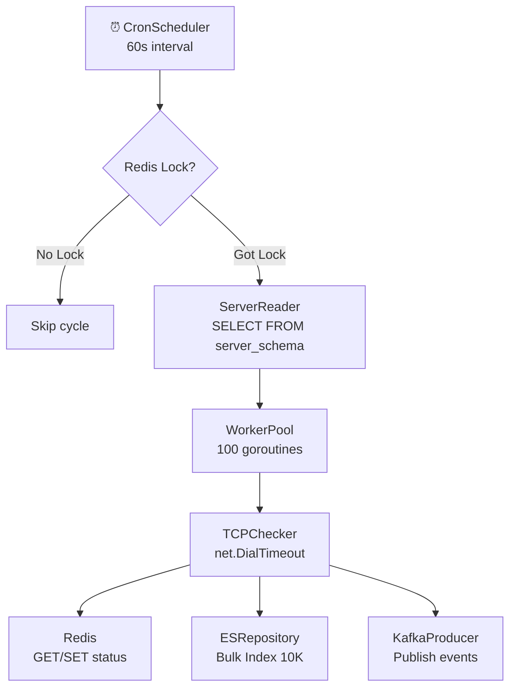
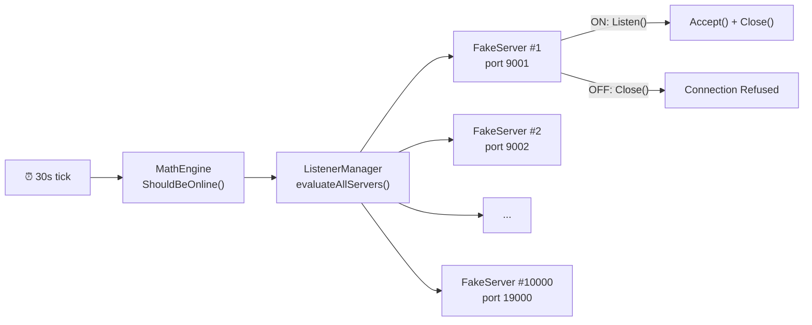

# 🧩 Component Diagram — Service Dependencies

> **Ngày tạo:** 09/06/2026
> **Mô tả:** Sơ đồ thành phần (Component Diagram) thể hiện các service, internal components và dependency giữa chúng.

---

## Tổng quan Components

```mermaid
graph TB
    subgraph "🌐 External"
        Client["👤 Client<br/>(Postman / Browser)"]
        Gmail["📧 Gmail SMTP"]
    end

    subgraph "🚪 API Gateway :8080"
        GW_Router["Router<br/>Route → Backend mapping"]
        GW_JWT["JWT Middleware<br/>Verify + Scope Check"]
        GW_Rate["Rate Limiter<br/>Redis Sliding Window"]
        GW_Proxy["Reverse Proxy<br/>httputil.ReverseProxy"]
        GW_Logger["Request Logger<br/>request_id + latency"]
    end

    subgraph "🔐 Auth Service :8081"
        Auth_Handler["AuthHandler<br/>Register/Login/Refresh/Logout"]
        Auth_Service["AuthService<br/>bcrypt + JWT generation"]
        Auth_Repo["UserRepository<br/>GORM + auth_schema"]
    end

    subgraph "🖥️ Server Service :8082"
        Srv_Handler["ServerHandler<br/>CRUD + Filter/Sort/Paging"]
        Srv_Service["ServerService<br/>Validate + Business Logic"]
        Srv_Repo["ServerRepository<br/>GORM + server_schema"]
        Srv_Kafka["KafkaProducer<br/>server.created/updated/deleted"]
    end

    subgraph "📡 Monitor Service :8083"
        Mon_Scheduler["HealthCheckScheduler<br/>Cron 60s"]
        Mon_Checker["TCPChecker<br/>net.DialTimeout"]
        Mon_Worker["WorkerPool<br/>100 goroutines"]
        Mon_ESRepo["ESRepository<br/>Bulk Index"]
        Mon_ServerReader["ServerReader<br/>Cross-schema read"]
        Mon_Kafka["KafkaProducer<br/>status.changed + health.batch"]
    end

    subgraph "📊 Report Service :8084"
        Rpt_Handler["ReportHandler<br/>On-demand + Summary API"]
        Rpt_Service["ReportService<br/>Uptime calculation"]
        Rpt_ESRepo["ESUptimeRepository<br/>Aggregation queries"]
        Rpt_Cron["DailyReportCron<br/>08:00 AM"]
        Rpt_Email["SMTPSender<br/>Gmail SMTP"]
    end

    subgraph "📁 File I/O Service :8085"
        File_Import["ImportHandler<br/>Upload + Async Job"]
        File_Export["ExportHandler<br/>Generate Excel"]
        File_Parser["ExcelParser<br/>excelize — parse .xlsx"]
        File_Generator["ExcelGenerator<br/>excelize — gen .xlsx"]
        File_Kafka["KafkaConsumer<br/>import.job.created"]
    end

    subgraph "🎭 TCP Simulator :9001-19000"
        TCP_Math["MathEngine<br/>ShouldBeOnline()"]
        TCP_Manager["ListenerManager<br/>10.000 FakeServer"]
        TCP_Server["FakeServer<br/>StartListening / StopListening"]
    end

    Client --> GW_Router
    GW_Router --> GW_JWT
    GW_JWT --> GW_Rate
    GW_Rate --> GW_Proxy
    GW_Proxy --> Auth_Handler
    GW_Proxy --> Srv_Handler
    GW_Proxy --> Mon_Scheduler
    GW_Proxy --> Rpt_Handler
    GW_Proxy --> File_Import
    GW_Proxy --> File_Export

    Mon_Checker -.->|"TCP Connect"| TCP_Server
    Rpt_Email --> Gmail
```

---

## Dependency Matrix giữa các Components

| Component | Phụ thuộc vào |
|-----------|--------------|
| **API Gateway** | Redis (rate limit, JWT blacklist), Tất cả services (reverse proxy) |
| **Auth Service** | PostgreSQL (users, roles), Redis (refresh token, blacklist) |
| **Server Service** | PostgreSQL (servers), Redis (cache), Kafka (publish events) |
| **Monitor Service** | PostgreSQL (read servers), Redis (lock, status cache), ES (bulk index), Kafka (publish), TCP Simulator (ping) |
| **Report Service** | PostgreSQL (report_jobs, snapshots), ES (aggregation), Kafka (consume), Gmail SMTP (send) |
| **File I/O Service** | PostgreSQL (read/write servers, import_jobs), Kafka (publish/consume) |
| **TCP Simulator** | Standalone — không phụ thuộc service nào khác |

---

## Internal Component Details

### 🚪 API Gateway

```mermaid
flowchart LR
    Request["HTTP Request"] --> Recovery["Recovery<br/>catch panic"]
    Recovery --> Logger["Request Logger<br/>request_id + latency"]
    Logger --> CORS["CORS Middleware"]
    CORS --> RateLimit["Rate Limiter<br/>Redis: 100 req/min/IP"]
    RateLimit --> JWT["JWT Middleware<br/>verify + extract claims"]
    JWT --> Scope["Scope Authorization<br/>check required scope"]
    Scope --> Proxy["Reverse Proxy<br/>forward to backend"]
    Proxy --> Response["HTTP Response"]
```

### 📡 Monitor Service

### 🎭 TCP Simulator

---

## Communication Protocols

| Từ | Đến | Protocol | Pattern |
|----|-----|----------|---------|
| Client | API Gateway | HTTP/REST | Synchronous |
| API Gateway | All Services | HTTP/REST (Reverse Proxy) | Synchronous |
| Monitor | TCP Simulator | TCP Connect | Synchronous (Dial → Accept/Refuse) |
| All Services | PostgreSQL | TCP (GORM) | Connection Pool |
| All Services | Redis | TCP (go-redis) | Connection Pool |
| All Services | Elasticsearch | HTTP (go-elasticsearch) | Bulk API |
| All Services | Kafka | TCP (Sarama) | Pub/Sub Async |
| Report | Gmail SMTP | SMTP/TLS :587 | Synchronous |
