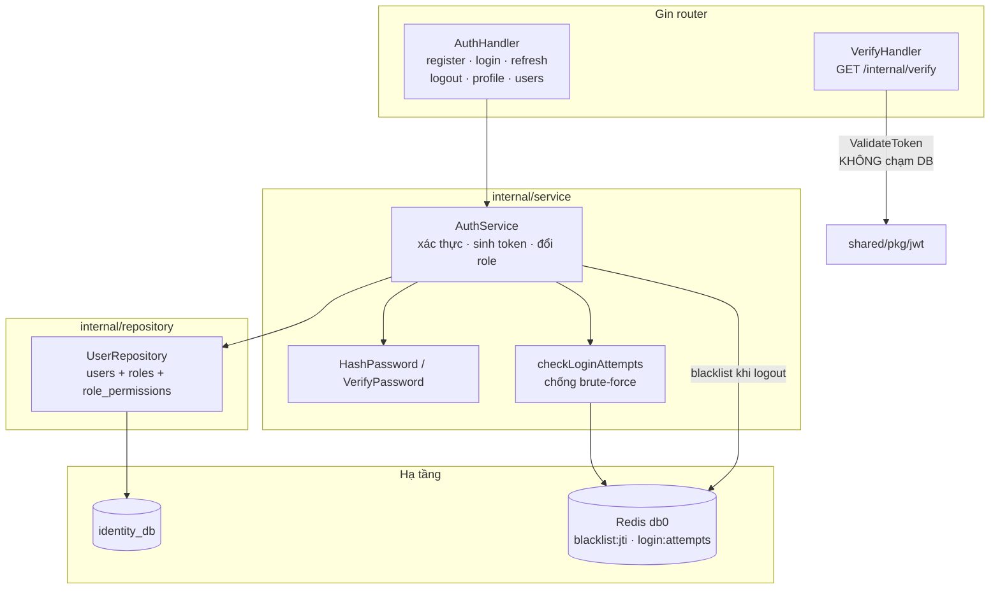
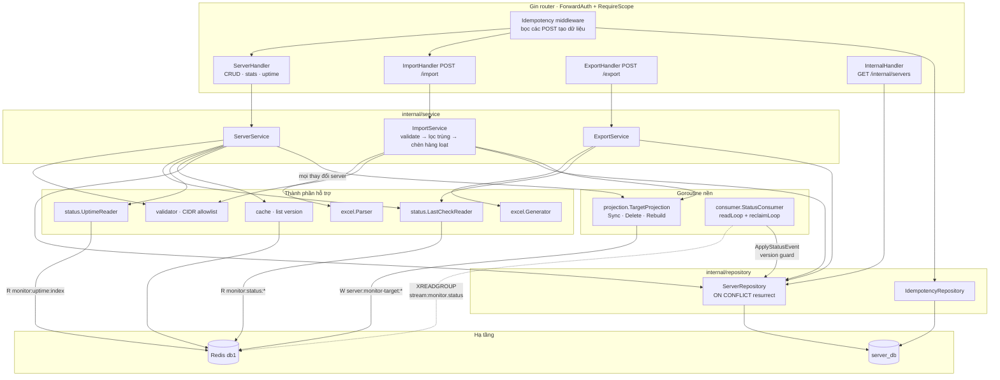
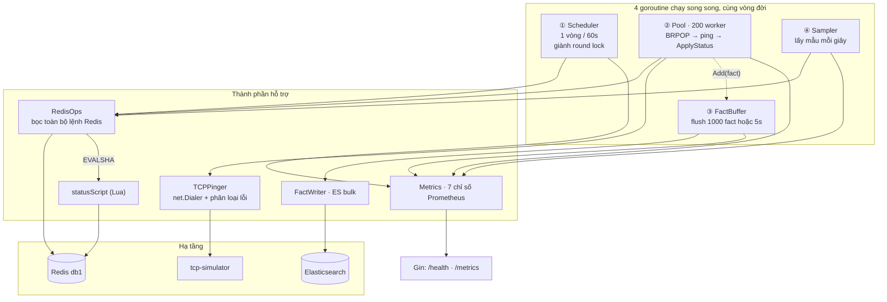
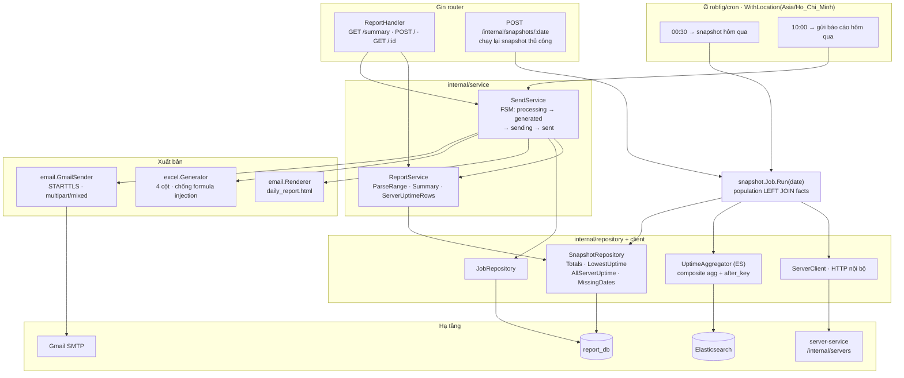
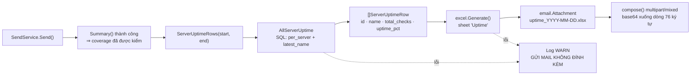
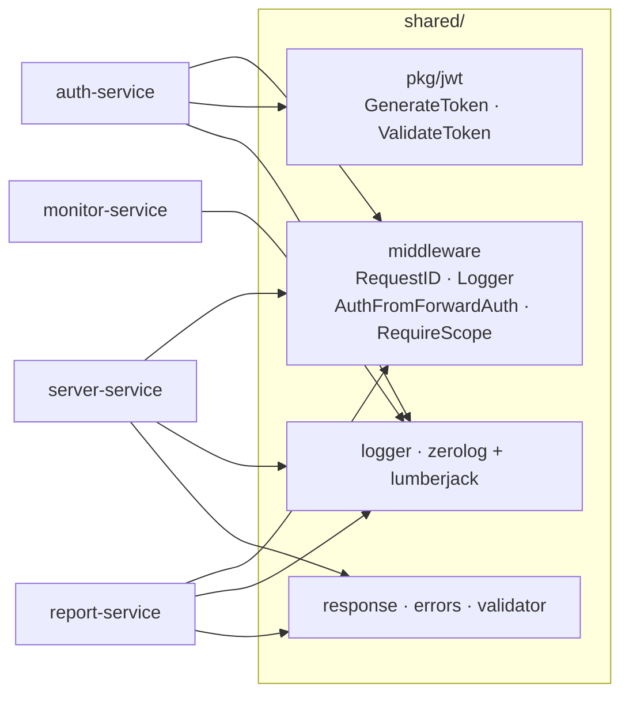

# 🧩 Sơ đồ thành phần — bên trong từng service

> Cập nhật: 21/07/2026 · Ánh xạ 1-1 với thư mục `internal/` của từng service.

Tất cả service theo cùng một mạch: **handler → service → repository → hạ tầng**, cộng thêm các goroutine nền chạy song song với HTTP server.

---

## 1. auth-service — `:8081`

**Điểm đáng chú ý:** `VerifyHandler` nằm trên đường đi của **mọi** request có xác thực, nên nó chỉ kiểm chữ ký JWT trong bộ nhớ — không truy vấn PostgreSQL. Scope được nhúng sẵn trong token lúc login.

---

## 2. server-service — `:8082` (service phức tạp nhất)

**Ba dòng chảy độc lập bên trong service này:**

| Dòng | Kích hoạt bởi | Làm gì |
|------|---------------|--------|
| **HTTP** | người dùng | CRUD, import, export |
| **Projection** | mọi thay đổi server | đồng bộ danh sách target sang Redis cho Monitoring |
| **Consumer** | Monitoring đẩy event | cập nhật `servers.status` trong PostgreSQL |

Consumer chạy trong chính process này (goroutine khởi động ở `cmd/main.go`), dừng cùng lúc với HTTP server khi nhận SIGTERM.

`cmd/main.go` còn có một chế độ chạy phụ: `server-service rebuild-monitor-cache` — nạp lại toàn bộ projection rồi thoát, dùng khi Redis bị xoá sạch.

---

## 3. monitor-service — `:8083` (bốn goroutine song song)

**Vì sao Scheduler chạy trên *mọi* instance nhưng chỉ một instance nạp hàng đợi?**
`SETNX monitor:round:lock:{round}` — ai thắng thì nạp queue. Instance thua **vẫn** chạy Pool và vẫn ping, nên thêm instance là thêm năng lực ping chứ không nhân đôi công việc.

**Bảy chỉ số Prometheus:**

| Chỉ số | Ý nghĩa | Báo động khi |
|--------|---------|--------------|
| `round_duration_seconds` | vòng chạy hết bao lâu | tiến sát 60s |
| `targets_expected` | số target đã nạp | lệch số server thật |
| `checks_completed_total` | số ping instance này làm | — |
| `checks_missing` | queue còn thừa khi vòng kết thúc | **> 0 kéo dài → thiếu worker** |
| `queue_depth` | độ sâu hàng đợi hiện tại | không về 0 |
| `tcp_latency_seconds` | độ trễ TCP connect | đuôi phân phối tăng |
| `es_bulk_failure_total` | batch bị bỏ sau khi retry | > 0 |

---

## 4. report-service — `:8084`

**Thứ tự hai cron là bắt buộc, không phải ngẫu nhiên:** báo cáo chỉ đọc được thứ mà snapshot đã ghi. 00:30 → 10:00 để lại 9,5 giờ đệm, đủ để chạy lại thủ công nếu job đêm hỏng.

---

## 5. Đính kèm Excel — luồng dữ liệu chi tiết

Đính kèm là **phụ trợ**: hỏng file Excel không được phép làm mất báo cáo mà phần thân email đã mang.

`uptime_pct` là con trỏ `*float64` — `nil` nghĩa là *không ai đo được* (ô trống trong Excel), khác hẳn `0` nghĩa là *server chết cả ngày*.

---

## 6. shared/ — module dùng chung

`AuthFromForwardAuth()` đọc header `X-User-Id` / `X-User-Scopes` mà Traefik tiêm vào; `RequireScope("...")` so khớp scope. Đây chính là lý do bốn service không được publish port ra host.
