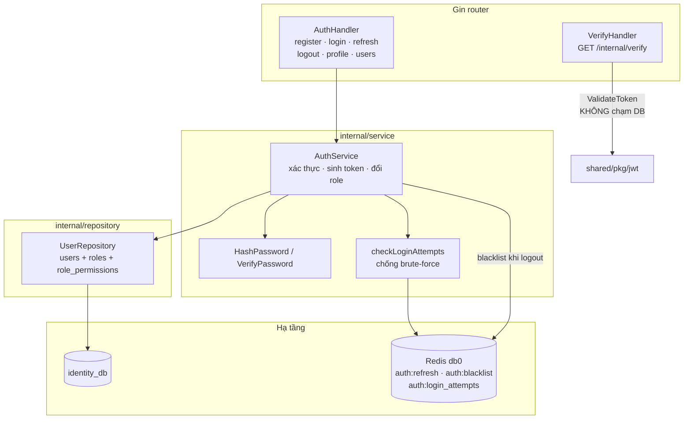
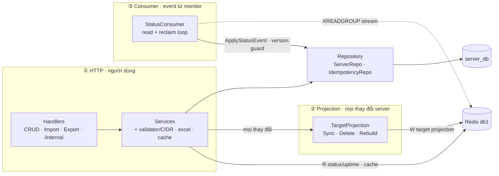
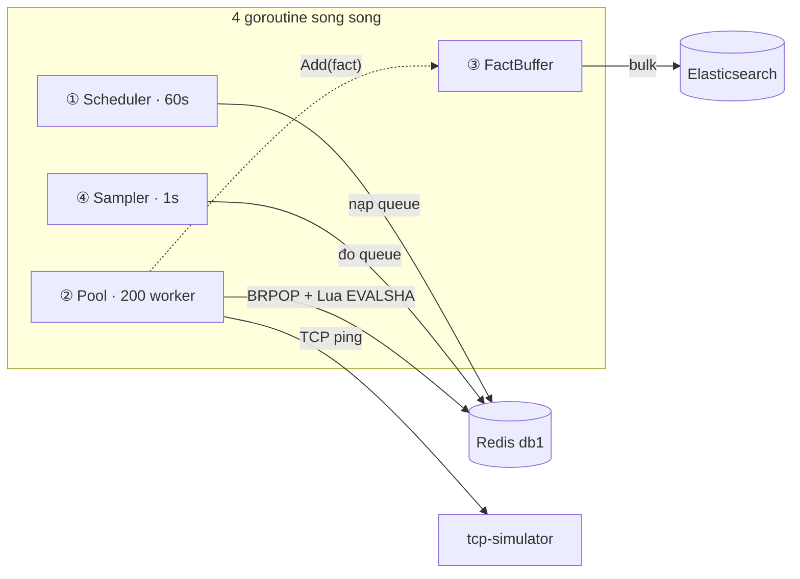
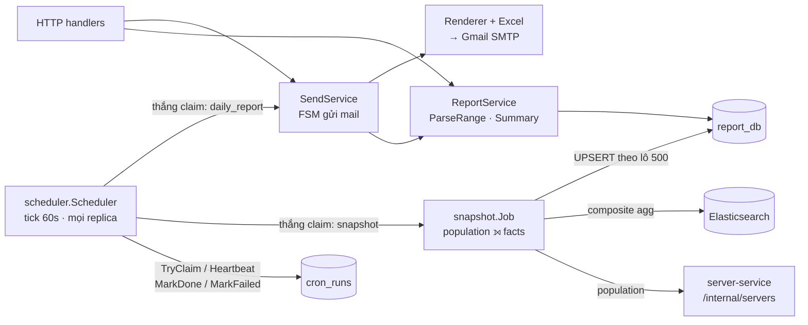
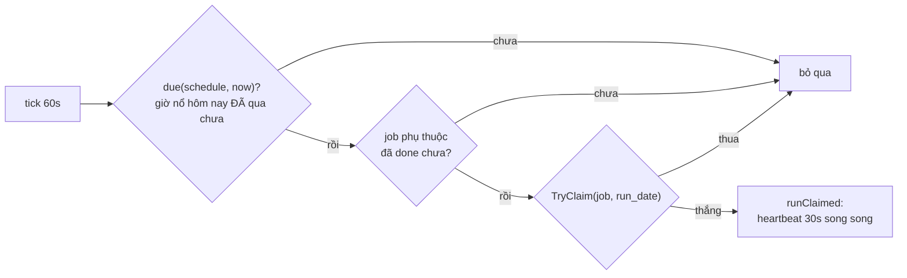
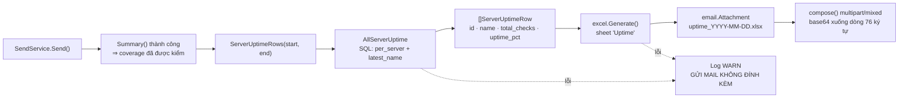
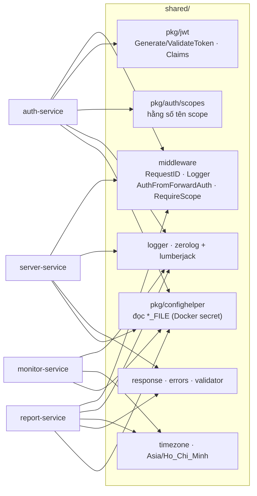

# 🧩 Sơ đồ thành phần — bên trong từng service

> Cập nhật: 24/07/2026 · Ánh xạ 1-1 với thư mục `internal/` của từng service.

Tất cả service theo cùng một mạch: **handler → service → repository → hạ tầng**, cộng thêm các goroutine nền chạy song song với HTTP server.

---

## 1. auth-service — `:8081`



**Điểm đáng chú ý:** `VerifyHandler` nằm trên đường đi của **mọi** request có xác thực, nên nó chỉ kiểm chữ ký JWT trong bộ nhớ — không truy vấn PostgreSQL. Scope được nhúng sẵn trong token lúc login.

**Ba key trong db0** (tên đầy đủ, để `redis-cli` khỏi tìm sai):

| Key | Giá trị | TTL |
|---|---|---|
| `auth:refresh:{jti}` | `user_id` | `JWT_REFRESH_EXPIRY_DAYS` (7d) |
| `auth:blacklist:{jti}` | `"revoked"` | thời gian còn lại của access token |
| `auth:login_attempts:{email}` | số lần sai | 15 phút; khoá khi ≥ 5 |

`refresh` có **rotation**: mỗi `POST /auth/refresh` xoá jti cũ và ghi jti mới, nên một
refresh token chỉ dùng được đúng một lần.

**Mật khẩu: Argon2id, với đường di trú từ bcrypt.** `HashPassword` luôn sinh Argon2id
(`m=64MB, t=1, p=4`). `VerifyPassword` nhận **cả** `$2a$`/`$2b$` (bcrypt) lẫn
`$argon2id$`, và khi khớp một hash bcrypt thì trả `needsRehash = true` để `Login`
lặng lẽ nâng cấp hash trong DB. Admin seed trong `init.sql` là bcrypt, và nó chuyển
thành Argon2id ngay sau lần đăng nhập đầu tiên.

> `internal/service/login_guard.go` định nghĩa một `LoginGuard` làm đúng việc mà
> `authServiceImpl.checkLoginAttempts` / `recordFailedAttempt` đang làm. Hiện tại
> **không ai gọi** `LoginGuard` — sơ đồ trên vẽ theo đường thật sự chạy.

---

## 2. server-service — `:8082` (service phức tạp nhất)

Service này chạy **ba dòng độc lập** cùng lúc. Vẽ tách theo dòng cho dễ đọc:



**Ba dòng chảy độc lập bên trong service này:**

| Dòng | Kích hoạt bởi | Làm gì |
|------|---------------|--------|
| **HTTP** | người dùng | CRUD, import, export |
| **Projection** | mọi thay đổi server | đồng bộ danh sách target sang Redis cho Monitoring |
| **Consumer** | Monitoring đẩy event | cập nhật `servers.status` trong PostgreSQL |

Consumer chạy trong chính process này (goroutine khởi động ở `cmd/main.go`), dừng cùng lúc với HTTP server khi nhận SIGTERM.

`cmd/main.go` còn có một chế độ chạy phụ: `server-service rebuild-monitor-cache` — nạp lại toàn bộ projection rồi thoát, dùng khi Redis bị xoá sạch.

---

## 3. monitor-service — `:8083` (bốn goroutine song song)

Bốn goroutine chạy song song, cùng vòng đời. Tất cả cùng cập nhật `Metrics` (7 chỉ số
Prometheus tại `/metrics`) — lược khỏi sơ đồ cho gọn:



**Vì sao Scheduler chạy trên *mọi* instance nhưng chỉ một instance nạp hàng đợi?**
`SETNX monitor:round:lock:{round}` — ai thắng thì nạp queue. Instance thua **vẫn** chạy Pool và vẫn ping, nên thêm instance là thêm năng lực ping chứ không nhân đôi công việc.

**Bảy chỉ số Prometheus:**

| Chỉ số | Ý nghĩa | Báo động khi |
|--------|---------|--------------|
| `vcs_monitor_round_duration_seconds` | vòng chạy hết bao lâu | tiến sát 60s |
| `vcs_monitor_targets_expected` | số target đã nạp | lệch số server thật |
| `vcs_monitor_checks_completed_total` | số ping instance này làm | — |
| `vcs_monitor_checks_missing` | queue còn thừa khi vòng kết thúc | **> 0 kéo dài → thiếu worker** |
| `vcs_monitor_queue_depth` | độ sâu hàng đợi hiện tại | không về 0 |
| `vcs_monitor_tcp_latency_seconds` | độ trễ TCP connect | đuôi phân phối tăng |
| `vcs_monitor_es_bulk_failure_total` | batch bị bỏ sau khi retry | > 0 |

Image của monitor là distroless (không có shell, không có `wget`/`curl`), nên đọc
metrics phải đi từ một container khác trên cùng network:

```bash
docker exec vcs-sms-traefik wget -qO- http://monitor-service:8083/metrics | grep vcs_monitor
```

---

## 4. report-service — `:8084` (service duy nhất chạy nhiều replica có state)

Hai công việc chính: **snapshot** cô đọng dữ liệu của ngày hôm qua, **send** đọc rồi
gửi mail. Cả hai do `scheduler.Scheduler` điều phối, và `Scheduler` chạy trên **mọi**
replica.



### Vì sao Scheduler *reconcile* mỗi phút thay vì nổ đúng khoảnh khắc cron

`robfig/cron` được dùng **chỉ để parse biểu thức**, không để đăng ký callback. Vòng lặp
thật là: mỗi 60 giây, với mỗi job, hỏi ba câu.



Nổ theo callback thì một replica boot lúc 10:05 sẽ **không bao giờ** biết job 10:00 chưa
ai làm. Reconcile thì nó thấy `due` = true, `cron_runs` chưa có dòng nào cho ngày đó, và
tự nhận việc. Đây là điều làm cho một lần deploy giữa giờ cron không mất báo cáo.

| Tham số | Giá trị | Ý nghĩa |
|---|---|---|
| `tickInterval` | 60s | nhịp reconcile |
| `heartbeatInterval` | 30s | làm mới claim khi đang chạy |
| `staleAfter` | 3 phút | 6 nhịp heartbeat bị bỏ → replica khác được cướp claim |
| `snapshotTimeout` | 1 giờ | ngân sách cho job snapshot |
| `dailyTimeout` | 10 phút | ngân sách cho job gửi mail |

`beat()` không chỉ làm mới claim — nếu `Heartbeat` trả về "anh không còn giữ nó nữa",
nó **cancel context của chính job đang chạy**. Nhờ vậy hai replica không bao giờ cùng
ghi một `run_date`, kể cả trong tình huống replica cũ chỉ bị treo mạng chứ chưa chết.

**`run_date` luôn là *hôm qua*.** Cả hai job đều làm việc với ngày đã kết thúc:
`runDate = startOfDay(now) - 1 day`. Đó cũng là khoá claim, nên một job chỉ chạy đúng
một lần cho mỗi ngày **dữ liệu**, bất kể có bao nhiêu replica hay bao nhiêu lần restart.

**Thứ tự hai cron là bắt buộc, không phải ngẫu nhiên:** `daily_report` khai báo
`dependsOn: snapshot` và mỗi tick đều kiểm `IsDone(snapshot, date)`, nên nó không thể
đọc một ngày mà snapshot chưa cô đọng. Mặc định `30 0 * * *` → `0 10 * * *` để lại
9,5 giờ đệm, đủ để chạy lại thủ công qua `POST /internal/snapshots/{date}` nếu job đêm hỏng.

---

## 5. Đính kèm Excel — luồng dữ liệu chi tiết



Đính kèm là **phụ trợ**: hỏng file Excel không được phép làm mất báo cáo mà phần thân email đã mang.

`uptime_pct` là con trỏ `*float64` — `nil` nghĩa là *không ai đo được* (ô trống trong Excel), khác hẳn `0` nghĩa là *server chết cả ngày*.

---

## 6. shared/ — module dùng chung



`AuthFromForwardAuth()` đọc header `X-User-Id` / `X-User-Scopes` mà Traefik tiêm vào; `RequireScope("...")` so khớp scope. Đây chính là lý do bốn service không được publish port ra host.

**`timezone` được cả monitor và report dùng, không chỉ report.** Monitor cần nó để tính
field `day` của bộ đếm uptime; report cần nó cho ranh giới ngày và lịch cron. Một hàm
`Load()` duy nhất là cách để hai bên không có hai định nghĩa "hôm nay" khác nhau.

**`pkg/confighelper`** đọc cặp `X` / `X_FILE`: nếu `REDIS_PASSWORD_FILE` được set thì
giá trị lấy từ nội dung file. Đây là cầu nối để `docker-stack.yml` dùng Docker secret
mà không phải sửa code config của service nào.
