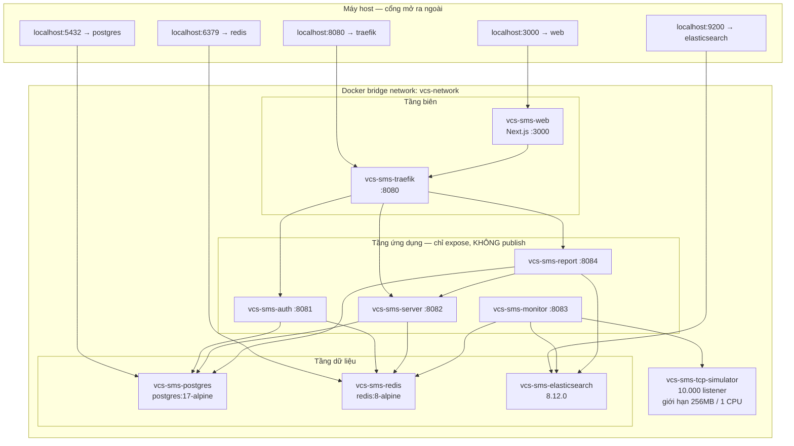
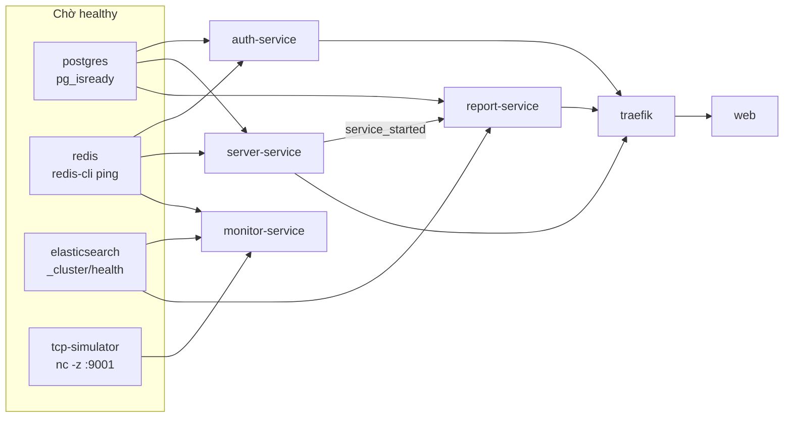
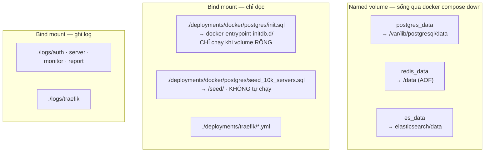
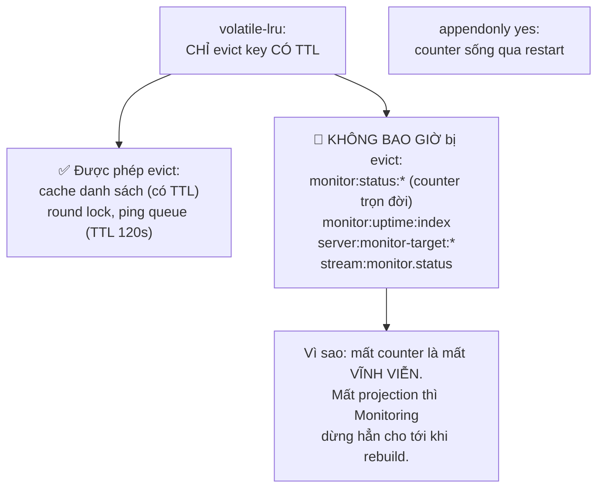
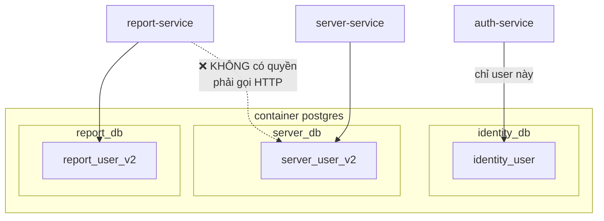

# 🚀 Sơ đồ triển khai — Docker Compose

> Cập nhật: 21/07/2026 · Nguồn: `server-management-system/docker-compose.yml`

---

## 1. Toàn cảnh 10 container trên mạng `vcs-network`



---

## 2. Thứ tự khởi động — `depends_on` + healthcheck



| Phụ thuộc | Kiểu | Vì sao |
|-----------|------|--------|
| monitor → tcp-simulator | `service_healthy` | ping vào cổng chưa mở thì mọi server đều báo OFF sai |
| report → server-service | `service_started` (không phải healthy) | chỉ snapshot job cần, mà nó chạy lúc 00:30 |
| monitor → **không** có postgres | — | Monitoring hoàn toàn không đụng PostgreSQL |

---

## 3. Volume và tính bền dữ liệu



> ⚠️ `init.sql` chỉ chạy **lần đầu**, khi `postgres_data` còn rỗng. Sửa file này rồi restart sẽ **không** có tác dụng — phải `docker compose down -v` (mất toàn bộ dữ liệu) hoặc chạy tay bằng `psql`.

---

## 4. Cấu hình Redis — vì sao đúng như thế

```
redis-server --requirepass ...
  --maxmemory 512mb
  --maxmemory-policy volatile-lru      ← KHÔNG phải allkeys-lru
  --appendonly yes --appendfsync everysec
```



Nếu dùng `allkeys-lru`, Redis có thể xoá `monitor:status:*` khi thiếu bộ nhớ — và số đếm uptime trọn đời không có cách nào tính lại.

---

## 5. Phân tách database — một Postgres, ba DB, ba user



Ranh giới được cưỡng chế bằng **quyền của DB user**, không phải bằng quy ước. Report Service *không thể* `SELECT` bảng `servers` kể cả khi có người viết code như vậy — nó buộc phải gọi `GET /internal/servers`.

---

## 6. Vận hành thường ngày

```bash
# Khởi động toàn bộ
docker compose up -d

# Nạp 10.000 server test (không tự chạy)
docker exec vcs-sms-postgres psql -U vcs_admin -d server_db -f /seed/seed_10k_servers.sql

# Dựng lại projection để Monitoring nhìn thấy target
docker exec vcs-sms-server /app/server-service rebuild-monitor-cache

# Xem chỉ số giám sát
docker exec vcs-sms-monitor wget -qO- localhost:8083/metrics | grep vcs_monitor

# Chạy lại snapshot của một ngày cụ thể
docker exec vcs-sms-report wget -qO- --post-data='' \
  http://localhost:8084/internal/snapshots/2026-07-17

# Soi Redis — NHỚ -n 1
docker exec vcs-sms-redis redis-cli -a "$REDIS_PASSWORD" -n 1 dbsize
```

**Ba lỗi vận hành hay gặp:**

| Triệu chứng | Nguyên nhân | Cách xử lý |
|------------|-------------|------------|
| `redis-cli` cho ra 0 key | đang xem db0, dữ liệu ở db1 | thêm `-n 1` |
| Log Monitoring: *"target projection not ready"* | Redis bị xoá sạch, projection mất | chạy `rebuild-monitor-cache` |
| `make seed` báo *"input device is not a TTY"* | Makefile dùng `docker exec -it` | gọi `docker exec` không kèm `-it` |

---

## 7. Ước lượng tài nguyên (10.000 server)

| Container | RAM | Ghi chú |
|-----------|-----|---------|
| elasticsearch | ~1 GB | heap cố định 512MB (`ES_JAVA_OPTS`) |
| postgres | ~256 MB | 10k dòng servers + ~10k snapshot/ngày |
| redis | ≤ 512 MB | `maxmemory` chặn cứng |
| tcp-simulator | ≤ 256 MB | giới hạn qua `deploy.resources` |
| 4 service Go | ~100 MB/cái | monitor cao nhất — 200 goroutine + buffer 50k fact |
| web (Next.js) | ~150 MB | |

**Tải mỗi ngày:** 10.000 server × 1.440 vòng = **14,4 triệu** lượt ping và **14,4 triệu** document ES. Đây chính là lý do Report Service đọc `daily_snapshots` (10.000 dòng) chứ không truy vấn thẳng Elasticsearch mỗi lần cần báo cáo.
