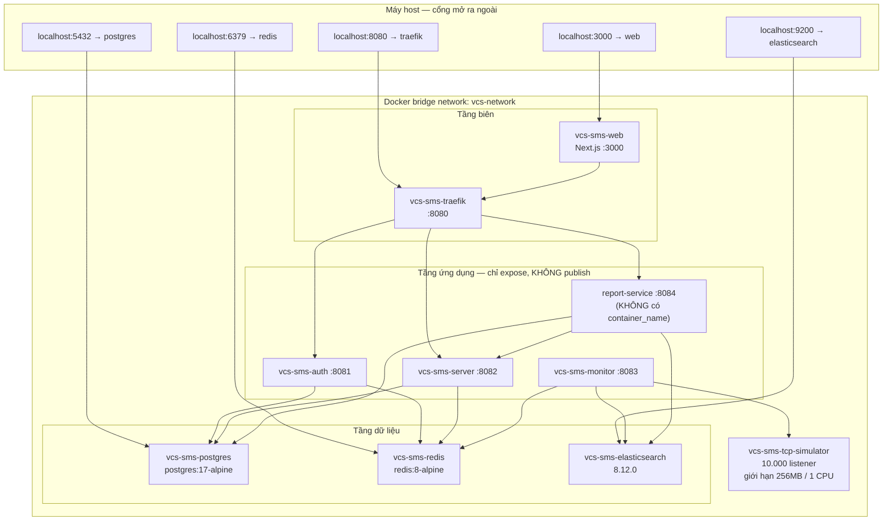
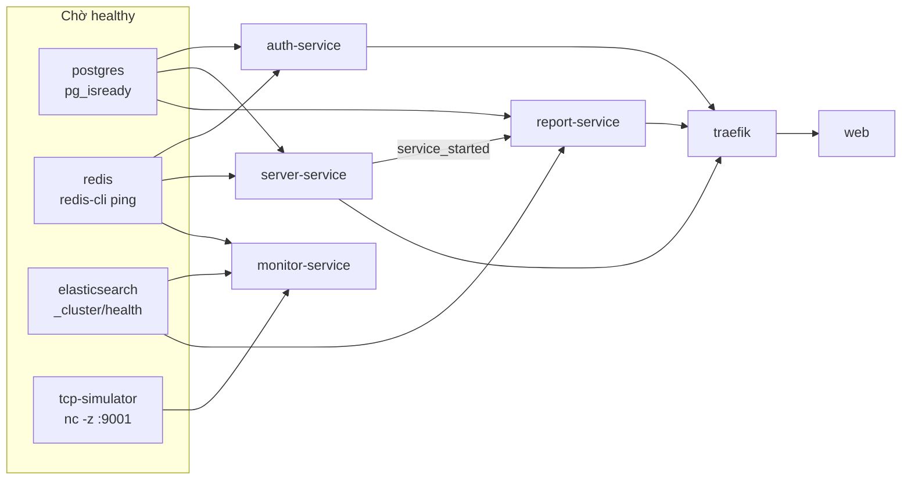
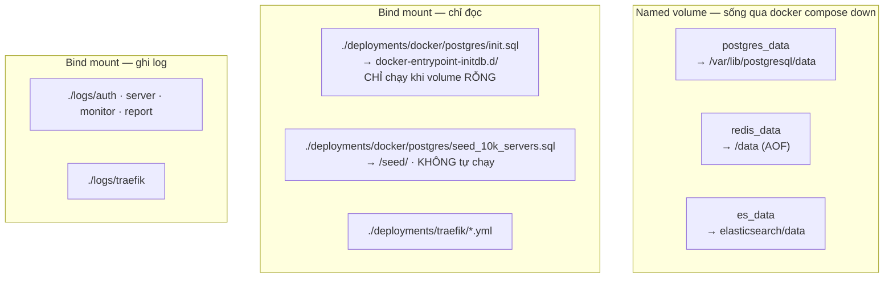
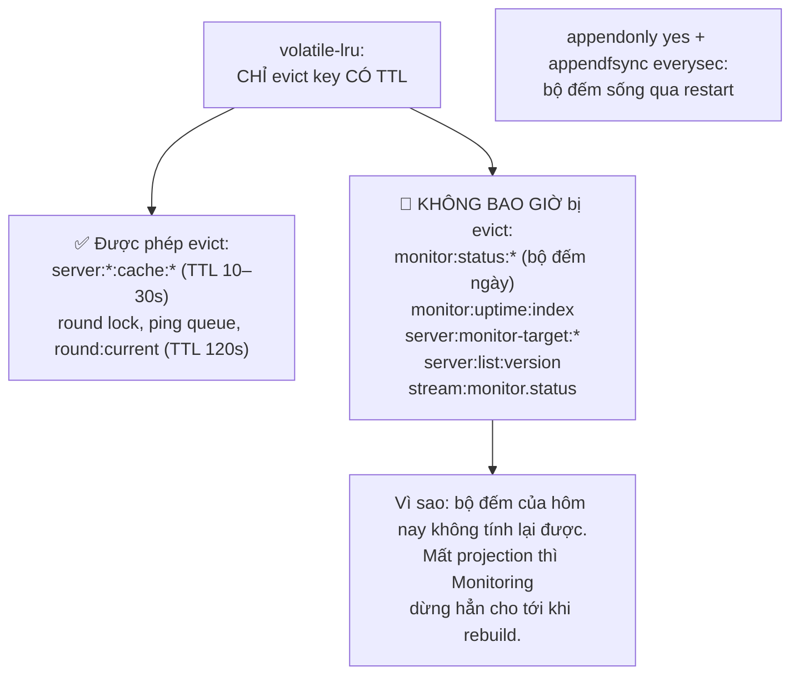
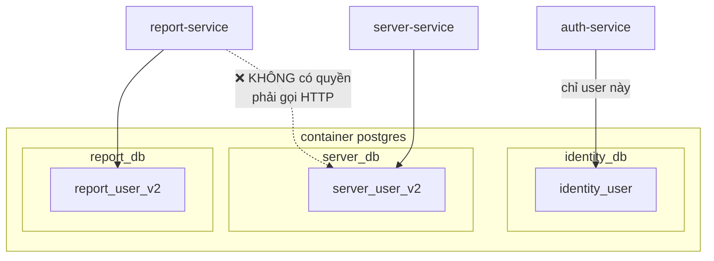
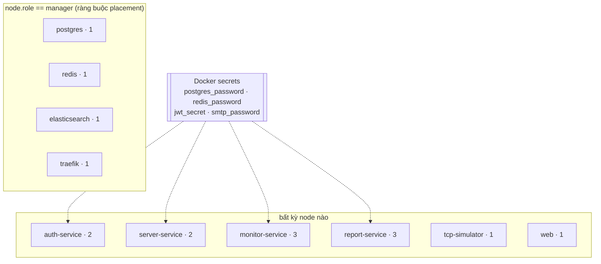

# 🚀 Sơ đồ triển khai — Docker Compose & Docker Swarm

> Cập nhật: 24/07/2026 · Nguồn: `docker-compose.yml`, `docker-compose.dev.yml`,
> `docker-stack.yml`, `deployments/` — và một lần chạy thật để xác nhận từng lệnh ở §6.

Hai đích triển khai, cùng một bộ image:

| File | Dùng khi | Đặc điểm |
|---|---|---|
| `docker-compose.yml` | máy đơn, demo, dev toàn phần | build tại chỗ, 1 replica mỗi service, secret nằm trong `.env` |
| `docker-compose.dev.yml` | chỉ cần hạ tầng, service chạy bằng `go run` | `extends` 4 service hạ tầng từ file trên |
| `docker-stack.yml` | Swarm nhiều node | image từ registry, **nhiều replica**, Docker secret |

---

## 1. Toàn cảnh 10 container trên mạng `vcs-network`



**Chín container có `container_name`, một container thì không.** `report-service` cố ý
bỏ cả `container_name` và bind-mount log, vì hai thứ đó **chặn**
`docker compose up --scale report-service=3` (tên container phải là duy nhất). Hệ quả khi
vận hành: dùng `docker compose exec report-service …` chứ không `docker exec vcs-sms-report …`.

---

## 2. Thứ tự khởi động — `depends_on` + healthcheck



| Phụ thuộc | Kiểu | Vì sao |
|-----------|------|--------|
| monitor → tcp-simulator | `service_healthy` (`nc -z :9001`) | ping vào cổng chưa mở thì mọi server đều báo OFF sai |
| report → server-service | `service_started` (không phải healthy) | chỉ snapshot job cần, mà nó chạy một lần mỗi ngày |
| monitor → **không** có postgres | — | Monitoring hoàn toàn không đụng PostgreSQL |
| traefik → auth/server/report | `service_started` | Traefik không route được vào backend chưa tồn tại; nhưng nó tự retry nên không cần `healthy` |

Chỉ `report-service` có `healthcheck` riêng ở tầng ứng dụng, và nó tự probe bằng chính
binary (`/app/bin/report-service healthcheck`) vì image distroless không có `curl`. Bốn
service Go đều đã có `/health`, nhưng chỉ report cần healthcheck vì nó là service duy
nhất chạy nhiều replica với `update_config: order: start-first`.

---

## 3. Volume và tính bền dữ liệu



> ⚠️ `init.sql` chỉ chạy **lần đầu**, khi `postgres_data` còn rỗng. Sửa file này rồi restart sẽ **không** có tác dụng — phải `docker compose down -v` (mất toàn bộ dữ liệu) hoặc chạy tay bằng `psql`.

---

## 4. Cấu hình Redis — vì sao đúng như thế

```
redis-server --requirepass ...
  --maxmemory 512mb
  --maxmemory-policy volatile-lru      ← KHÔNG phải allkeys-lru
  --appendonly yes --appendfsync everysec
```



Nếu dùng `allkeys-lru`, Redis có thể xoá `monitor:status:*` khi thiếu bộ nhớ. Bộ đếm chỉ
tính cho ngày hiện tại nên thiệt hại có giới hạn — nhưng vẫn là mất dữ liệu không tái tạo
được, vì fact thô nằm ở Elasticsearch và nó chưa được cô đọng. Nghiêm trọng hơn:
`server:monitor-target:*` cũng không có TTL, và mất nó thì Monitoring **bỏ qua mọi round**
cho tới khi ai đó chạy rebuild.

| Mất key nào | Hậu quả | Khôi phục |
|---|---|---|
| `server:*:cache:*` | miss cache một nhịp | tự động |
| `monitor:ping:queue:*`, `round:*` | mất tối đa 1 round | tự động, round sau |
| `monitor:status:*` + `uptime:index` | dashboard uptime về 0, đếm lại từ đầu **trong hôm nay** | tự động sau vài round; lịch sử thật vẫn ở `daily_snapshots` |
| `server:monitor-target:*` | **Monitoring dừng hẳn** | phải chạy `rebuild-monitor-cache` |
| `stream:monitor.status` + group | `servers.status` trong PostgreSQL đứng im | consumer tự phát hiện `NOGROUP`, tạo lại group tại `0` và replay |

---

## 5. Phân tách database — một Postgres, ba DB, ba user



Ranh giới được cưỡng chế bằng **quyền của DB user**, không phải bằng quy ước. Report Service *không thể* `SELECT` bảng `servers` kể cả khi có người viết code như vậy — nó buộc phải gọi `GET /internal/servers`.

---

## 6. Vận hành thường ngày

> ⚠️ **Bốn image service Go là distroless** (`gcr.io/distroless/static-debian12:nonroot`):
> không shell, không `wget`, không `curl`, không package manager. Mọi lệnh chẩn đoán phải
> gọi **binary trực tiếp**, hoặc đi từ một container khác trên cùng network. Container
> `traefik` là chỗ tiện nhất vì nó dựa trên Alpine và có `wget`.

```bash
# Khởi động toàn bộ
docker compose up -d --build

# Nạp 10.000 server test (init.sql KHÔNG tự chạy file seed)
docker exec vcs-sms-postgres \
  psql -U vcs_admin -d server_db -f /seed/seed_10k_servers.sql

# Dựng lại projection để Monitoring nhìn thấy target — BẮT BUỘC sau seed
docker compose exec server-service /app/server-service rebuild-monitor-cache

# Xem chỉ số giám sát (monitor không có wget → đi qua traefik)
docker exec vcs-sms-traefik wget -qO- http://monitor-service:8083/metrics | grep vcs_monitor

# Chạy lại snapshot của một ngày cụ thể
docker exec vcs-sms-traefik wget -qO- --post-data='' \
  http://report-service:8084/internal/snapshots/2026-07-23

# Soi Redis — NHỚ -n 1 cho dữ liệu giám sát, -n 0 cho auth
docker exec vcs-sms-redis redis-cli -a "$REDIS_PASSWORD" --no-auth-warning -n 1 dbsize
docker exec vcs-sms-redis redis-cli -a "$REDIS_PASSWORD" --no-auth-warning -n 1 \
  hgetall monitor:status:SRV-00001

# Kiểm tra lịch sử cron (report HA)
docker exec vcs-sms-postgres psql -U vcs_admin -d report_db \
  -c "SELECT job_name, run_date, state, owner, finished_at FROM cron_runs ORDER BY run_date DESC LIMIT 5;"
```

**Năm lỗi vận hành hay gặp:**

| Triệu chứng | Nguyên nhân | Cách xử lý |
|------------|-------------|------------|
| `redis-cli` cho ra 0 key | đang xem db0, dữ liệu giám sát ở db1 | thêm `-n 1` |
| Log Monitoring: *"target projection not ready"* | Redis bị xoá sạch, projection mất | chạy `rebuild-monitor-cache` |
| `exec: "wget": executable file not found` | image service là distroless | gọi từ `vcs-sms-traefik`, hoặc gọi binary trực tiếp |
| `docker exec vcs-sms-report ...` → *No such container* | `report-service` **không có** `container_name` (để `--scale` chạy được) | dùng `docker compose exec report-service ...` |
| `make seed` báo *"input device is not a TTY"* | Makefile dùng `docker exec -it` | gọi `docker exec` không kèm `-it` |

Riêng `report-service` có `HEALTHCHECK` gọi chính binary của nó
(`/app/bin/report-service healthcheck`) — đó là cách để một image không có shell vẫn
tự probe được `/health`.

---

## 7. Ước lượng tài nguyên (10.000 server)

| Container | RAM | Ghi chú |
|-----------|-----|---------|
| elasticsearch | ~1 GB | heap cố định 512MB (`ES_JAVA_OPTS`) |
| postgres | ~256 MB | 10k dòng servers + ~10k snapshot/ngày |
| redis | ≤ 512 MB | `maxmemory` chặn cứng |
| tcp-simulator | ≤ 256 MB | giới hạn qua `deploy.resources` |
| 4 service Go | ~100 MB/cái | monitor cao nhất — 200 goroutine + buffer 50k fact |
| web (Next.js) | ~150 MB | |

**Tải mỗi ngày:** 10.000 server × 1.440 vòng = **14,4 triệu** lượt ping và **14,4 triệu** document ES. Đây chính là lý do Report Service đọc `daily_snapshots` (10.000 dòng) chứ không truy vấn thẳng Elasticsearch mỗi lần cần báo cáo.

---

## 8. Triển khai Swarm — `docker-stack.yml`



### Ba service **nào** scale được, và vì sao

| Service | Replica | Cơ chế cho phép scale |
|---|---|---|
| `auth-service` | 2 | Stateless. `/internal/verify` chỉ kiểm chữ ký trong bộ nhớ |
| `server-service` | 2 | Consumer group `server-svc`: mỗi replica là một consumer, Redis chia message. `XAUTOCLAIM` tiếp quản việc của replica chết |
| `monitor-service` | 3 | `SETNX round:lock` chọn kẻ nạp queue; **mọi** replica `BRPOP` nên đều ping |
| `report-service` | 3 | `cron_runs` chọn kẻ chạy cron; API `/reports` thì stateless |

Ba service hạ tầng và `traefik` bị ghim vào manager node bằng
`placement.constraints: [node.role == manager]`, vì cả ba dùng **named volume local**
(`postgres_data`, `redis_data`, `es_data`) và Traefik bind-mount file config từ repo.
Đây là giới hạn có ý thức của bản stack này: nó scale **tầng ứng dụng**, không scale
tầng dữ liệu.

### Secret: `X_FILE` thay vì `X`

Compose đọc secret từ `.env`; Swarm mount chúng vào `/run/secrets/`. Cầu nối là
`shared/pkg/confighelper.GetStringSecret(name, fallback)`: nếu `<NAME>_FILE` được set và
đọc được, dùng nội dung file; nếu không, dùng giá trị env thường.

```yaml
environment:
  REDIS_PASSWORD_FILE: /run/secrets/redis_password
secrets:
  - redis_password
```

Nhờ vậy **không dòng code config nào phải biết** mình đang chạy Compose hay Swarm.

> Mật khẩu của ba DB user (`identity_user`, `server_user_v2`, `report_user_v2`) **không**
> đi qua secret: chúng do `init.sql` đặt cứng, và service kết nối bằng user thường chứ
> không phải superuser. Chỉ mật khẩu superuser của Postgres là secret.

### Hai điểm khác biệt về log

`docker-stack.yml` **không** bind-mount `./logs` cho service nào (một node khác không có
thư mục đó), nên log chỉ ra stdout — đọc bằng `docker service logs`. Trong
`docker-compose.yml` thì `auth`/`server`/`monitor` có bind-mount `./logs/*`, còn
`report-service` thì không — chính là để `docker compose up --scale report-service=3`
chạy được mà ba replica không ghi chồng lên cùng một file.

```bash
docker stack deploy -c docker-stack.yml vcs-sms
docker service scale vcs-sms_monitor-service=5
docker service logs -f vcs-sms_report-service
```
