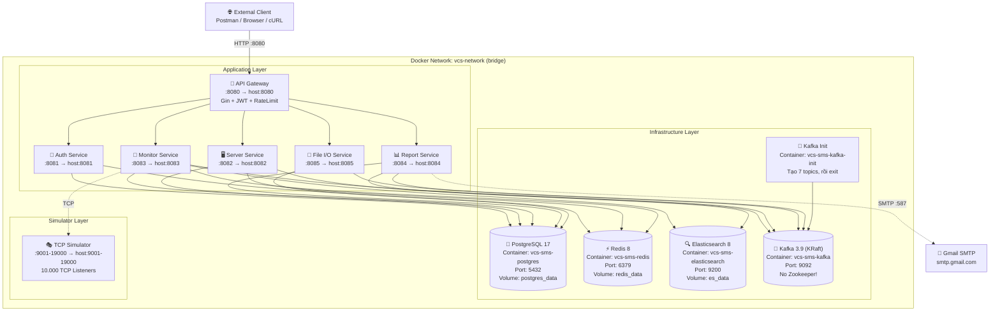
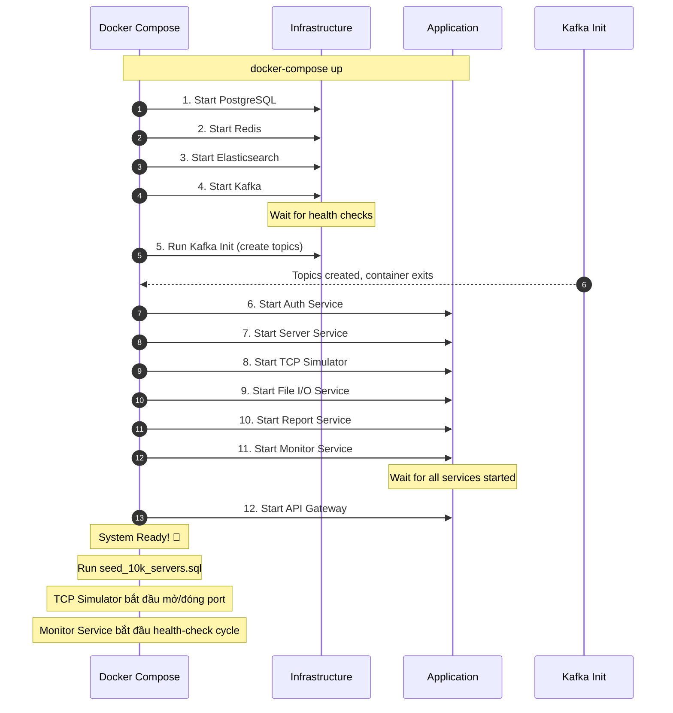

# 🐳 Deployment Diagram — Docker Compose

> **Ngày tạo:** 09/06/2026
> **Mô tả:** Sơ đồ triển khai hệ thống VCS-SMS trên Docker.

---

## Docker Network Topology

---

## Container Inventory

| # | Container | Image | Ports (host:container) | Volumes | Startup Order |
|---|-----------|-------|------------------------|---------|:---:|
| 1 | `vcs-sms-postgres` | `postgres:17-alpine` | `5432:5432` | `postgres_data` + `init.sql` | 1st |
| 2 | `vcs-sms-redis` | `redis:8-alpine` | `6379:6379` | `redis_data` | 1st |
| 3 | `vcs-sms-elasticsearch` | `elasticsearch:8.12.0` | `9200:9200` | `es_data` | 1st |
| 4 | `vcs-sms-kafka` | `apache/kafka:3.9.0` | `9092:9092` | — | 1st |
| 5 | `vcs-sms-kafka-init` | `apache/kafka:3.9.0` | — | — | After Kafka |
| 6 | `vcs-sms-gateway` | Custom Go | `8080:8080` | `./logs/gateway` | After Redis + All Services |
| 7 | `vcs-sms-auth` | Custom Go | `8081:8081` | `./logs/auth` | After PG + Redis |
| 8 | `vcs-sms-server` | Custom Go | `8082:8082` | `./logs/server` | After PG + Redis + Kafka |
| 9 | `vcs-sms-monitor` | Custom Go | `8083:8083` | `./logs/monitor` | After PG + Redis + ES + Kafka + TCP Sim |
| 10 | `vcs-sms-report` | Custom Go | `8084:8084` | `./logs/report` | After PG + ES + Kafka |
| 11 | `vcs-sms-fileio` | Custom Go | `8085:8085` | `./logs/fileio` + `./uploads` | After PG + Kafka |
| 12 | `vcs-sms-tcp-simulator` | Custom Go | `9001-19000:9001-19000` | — | After Kafka Init (standalone) |

---

## Resource Requirements (Development / Demo)

| Container | CPU | RAM | Disk | Ghi chú |
|-----------|-----|-----|------|---------|
| PostgreSQL | 0.5-1 core | 256-512MB | ~500MB | 10K rows servers |
| Redis | 0.25 core | 64-128MB | ~10MB | Cache chủ yếu |
| Elasticsearch | 1-2 cores | 512MB-1GB | ~1-5GB | 10K docs × 60s × hours |
| Kafka | 0.5-1 core | 512MB-1GB | ~500MB | 7 topics |
| TCP Simulator | 0.5-1 core | 100-256MB | — | 10K goroutines × ~10KB |
| 5 Business Services | ~0.25 core each | ~64MB each | — | Go binaries |
| API Gateway | 0.25 core | 64MB | — | Reverse proxy |
| **TOTAL** | **~4-6 cores** | **~2-3.5GB** | **~5GB** | |

---

## Startup Sequence

---

## Health Check Endpoints

| Container | Health Check Method | Interval |
|-----------|---------------------|----------|
| PostgreSQL | `pg_isready -U vcs_admin -d vcs_sms` | 10s |
| Redis | `redis-cli -a $REDIS_PASSWORD ping` | 10s |
| Elasticsearch | `curl -f http://localhost:9200/_cluster/health` | 15s |
| Kafka | `kafka-broker-api-versions.sh --bootstrap-server localhost:9092` | 15s |
| All Go Services | `curl -f http://localhost:{port}/health` | 30s |
