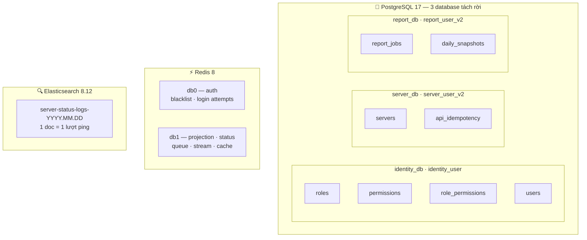
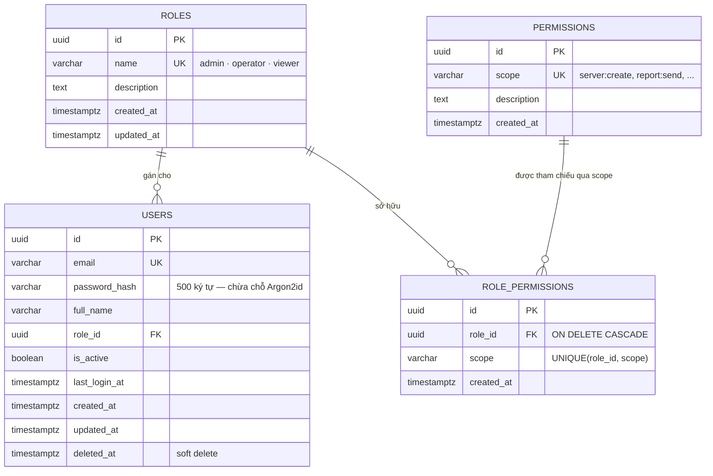
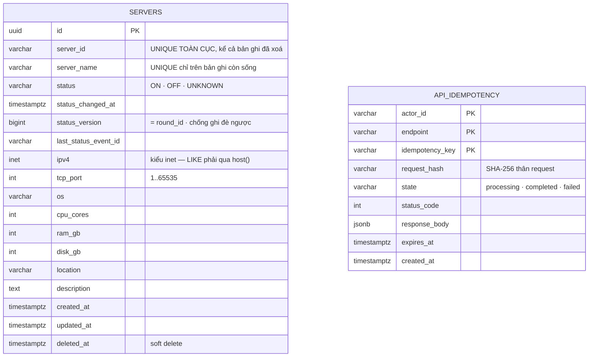
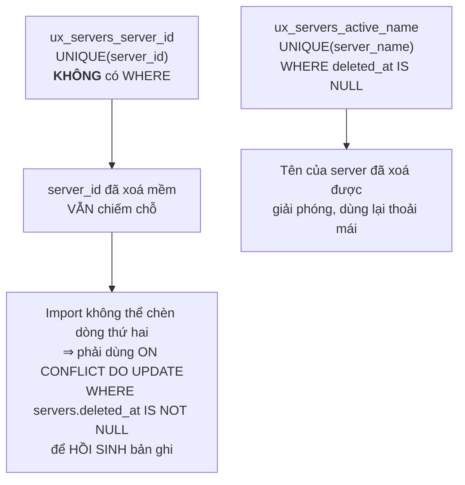
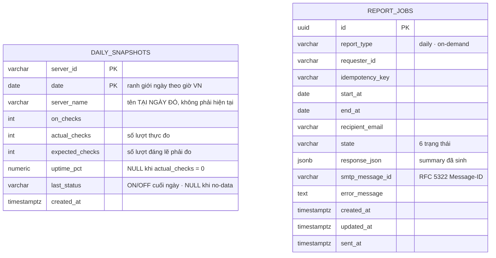
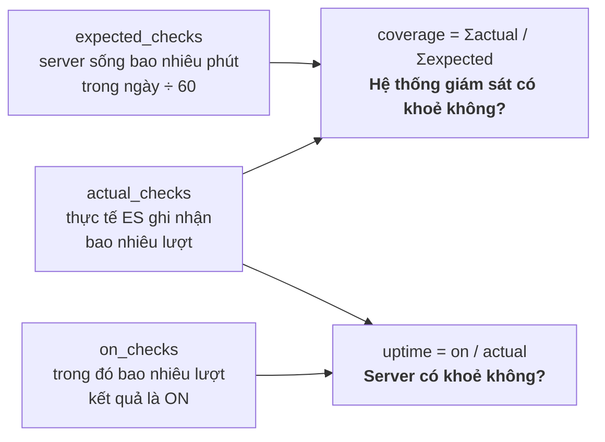
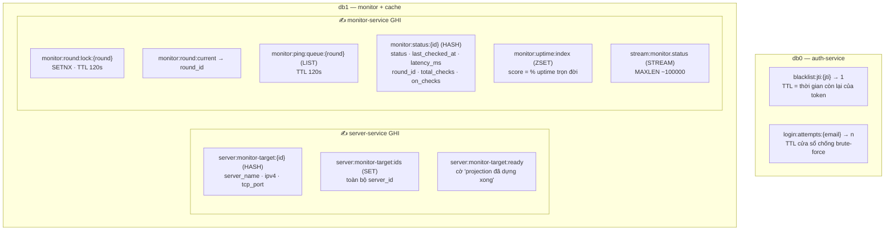
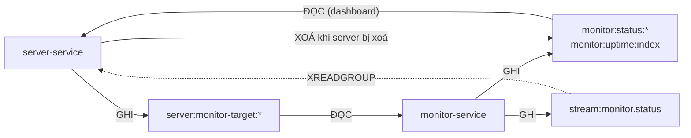
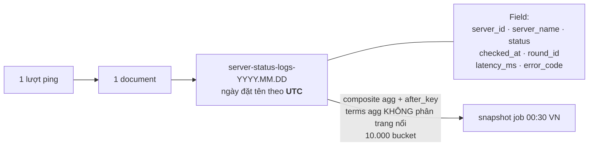

# 🗄️ Mô hình dữ liệu — PostgreSQL · Redis · Elasticsearch

> Cập nhật: 21/07/2026 · Nguồn: `deployments/docker/postgres/init.sql` + các file `internal/model`, `keys.go`.

---

## 1. Toàn cảnh — dữ liệu nằm ở đâu

Không có khoá ngoại nào bắc qua ranh giới database. `daily_snapshots.server_id` và `servers.server_id` trùng giá trị nhưng **không** có FK — đó là chủ đích của database-per-service.

---

## 2. identity_db — RBAC

`role_permissions.scope` là **chuỗi**, không phải FK trỏ `permissions.id`. Cách này cho phép thêm scope mới trong code trước khi kịp seed vào bảng `permissions`.

---

## 3. server_db — nguồn sự thật về server

### Hai index UNIQUE khác nhau — đây là gốc rễ của hành vi import

| Tình huống import | `server_id` đã tồn tại | Kết quả |
|-------------------|------------------------|---------|
| bản ghi **còn sống** | có | `WHERE` không khớp → không trả về từ `RETURNING` → báo **trùng** |
| bản ghi **đã xoá mềm** | có | `WHERE` khớp → ghi đè + `deleted_at = NULL` → báo **thành công** (hồi sinh) |
| chưa từng có | không | INSERT thường → **thành công** |

Cột `ipv4` kiểu `inet`, nên lọc theo tiền tố phải viết `host(ipv4) LIKE ?` — `ipv4 LIKE ?` sẽ lỗi `operator does not exist: inet ~~ unknown`.

---

## 4. report_db — kết tinh và vết gửi mail

### Ba con số đo lường, ba câu hỏi khác nhau

`uptime_pct = NULL` (no-data) khác hoàn toàn `uptime_pct = 0`:

| | Ý nghĩa | Vào `AVG()`? | Đếm vào |
|---|---|---|---|
| `NULL` | **không ai đo được** | không | `servers_no_data` |
| `0` | **server chết cả ngày** | có | `servers_uptime0` |

Server mới tạo lúc 18:00 chỉ có `expected_checks = 360` chứ không phải 1440 — nếu không, việc tạo server sẽ trông như một sự cố giám sát.

---

## 5. Redis keyspace

### Ai ghi, ai đọc — và vì sao chiều ngược lại không tồn tại

Khi xoá server, server-service phải tự dọn `monitor:status:{id}` và gỡ khỏi `monitor:uptime:index` — nếu không, server đã chết vẫn tiếp tục được tính điểm trong bảng xếp hạng "10 server tệ nhất" mãi mãi.

**Chính sách eviction:** `volatile-lru` chứ không phải `allkeys-lru`. Chỉ cache mới có TTL; số đếm uptime, status, projection và stream **không** có TTL, và xoá bất kỳ thứ nào trong đó là mất dữ liệu không tái tạo được. AOF `everysec` giữ số đếm qua lần restart.

> ⚠️ Khi debug bằng `redis-cli`, nhớ `-n 1` — dữ liệu giám sát nằm ở db1, không phải db0.

---

## 6. Elasticsearch — fact thô

| Đại lượng | Giá trị |
|-----------|---------|
| Document/ngày | 10.000 server × 1440 vòng ≈ **14,4 triệu** |
| Ghi | bulk, 1000 doc hoặc 5 giây |
| Đọc | **1 lần/ngày** bởi snapshot job |
| Retry | 3 lần, backoff tăng dần, rồi **drop** |

Index đặt tên theo ngày **UTC** trong khi báo cáo cắt ngày theo **UTC+7**, nên một ngày VN trải trên **hai** index UTC. Truy vấn dùng wildcard `server-status-logs-*` với bộ lọc `checked_at` theo khoảng thời gian tuyệt đối, nên chuyện này không gây lệch.

---

## 7. Bảng tra nhanh: một sự kiện chạm vào những gì

| Hành động | PostgreSQL | Redis | Elasticsearch |
|-----------|-----------|-------|---------------|
| Tạo server | `INSERT servers` | `HSET` target + `SADD` ids | — |
| Xoá server | `deleted_at = now()` | `DEL` target, `SREM` ids, `DEL` status, `ZREM` uptime | — |
| Import 10k | `INSERT ... ON CONFLICT` | ghi hàng loạt target | — |
| Một lượt ping | — | Lua: status + counter + (stream nếu đổi) | +1 document |
| Đổi trạng thái | `UPDATE servers.status` (qua consumer) | `XADD` stream | +1 document |
| Snapshot 00:30 | `UPSERT daily_snapshots` | — | composite agg |
| Gửi báo cáo | `INSERT report_jobs` + đổi state | — | — |
