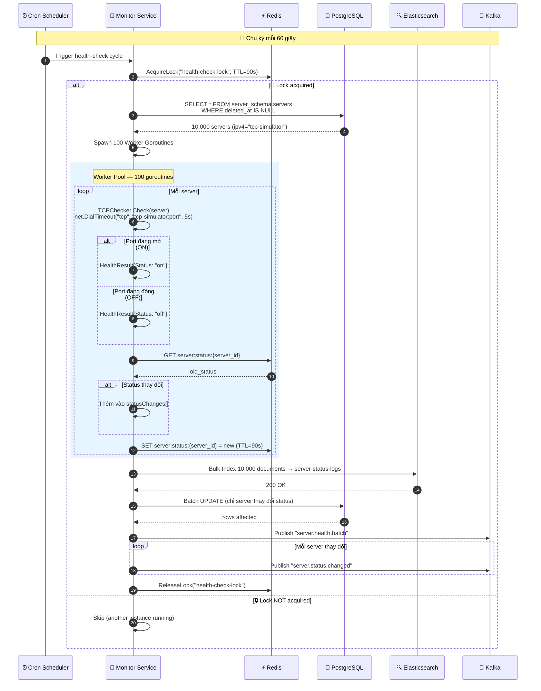
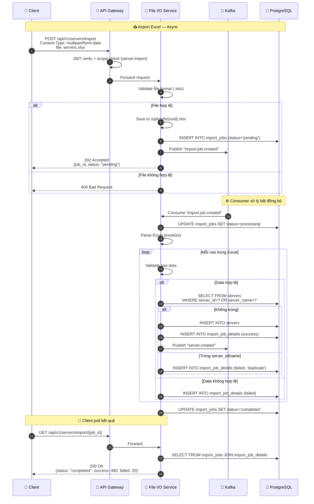
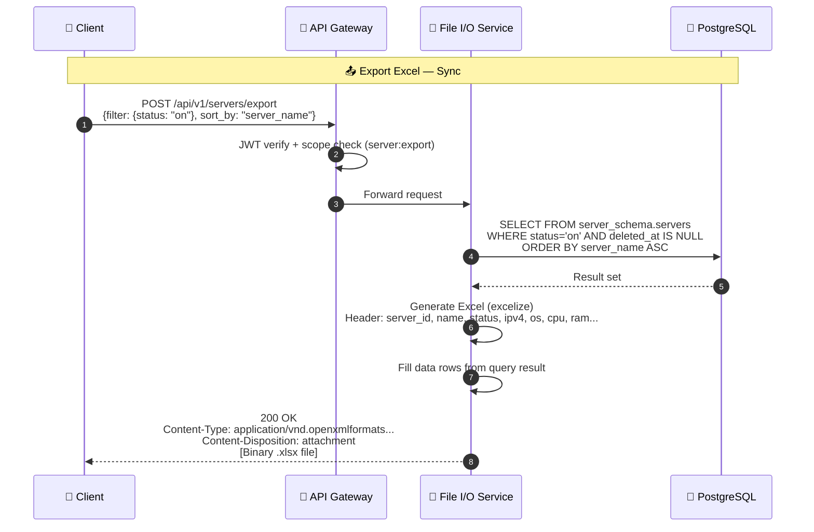
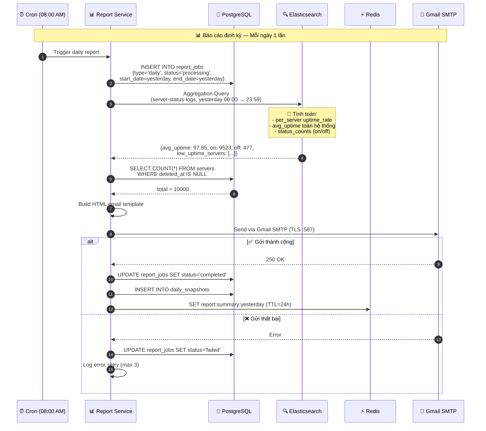
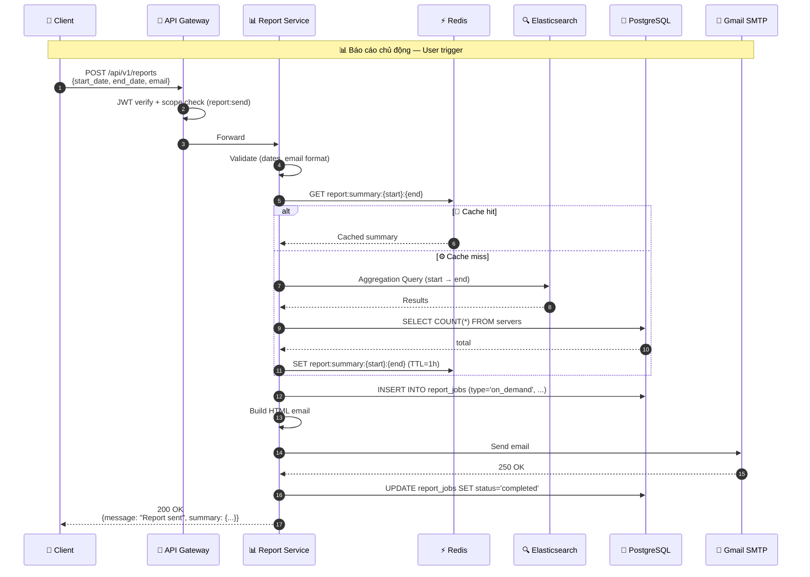
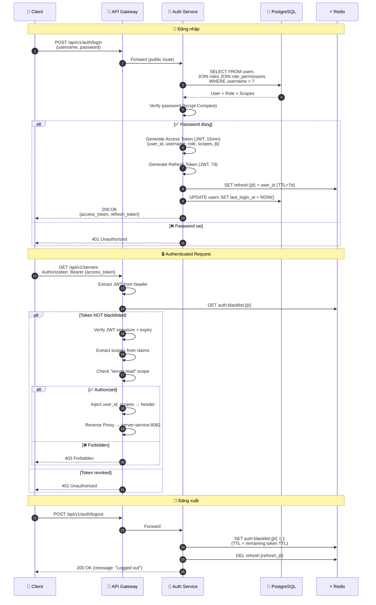

# ⚡ Sequence Diagrams — Các luồng vận hành chính

> **Ngày tạo:** 09/06/2026
> **Mô tả:** 6 Sequence Diagrams mô tả các luồng nghiệp vụ cốt lõi của VCS-SMS.

---

## 1. Health-Check Batch Cycle (60 giây / lần)

---

## 2. Import Excel — Bất đồng bộ qua Kafka

---

## 3. Export Excel — Đồng bộ

---

## 4. Daily Report Email — Cron 08:00 AM

---

## 5. On-Demand Report API

---

## 6. JWT Authentication Flow

