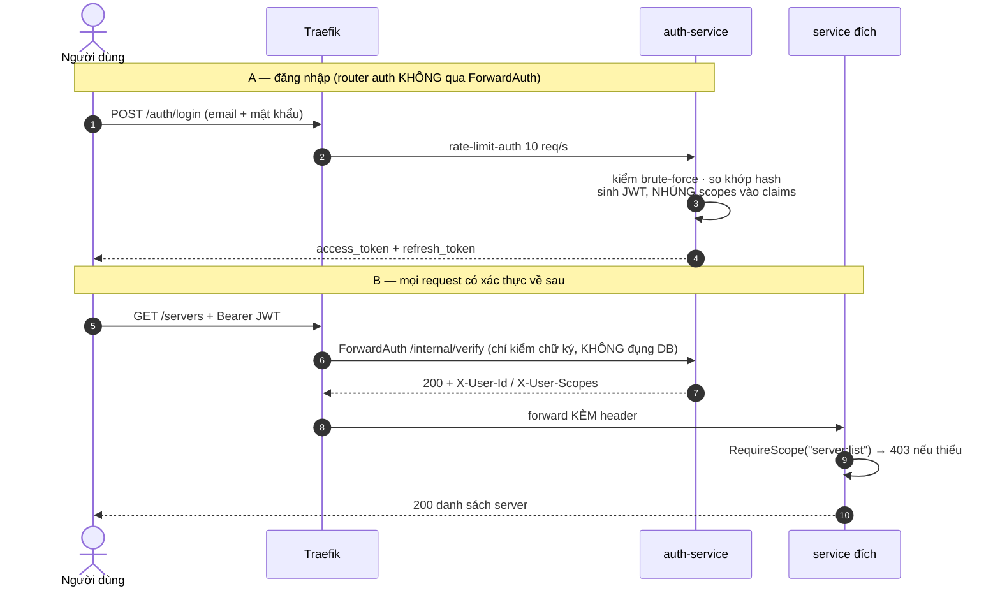
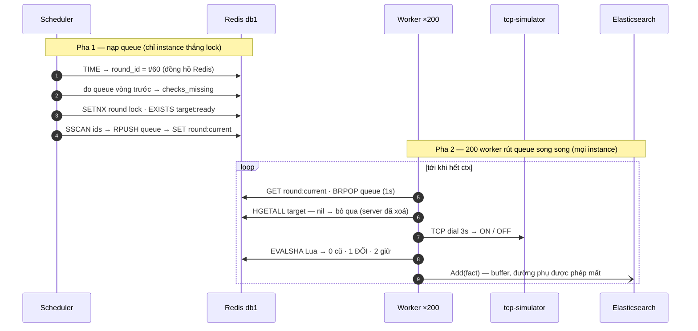
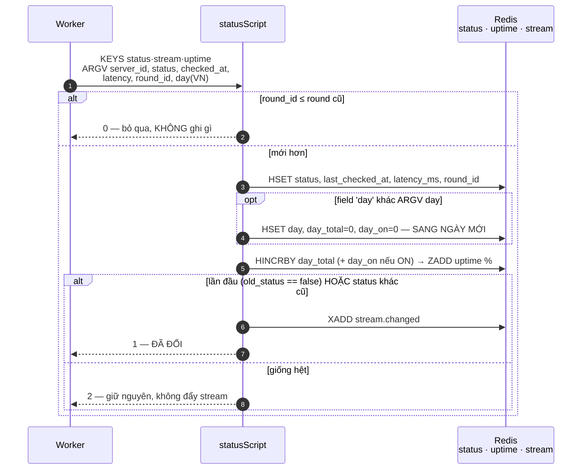
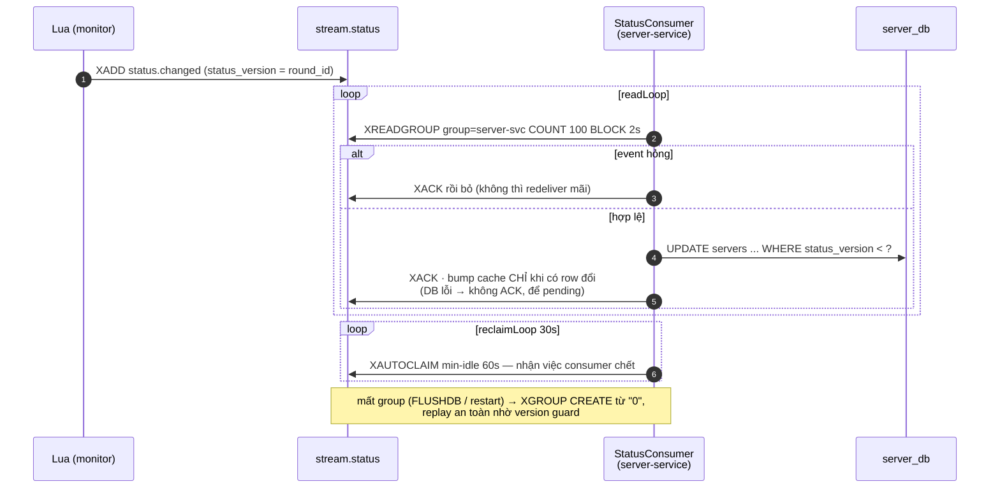
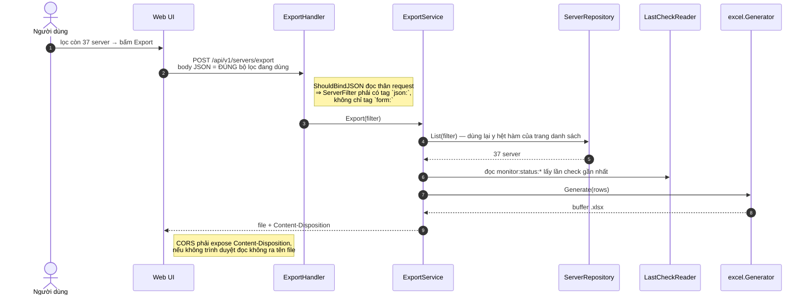
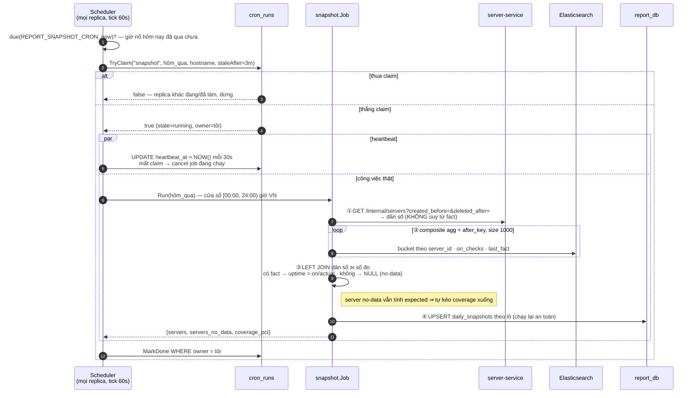
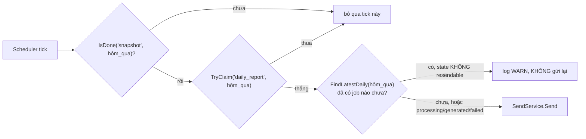
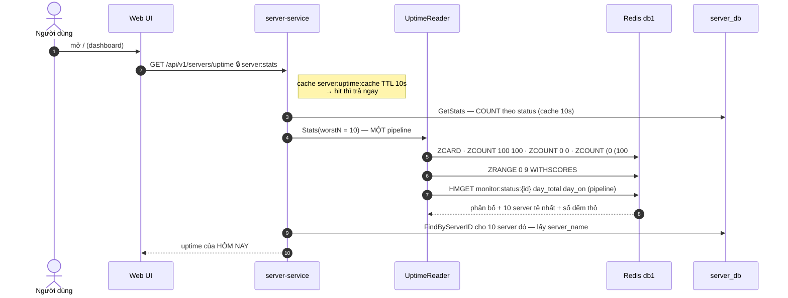

# 🔄 Sơ đồ tuần tự — 8 luồng nghiệp vụ

> Cập nhật: 24/07/2026

| # | Luồng | Kích hoạt |
|---|-------|-----------|
| [1](#1-đăng-nhập-và-xác-thực-mọi-request-sau-đó) | Đăng nhập + ForwardAuth | người dùng |
| [2](#2-một-vòng-giám-sát-60-giây) | Một vòng giám sát 60s | tự động |
| [3](#3-lan-truyền-thay-đổi-trạng-thái-redis--postgresql) | Lan truyền đổi trạng thái | tự động |
| [4](#4-import-10000-server-từ-excel) | Import Excel | người dùng |
| [5](#5-export-theo-đúng-bộ-lọc-đang-áp-dụng) | Export theo bộ lọc | người dùng |
| [6](#6-snapshot-hằng-ngày-) | Snapshot hằng ngày ⏰ | cron (có leader election) |
| [7](#7-gửi-báo-cáo-kèm-file-excel) | Gửi báo cáo + Excel | cron / người dùng |
| [8](#8-dashboard-uptime-thời-gian-thực) | Dashboard realtime | người dùng |

---

## 1. Đăng nhập và xác thực mọi request sau đó



**Vì sao `/internal/verify` không đọc DB?** Nó nằm trên đường đi của *mọi* request. Một truy vấn ở đây là một truy vấn nhân với toàn bộ lưu lượng hệ thống. Đổi lại: đổi role của user chỉ có hiệu lực sau khi token cũ hết hạn hoặc user đăng nhập lại.

---

## 2. Một vòng giám sát 60 giây



Scheduler đặt `round:current` **cuối cùng** để worker thấy round nào thì queue của round
đó chắc chắn đã nạp đầy. Thua lock là bình thường — worker vẫn ping từ queue người khác
nạp. FactBuffer flush khi đủ 1000 fact hoặc 5s; ES lỗi thì retry 3 lần rồi **drop**
(coverage giảm là hồi phục được, OOM thì không).

### Bên trong Lua script — vì sao phải nguyên tử



Ghi status, reset/cộng bộ đếm ngày, cập nhật ZSET và đẩy stream nằm trong **một** lệnh
Redis. Nếu tách rời, sẽ có khe hở mà Redis nói "server ON" còn stream chưa hề báo — hoặc
ngược lại.

Bộ đếm nằm **sau** chốt chặn round cũ, nên một round phát lại hay tới muộn không thổi
phồng số. `day` do Go tính theo `Asia/Ho_Chi_Minh` rồi truyền vào, không phải Lua tự lấy
giờ — `redis.call('TIME')` trả UTC, và dùng nó sẽ làm bộ đếm reset lúc 7 giờ sáng VN.

`old_status == false`, **không** `== nil`: Redis Lua trả `false` cho field không tồn tại.
Viết `nil` thì điều kiện vĩnh viễn sai, event đầu tiên (`UNKNOWN → ON/OFF`) không bao giờ
phát, và server mới kẹt `UNKNOWN` mãi mãi trong PostgreSQL.

---

## 3. Lan truyền thay đổi trạng thái: Redis → PostgreSQL



**Hai lớp chống ghi đè ngược thời gian:**

| Lớp | Cơ chế | Bảo vệ khỏi |
|-----|--------|-------------|
| Redis | Lua: `round_id ≤ old_round → return 0` | worker chậm ghi đè kết quả mới hơn |
| PostgreSQL | `WHERE status_version < ?` | message tới không đúng thứ tự / phát lại |

---

## 4. Import 10.000 server từ Excel

```mermaid
sequenceDiagram
    autonumber
    actor U as Operator
    participant T as Traefik
    participant S as ImportService
    participant PG as server_db
    participant RD as Redis

    U->>T: POST /servers/import + Idempotency-Key
    T->>S: 🔒 scope server:import
    note right of S: cùng key+body → trả kết quả cũ, KHÔNG import lại

    S->>S: Parse Excel — file hỏng → 400, từ chối CẢ file
    note right of S: lọc từng dòng: invalid / ngoài CIDR → failed;<br/>trùng trong file / tên đã tồn tại → skipped

    loop mỗi lô 500 dòng hợp lệ
        S->>PG: INSERT ... ON CONFLICT (server_id) DO UPDATE<br/>WHERE deleted_at IS NOT NULL RETURNING server_id
        PG-->>S: id ghi được<br/>(vắng mặt = trùng · đã xoá mềm = HỒI SINH)
    end

    S->>RD: HSET target + SADD ids · bump cache version
    S-->>U: 200 { succeeded, failed, skipped_duplicate }
```

**Câu chuyện thực tế đã sửa:** import lại đúng file 10.000 dòng sau khi xoá 5 server, kết quả đúng phải là 5 thành công / 9.995 trùng. Trước khi sửa, `ON CONFLICT DO NOTHING` cộng với index `UNIQUE(server_id)` không có mệnh đề `WHERE` khiến 5 server đã xoá mềm không bao giờ hồi sinh được → báo trùng cả 10.000.

---

## 5. Export theo đúng bộ lọc đang áp dụng



**Lỗi đã sửa:** `ServerFilter` chỉ có tag `form:` nên khi bind từ thân JSON, các trường `server_id` / `server_name` / `page_size` bị bỏ im lặng → export ra cả 10.000 thay vì 37 dòng đang lọc.

---

## 6. Snapshot hằng ngày ⏰



**Vì sao dân số phải đọc từ Server Service?** Một server *không ai ping được* vẫn phải xuất hiện trong báo cáo. Nếu suy dân số từ chính đống fact, server đó biến mất — và lỗ hổng giám sát tự xoá dấu vết của nó.

Endpoint nội bộ nhận **hai** tham số bắt buộc, cả hai RFC3339:
`created_before` = 00:00 ngày kế tiếp, `deleted_after` = 00:00 ngày cần snapshot. Đó chính
là điều kiện "server này có tồn tại trong ngày đó không". Trả về theo cursor
(`next_cursor` = `server_id` cuối), tối đa 1000 dòng mỗi trang → ~10 request cho 10.000 server.

**Vì sao `TryClaim` chứ không chỉ dựa vào cron nổ một lần?** `report-service` chạy 3
replica, mỗi replica có scheduler riêng. Không có claim thì 3 replica cùng aggregate 14,4
triệu document và cùng UPSERT — vô hại về dữ liệu (UPSERT idempotent) nhưng tốn 3 lần tài
nguyên và làm Elasticsearch nghẹt.

**Chạy lại thủ công khi job đêm hỏng** (không đi qua Traefik, không cần claim):
```bash
docker exec vcs-sms-traefik wget -qO- --post-data='' \
  http://report-service:8084/internal/snapshots/2026-07-23
```

---

## 7. Gửi báo cáo kèm file Excel

```mermaid
sequenceDiagram
    autonumber
    actor U as Operator / ⏰ Scheduler
    participant SS as SendService
    participant RS as ReportService
    participant PG as report_db
    participant SM as GmailSender

    U->>SS: Send(range, recipient, reportType, requesterID, idemKey)
    SS->>RS: ParseRange — end_date phải ĐÃ kết thúc · ≤ REPORT_MAX_RANGE_DAYS
    opt có Idempotency-Key
        SS->>PG: FindByIdempotency(requesterID, key)
        alt tìm thấy, cùng nội dung
            PG-->>SS: job cũ → REPLAY, dừng ở đây
        else tìm thấy, khác nội dung
            PG-->>SS: ErrIdempotencyConflict
        end
    end
    SS->>PG: Create job (state=processing) — có TRƯỚC khi gửi
    note right of PG: ux_report_jobs_idem là partial unique index;<br/>insert bị chối ⇒ replica khác vừa giành key ⇒ replay
    SS->>RS: Summary
    RS->>PG: MissingDates? → từ chối + nêu ngày thiếu
    RS-->>SS: total · avg_uptime · coverage · top10
    SS->>PG: state=generated, lưu response_json
    SS->>SS: render HTML → state=sending
    SS->>SS: sinh Excel (đính kèm là phụ trợ, hỏng vẫn gửi — chỉ log WARN)
    SS->>SM: STARTTLS → AUTH → DATA
    alt 250 OK
        SM-->>SS: sent + Message-ID
    else lỗi RÕ (535, domain bị chặn)
        SM-->>SS: failed
    else lỗi MẬP MỜ (đứt sau DATA)
        SM-->>SS: delivery_unknown — giữ Message-ID, KHÔNG retry
    end
```

### Đường tự động có thêm một chốt mà đường người dùng không có



`resendable(state)` chỉ nhận `processing`, `generated`, `failed` — ba trạng thái mà body
**chưa** lên dây. `sending` **không** resendable, vì nó được ghi *trước* khi gọi SMTP: một
replica chết đúng khoảng đó thì không ai biết mail đã đi hay chưa, và đoán "chưa" là cách
gửi hai lần.

Đây là lý do claim `cron_runs` một mình không đủ. Claim chỉ bảo đảm "cùng một lúc chỉ một
replica chạy"; nó không nói gì về "lần chạy trước đã làm tới đâu".

**Số liệu lượt kiểm tra khớp nhau ở hai nơi:**
- Thân email: `ActualChecks` = **tổng** toàn hệ thống (ví dụ 1.110.043).
- Excel cột `total_checks` = **từng server** (ví dụ 137 lượt/server).
- Cộng cột `total_checks` lại đúng bằng con số trong thân email — hai bên cùng bắt nguồn từ `SUM(actual_checks)` trên `daily_snapshots`.

---

## 8. Dashboard uptime thời gian thực



> **Con số này là uptime của NGÀY HÔM NAY theo giờ Việt Nam**, không phải luỹ kế trọn đời.
> Lua giữ field `day` trong `monitor:status:{id}`; lần check đầu tiên của ngày mới thấy
> `day` khác thì đặt lại `day_total`/`day_on` về 0, nên toàn bộ ZSET tự làm mới trong
> **một round** sau nửa đêm.
>
> Hệ quả: đổi `SIMULATOR_DEFAULT_UPTIME_RATE` sẽ thấy dashboard hội tụ về tỉ lệ mới trong
> vòng một ngày, **không** cần xoá key thủ công.

**Ba con số, ba nguồn — trong cùng một response:**

| Nhóm field | Nguồn | Ý nghĩa |
|---|---|---|
| `total_servers`, `servers_on/off/unknown` | PostgreSQL `COUNT(*)` theo `status` | trạng thái **hiện tại** |
| `servers_uptime_100/partial/0`, `avg_uptime_pct`, `top_10_lowest_uptime` | Redis ZSET | uptime **hôm nay** |
| `servers_no_data` | `total_servers − ZCARD` | server Monitoring chưa từng chấm điểm |

`servers_no_data` được **trừ ra**, không đoán: một server vừa tạo chưa qua round nào thì
không có mặt trong ZSET, và nó phải được đếm riêng chứ không bị coi là uptime 0%.

`server_name` lấy từ PostgreSQL chứ không từ Redis, vì PostgreSQL là chủ sở hữu của tên.
Cái giá: 10 truy vấn `FindByServerID` cho đúng 10 dòng của bảng xếp hạng.

> Đây là con số **khác** với uptime trong email: email đọc `daily_snapshots` (mọi ngày đã
> kết thúc, cắt theo khoảng người dùng chọn), dashboard đọc Redis (chỉ hôm nay, có ngay
> mọi lúc kể cả khi chưa có snapshot nào).
