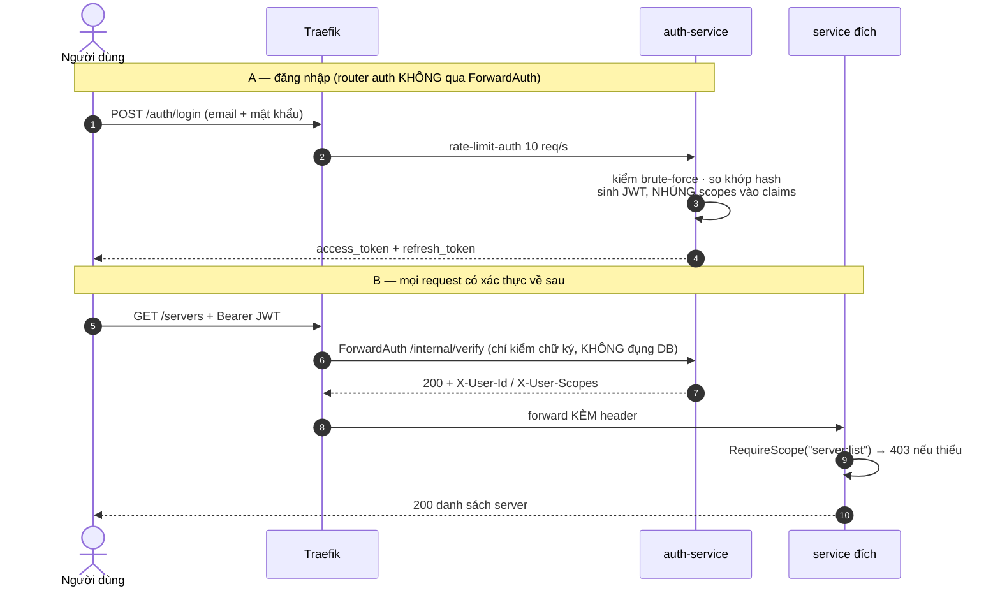
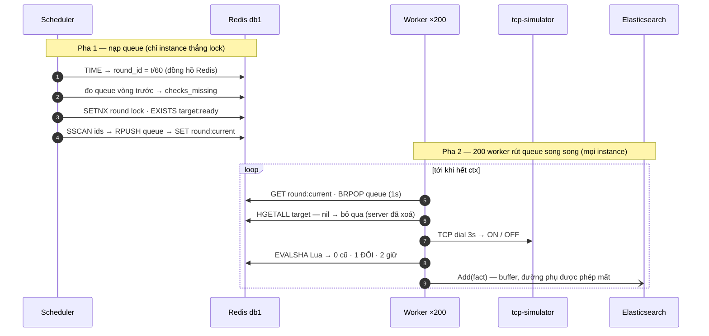
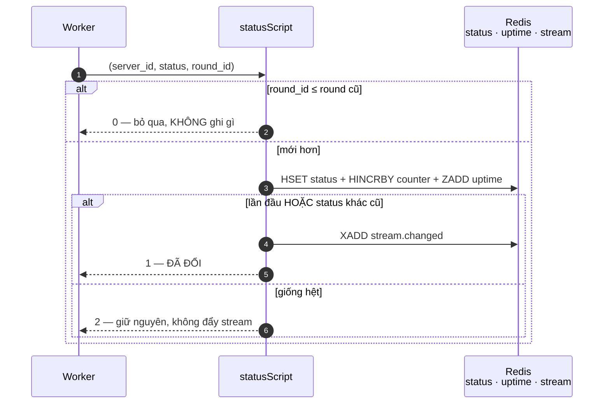
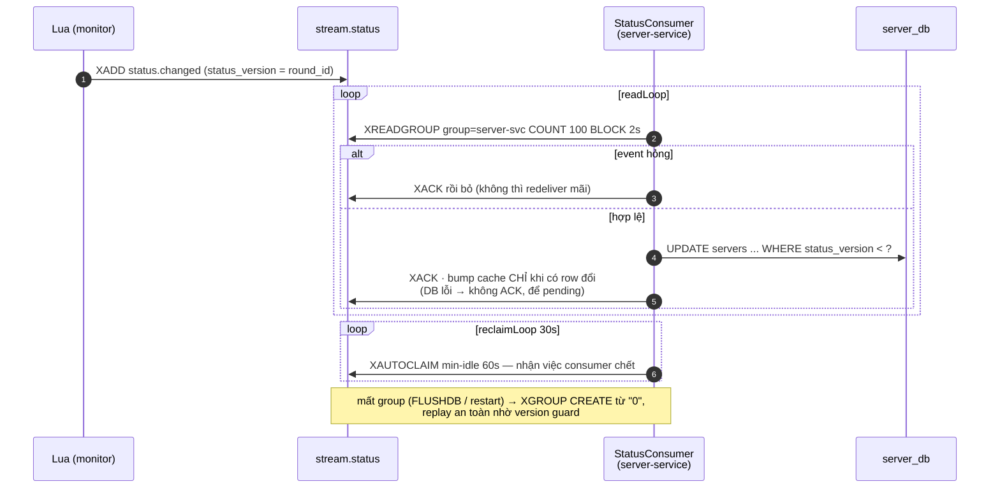
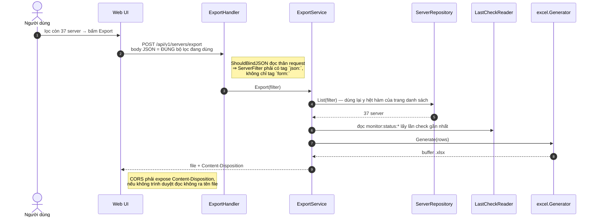
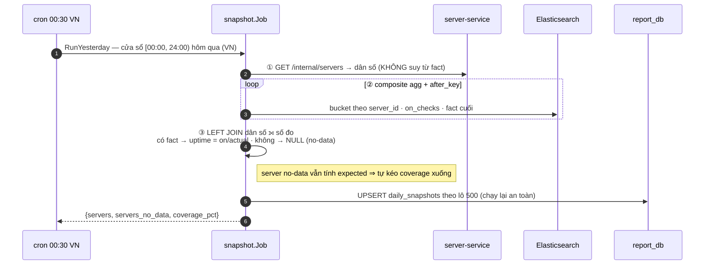
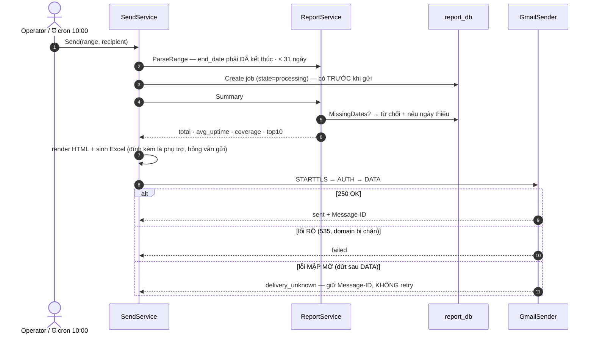
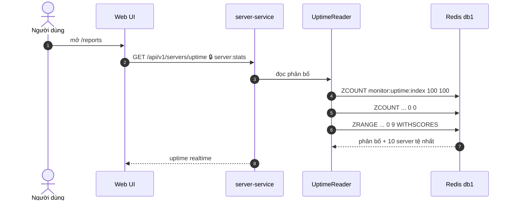

# 🔄 Sơ đồ tuần tự — 8 luồng nghiệp vụ

> Cập nhật: 21/07/2026

| # | Luồng | Kích hoạt |
|---|-------|-----------|
| [1](#1-đăng-nhập-và-xác-thực-mọi-request-sau-đó) | Đăng nhập + ForwardAuth | người dùng |
| [2](#2-một-vòng-giám-sát-60-giây) | Một vòng giám sát 60s | tự động |
| [3](#3-lan-truyền-thay-đổi-trạng-thái-redis--postgresql) | Lan truyền đổi trạng thái | tự động |
| [4](#4-import-10000-server-từ-excel) | Import Excel | người dùng |
| [5](#5-export-theo-đúng-bộ-lọc-đang-áp-dụng) | Export theo bộ lọc | người dùng |
| [6](#6-snapshot-hằng-ngày--0030-giờ-vn-) | Snapshot hằng ngày ⏰ | cron |
| [7](#7-gửi-báo-cáo-kèm-file-excel) | Gửi báo cáo + Excel | cron / người dùng |
| [8](#8-dashboard-uptime-thời-gian-thực) | Dashboard realtime | người dùng |

---

## 1. Đăng nhập và xác thực mọi request sau đó



**Vì sao `/internal/verify` không đọc DB?** Nó nằm trên đường đi của *mọi* request. Một truy vấn ở đây là một truy vấn nhân với toàn bộ lưu lượng hệ thống. Đổi lại: đổi role của user chỉ có hiệu lực sau khi token cũ hết hạn hoặc user đăng nhập lại.

---

## 2. Một vòng giám sát 60 giây



Scheduler đặt `round:current` **cuối cùng** để worker thấy round nào thì queue của round
đó chắc chắn đã nạp đầy. Thua lock là bình thường — worker vẫn ping từ queue người khác
nạp. FactBuffer flush khi đủ 1000 fact hoặc 5s; ES lỗi thì retry 3 lần rồi **drop**
(coverage giảm là hồi phục được, OOM thì không).

### Bên trong Lua script — vì sao phải nguyên tử



Đếm counter nằm **sau** chốt chặn round cũ nên phát lại không thổi phồng số. Ghi status,
cộng counter và đẩy stream gói trong **một** lệnh Redis — không có khe hở để Redis và
stream bất đồng.

Ghi status, cộng counter và đẩy stream nằm trong **một** lệnh Redis. Nếu tách rời, sẽ có khe hở mà Redis nói "server ON" còn stream chưa hề báo — hoặc ngược lại.

---

## 3. Lan truyền thay đổi trạng thái: Redis → PostgreSQL



**Hai lớp chống ghi đè ngược thời gian:**

| Lớp | Cơ chế | Bảo vệ khỏi |
|-----|--------|-------------|
| Redis | Lua: `round_id ≤ old_round → return 0` | worker chậm ghi đè kết quả mới hơn |
| PostgreSQL | `WHERE status_version < ?` | message tới không đúng thứ tự / phát lại |

---

## 4. Import 10.000 server từ Excel

```mermaid
sequenceDiagram
    autonumber
    actor U as Operator
    participant T as Traefik
    participant S as ImportService
    participant PG as server_db
    participant RD as Redis

    U->>T: POST /servers/import + Idempotency-Key
    T->>S: 🔒 scope server:import
    note right of S: cùng key+body → trả kết quả cũ, KHÔNG import lại

    S->>S: Parse Excel — file hỏng → 400, từ chối CẢ file
    note right of S: lọc từng dòng: invalid / ngoài CIDR → failed;<br/>trùng trong file / tên đã tồn tại → skipped

    loop mỗi lô 500 dòng hợp lệ
        S->>PG: INSERT ... ON CONFLICT (server_id) DO UPDATE<br/>WHERE deleted_at IS NOT NULL RETURNING server_id
        PG-->>S: id ghi được<br/>(vắng mặt = trùng · đã xoá mềm = HỒI SINH)
    end

    S->>RD: HSET target + SADD ids · bump cache version
    S-->>U: 200 { succeeded, failed, skipped_duplicate }
```

**Câu chuyện thực tế đã sửa:** import lại đúng file 10.000 dòng sau khi xoá 5 server, kết quả đúng phải là 5 thành công / 9.995 trùng. Trước khi sửa, `ON CONFLICT DO NOTHING` cộng với index `UNIQUE(server_id)` không có mệnh đề `WHERE` khiến 5 server đã xoá mềm không bao giờ hồi sinh được → báo trùng cả 10.000.

---

## 5. Export theo đúng bộ lọc đang áp dụng



**Lỗi đã sửa:** `ServerFilter` chỉ có tag `form:` nên khi bind từ thân JSON, các trường `server_id` / `server_name` / `page_size` bị bỏ im lặng → export ra cả 10.000 thay vì 37 dòng đang lọc.

---

## 6. Snapshot hằng ngày — 00:30 giờ VN ⏰



**Vì sao dân số phải đọc từ Server Service?** Một server *không ai ping được* vẫn phải xuất hiện trong báo cáo. Nếu suy dân số từ chính đống fact, server đó biến mất — và lỗ hổng giám sát tự xoá dấu vết của nó.

**Chạy lại thủ công khi job đêm hỏng:**
```
POST /internal/snapshots/2026-07-17
```

---

## 7. Gửi báo cáo kèm file Excel



**Số liệu lượt kiểm tra khớp nhau ở hai nơi:**
- Thân email: `ActualChecks` = **tổng** toàn hệ thống (ví dụ 1.110.043).
- Excel cột `total_checks` = **từng server** (ví dụ 137 lượt/server).
- Cộng cột `total_checks` lại đúng bằng con số trong thân email — hai bên cùng bắt nguồn từ `SUM(actual_checks)` trên `daily_snapshots`.

---

## 8. Dashboard uptime thời gian thực



> ⚠️ **Con số này là LUỸ KẾ TRỌN ĐỜI**, không phải "hôm nay". Đổi `SIMULATOR_DEFAULT_UPTIME_RATE` từ 0,95 xuống 0,75 sẽ **không** làm dashboard đổi ngay — số đếm cũ vẫn nằm đó. Muốn thấy tỉ lệ mới cần xoá `monitor:status:*` và `monitor:uptime:index` để đếm lại từ đầu.
>
> Đây là con số **khác** với uptime trong email: email đọc `daily_snapshots` (cắt theo từng ngày), dashboard đọc Redis (trọn đời).
