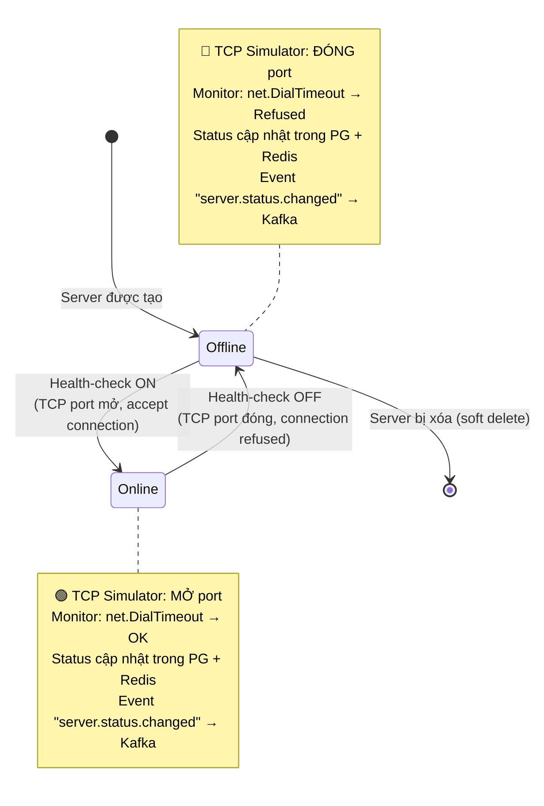
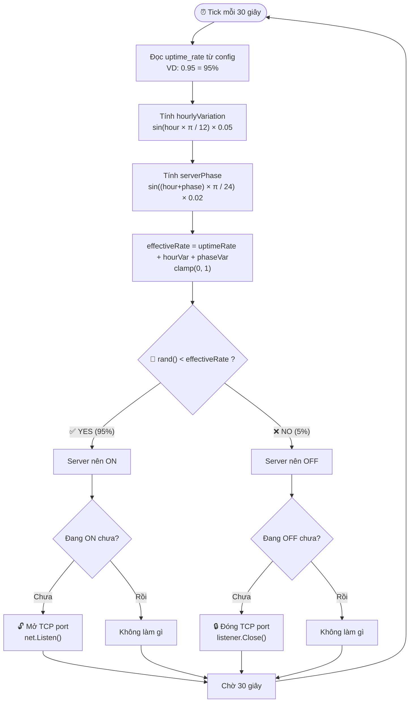
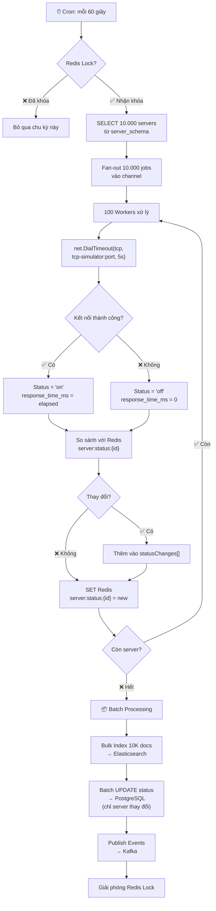
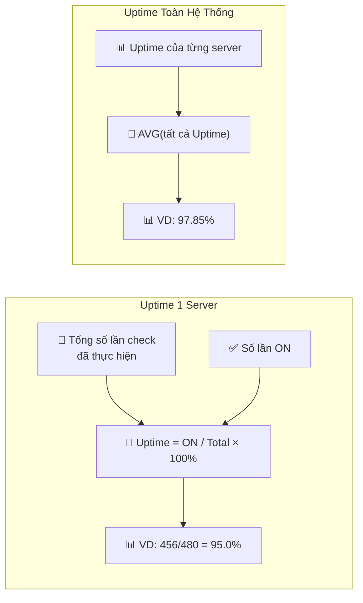

# 🔄 Server State Diagram — Trạng thái ON/OFF

> **Ngày tạo:** 09/06/2026
> **Mô tả:** Sơ đồ trạng thái của một server trong hệ thống VCS-SMS.

---

## State Machine — 1 Server

---

## State Transition Triggers

| Từ | Đến | Trigger | Actor |
|----|-----|---------|-------|
| `[*]` | `Offline` | Server được tạo (POST /servers hoặc Import Excel) | Admin |
| `Offline` | `Online` | Health-check trả về ON (TCP port mở) | Monitor Service |
| `Online` | `Offline` | Health-check trả về OFF (TCP port đóng) | Monitor Service |
| `Offline` | `[*]` | Server bị xóa (DELETE /servers/:id) | Admin |

---

## TCP Simulator: Math Engine quyết định On/Off

---

## Monitor Service: Check Flow mỗi 60 giây

---

## Uptime Calculation

