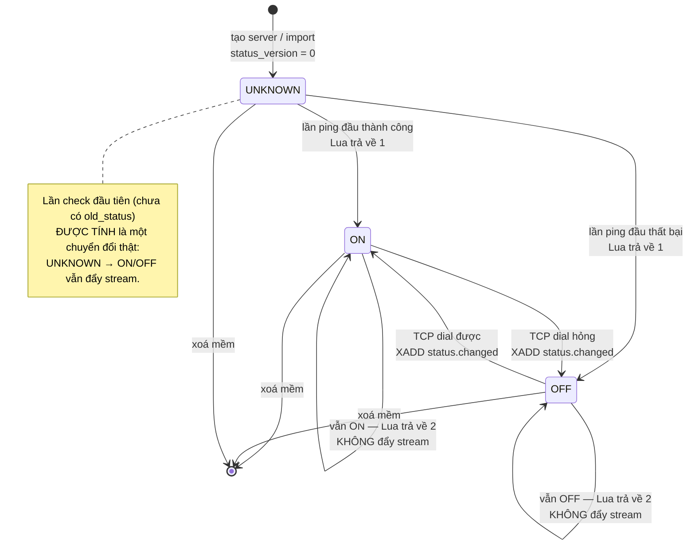
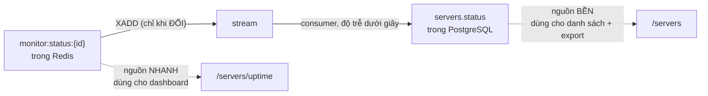
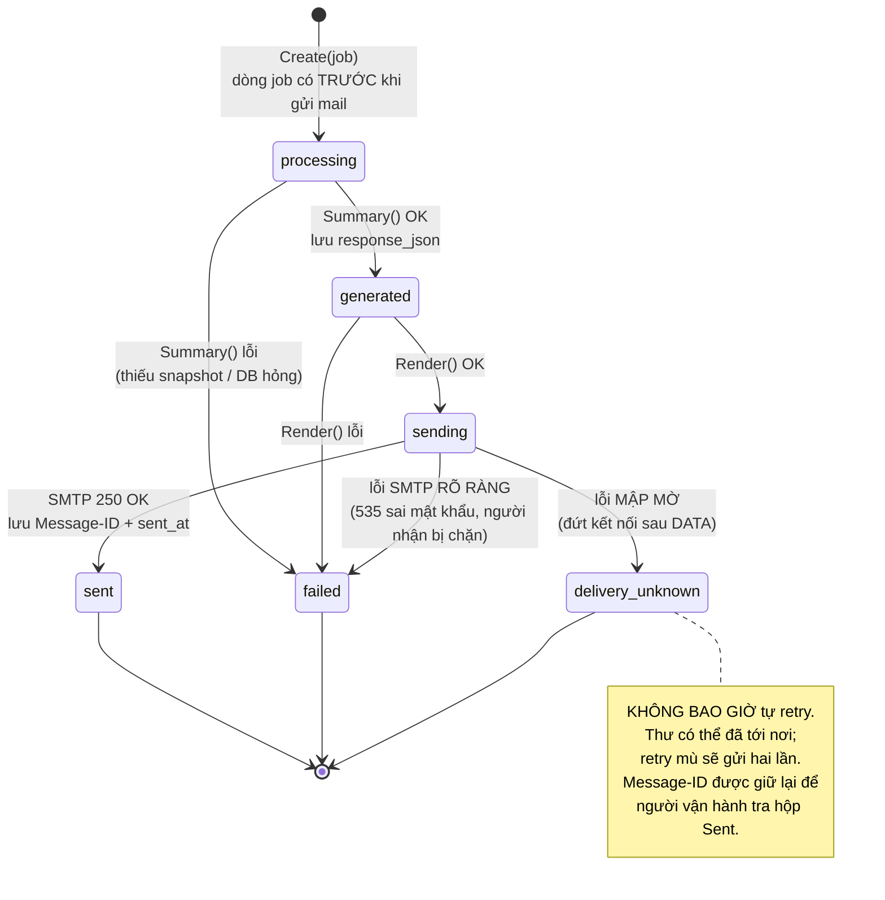
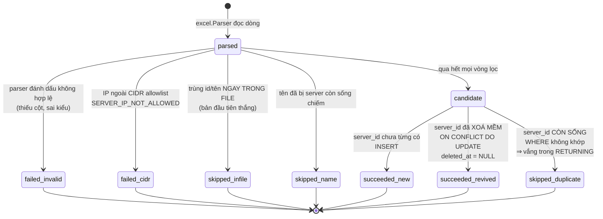
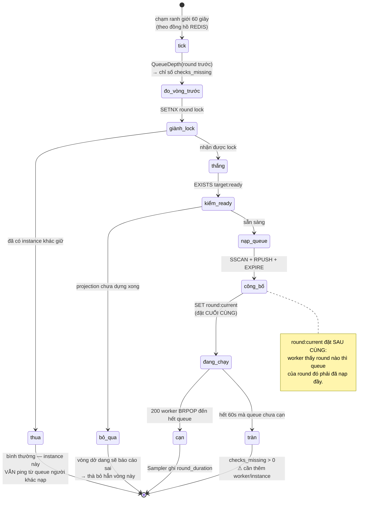
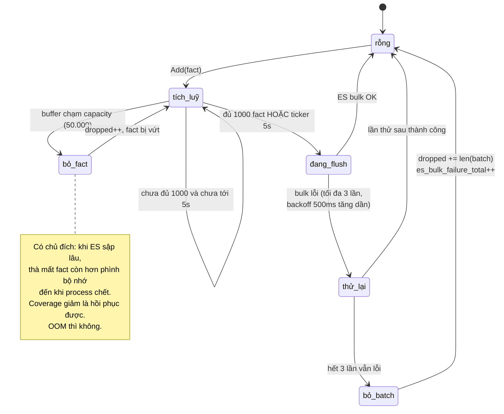
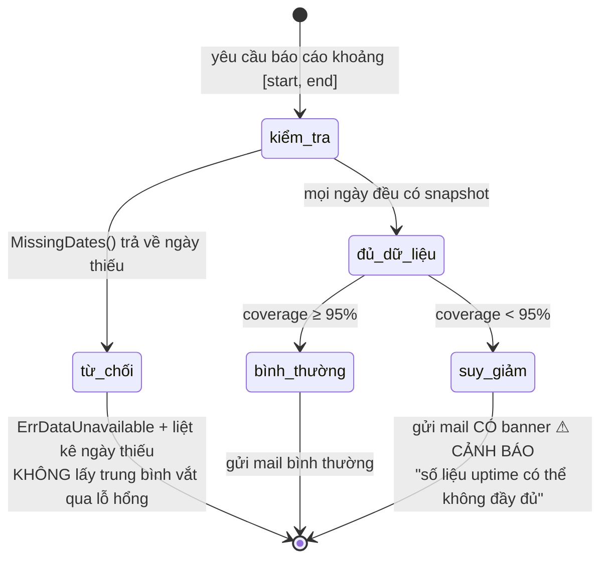

# 🔀 Sơ đồ trạng thái — các máy trạng thái trong hệ thống

> Cập nhật: 21/07/2026

---

## 1. Trạng thái server

**`UNKNOWN` tồn tại ở hai tình huống hoàn toàn khác nhau:**

| Tình huống | Ý nghĩa |
|-----------|---------|
| Server vừa tạo, chưa qua vòng ping nào | tạm thời, sẽ hết trong ≤ 60 giây |
| Server tồn tại nhưng Monitoring chết | báo động — trạng thái đang mục nát |

**Trạng thái nằm ở hai nơi và có thể lệch nhau trong chốc lát:**

Redis luôn đi trước một chút. Đó là chủ đích: dashboard cần nhanh, danh sách cần bền và query được bằng SQL.

---

## 2. Trạng thái report job

| Trạng thái | Người nhận có nhận được thư? | Hành động tiếp theo |
|-----------|------------------------------|---------------------|
| `sent` | ✅ chắc chắn | không cần làm gì |
| `failed` | ❌ chắc chắn không | sửa nguyên nhân rồi gửi lại — an toàn |
| `delivery_unknown` | ❓ không ai biết | **tra Message-ID trước**, rồi mới quyết định |

`ErrRecipientNotAllowed` là ngoại lệ duy nhất được trả ngược lên thành lỗi HTTP — người dùng cần biết ngay địa chỉ đó không nằm trong `SMTP_RECIPIENT_DOMAINS`.

---

## 3. Kết cục của một dòng trong file import

Một dòng hỏng **không bao giờ** làm hỏng cả request; chỉ file hỏng mới bị từ chối (`ErrImportFileRejected`). Kết quả trả về gộp thành ba nhóm: `succeeded`, `failed`, `skipped_duplicate`.

---

## 4. Vòng đời một round giám sát

**Chuyển vòng không cần cơ chế nào cả.** Worker đọc lại `monitor:round:current` ở *mỗi* vòng lặp và không bao giờ ghi nhớ round. Vòng mới bắt đầu → lần lặp kế tiếp tự động rút từ queue mới, phần thừa của queue cũ hết hạn theo TTL 120 giây.

---

## 5. FactBuffer — dưới áp lực

Hệ quả có thể quan sát được: ES sập → `actual_checks` trong snapshot giảm → `coverage_pct` giảm → nếu xuống dưới 95% thì email tự gắn cờ ⚠ **CẢNH BÁO** ngay trên đầu.

---

## 6. Sức khoẻ dữ liệu báo cáo

Ba mức phản ứng, tương ứng ba mức độ nghiêm trọng:

| Tình trạng | Phản ứng |
|-----------|----------|
| Mất vài fact | im lặng, coverage nhích xuống |
| Coverage < 95% | vẫn gửi, **có cảnh báo** trong email |
| Thiếu hẳn snapshot một ngày | **từ chối gửi**, nêu rõ ngày nào thiếu |
