# 📊 Use Case Diagram — VCS Server Management System (VCS-SMS)

> **Ngày tạo:** 09/06/2026  
> **Mô tả:** Sơ đồ Use Case tổng quan toàn hệ thống, bao gồm tất cả Actor và Use Case chính.

---

## 🎨 Sơ đồ Use Case

```mermaid
graph TB
    subgraph "VCS Server Management System"

        %% ── Auth ──
        subgraph "🔐 Authentication"
            UC_Register["Đăng ký tài khoản"]
            UC_Login["Đăng nhập"]
            UC_Logout["Đăng xuất"]
            UC_Refresh["Refresh Token"]
            UC_Profile["Xem Profile"]
        end

        %% ── Server CRUD ──
        subgraph "🖥️ Quản lý Server"
            UC_Create["Tạo Server"]
            UC_View["Xem danh sách Server\n(Filter, Sort, Paging)"]
            UC_Detail["Xem chi tiết Server"]
            UC_Update["Cập nhật Server"]
            UC_Delete["Xóa Server"]
        end

        %% ── Import / Export ──
        subgraph "📁 Import / Export"
            UC_Import["Import Servers từ Excel"]
            UC_Export["Export Servers ra Excel"]
            UC_CheckImport["Kiểm tra tiến độ Import"]
        end

        %% ── Monitoring ──
        subgraph "📡 Monitoring"
            UC_HealthCheck["Kiểm tra trạng thái\nđịnh kỳ (Health Check)"]
            UC_StatusUpdate["Cập nhật trạng thái\nServer On/Off"]
        end

        %% ── Report ──
        subgraph "📊 Báo cáo"
            UC_DailyReport["Gửi báo cáo định kỳ\nhàng ngày qua Email"]
            UC_OnDemandReport["Gửi báo cáo chủ động\n(theo khoảng ngày)"]
            UC_ViewSummary["Xem tóm tắt báo cáo"]
        end
    end

    %% ── Actors ──
    Admin["👑 Admin\n(Full quyền)"]
    Operator["🔧 Operator\n(Read + Update + View Report)"]
    Viewer["👀 Viewer\n(Chỉ Read)"]
    CronScheduler["⏰ Cron Scheduler\n(Tự động)"]
    MonitorSvc["📡 Monitor Service\n(Tự động 60s/cycle)"]
    EmailSystem["📧 Gmail SMTP\n(External)"]

    %% ── Admin use cases ──
    Admin --> UC_Register
    Admin --> UC_Login
    Admin --> UC_Logout
    Admin --> UC_Refresh
    Admin --> UC_Profile
    Admin --> UC_Create
    Admin --> UC_View
    Admin --> UC_Detail
    Admin --> UC_Update
    Admin --> UC_Delete
    Admin --> UC_Import
    Admin --> UC_CheckImport
    Admin --> UC_Export
    Admin --> UC_OnDemandReport
    Admin --> UC_ViewSummary

    %% ── Operator use cases ──
    Operator --> UC_Register
    Operator --> UC_Login
    Operator --> UC_Logout
    Operator --> UC_Refresh
    Operator --> UC_Profile
    Operator --> UC_View
    Operator --> UC_Detail
    Operator --> UC_Update
    Operator --> UC_ViewSummary

    %% ── Viewer use cases ──
    Viewer --> UC_Register
    Viewer --> UC_Login
    Viewer --> UC_Logout
    Viewer --> UC_Refresh
    Viewer --> UC_Profile
    Viewer --> UC_View
    Viewer --> UC_Detail
    Viewer --> UC_ViewSummary

    %% ── System use cases ──
    MonitorSvc --> UC_HealthCheck
    MonitorSvc --> UC_StatusUpdate
    CronScheduler --> UC_DailyReport
    UC_DailyReport --> EmailSystem
    UC_OnDemandReport --> EmailSystem

    %% ── Relationships ──
    UC_HealthCheck -.->|"include"| UC_StatusUpdate
    UC_DailyReport -.->|"include"| UC_ViewSummary
    UC_OnDemandReport -.->|"include"| UC_ViewSummary
    UC_Import -.->|"extend"| UC_CheckImport
    UC_View -.->|"extend"| UC_Detail
```

---

## 📋 Bảng tóm tắt Actor

| Actor | Mô tả | Use Case chính |
|-------|-------|---------------|
| 👑 **Admin** | Toàn quyền hệ thống, quản lý user & server | Tất cả 16 use case |
| 🔧 **Operator** | Vận hành, giám sát hệ thống | Xem/Update server, Xem báo cáo |
| 👀 **Viewer** | Chỉ đọc, theo dõi trạng thái | Xem server, Xem báo cáo |
| 📡 **Monitor Service** | Hệ thống tự động, chạy mỗi 60 giây | Health-check 10.000 server |
| ⏰ **Cron Scheduler** | Hệ thống tự động, chạy 08:00 AM mỗi ngày | Trigger báo cáo định kỳ |
| 📧 **Gmail SMTP** | Dịch vụ ngoài (External System) | Nhận và gửi email báo cáo |

---

## 🎯 Phân quyền chi tiết (RBAC Matrix)

| Use Case | Admin | Operator | Viewer | Ghi chú |
|----------|:-----:|:--------:|:------:|---------|
| Đăng ký | ✅ | ✅ | ✅ | Public |
| Đăng nhập | ✅ | ✅ | ✅ | Public |
| Đăng xuất | ✅ | ✅ | ✅ | Auth required |
| Refresh Token | ✅ | ✅ | ✅ | Public |
| Xem Profile | ✅ | ✅ | ✅ | Auth required |
| **Tạo Server** | ✅ | ❌ | ❌ | `server:create` |
| **Xem danh sách Server** | ✅ | ✅ | ✅ | `server:read` |
| **Xem chi tiết Server** | ✅ | ✅ | ✅ | `server:read` |
| **Cập nhật Server** | ✅ | ✅ | ❌ | `server:update` |
| **Xóa Server** | ✅ | ❌ | ❌ | `server:delete` |
| **Import Excel** | ✅ | ❌ | ❌ | `server:import` |
| **Kiểm tra tiến độ Import** | ✅ | ❌ | ❌ | `server:import` |
| **Export Excel** | ✅ | ❌ | ❌ | `server:export` |
| **Gửi báo cáo chủ động** | ✅ | ❌ | ❌ | `report:send` |
| **Xem tóm tắt báo cáo** | ✅ | ✅ | ✅ | `report:view` |

---

## 🔗 Mối quan hệ giữa các Use Case

| Quan hệ | Từ | Đến | Ý nghĩa |
|---------|----|-----|---------|
| **\<include\>** | Health Check | Cập nhật Status | Mỗi lần check luôn cập nhật trạng thái On/Off |
| **\<include\>** | Daily Report | View Summary | Báo cáo định kỳ luôn bao gồm số liệu tổng hợp |
| **\<include\>** | On-Demand Report | View Summary | Báo cáo chủ động cũng cần tính toán số liệu |
| **\<extend\>** | Import | Check Import Status | Sau khi import, user có thể kiểm tra tiến độ xử lý |
| **\<extend\>** | View List | View Detail | Từ danh sách server có thể xem chi tiết từng server |

---

## 📝 Ghi chú

- **Monitor Service** và **Cron Scheduler** là các Actor hệ thống, không phải người dùng thực. Chúng tự động thực thi các use case theo chu kỳ.
- **Gmail SMTP** là External System, nhận email từ Report Service để gửi đến Admin.
- Mối quan hệ **\<include\>** thể hiện use case bắt buộc phải gọi đến use case khác.
- Mối quan hệ **\<extend\>** thể hiện use case tùy chọn có thể mở rộng thêm.
