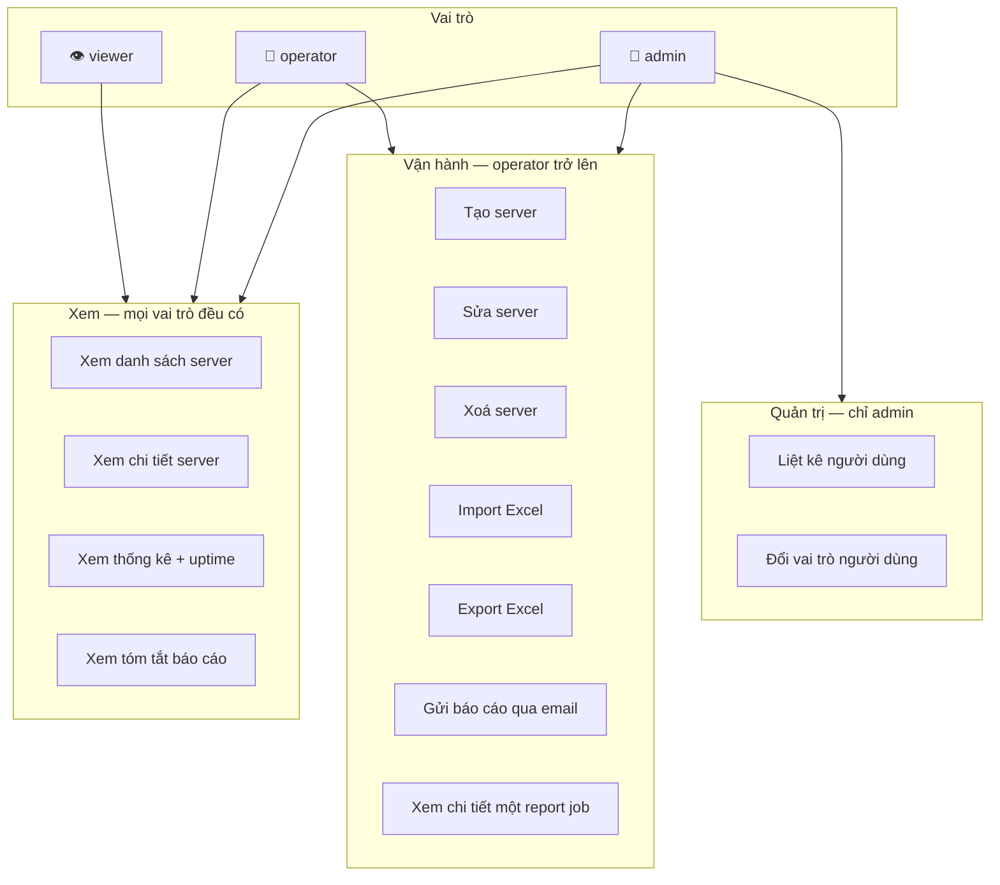
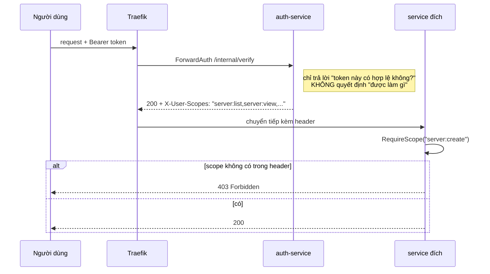
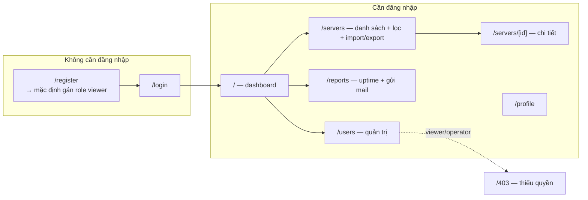
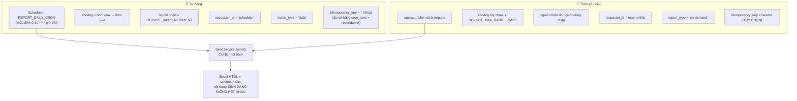

# 👥 Sơ đồ use case & phân quyền

> Cập nhật: 24/07/2026 · Nguồn: `init.sql` (seed roles/scopes) + `RequireScope(...)` trong
> các `cmd/main.go` — đã kiểm lại bằng một tài khoản `viewer` thật (`POST /servers` → 403,
> `GET /servers` → 200).

---

## 1. Ba vai trò và phạm vi của từng vai

Quan hệ là **bao hàm chặt**: `viewer ⊂ operator ⊂ admin`.

---

## 2. Ma trận 13 scope × 3 vai trò

| Scope | Endpoint | viewer | operator | admin |
|-------|----------|:------:|:--------:|:-----:|
| `server:list` | `GET /servers` | ✅ | ✅ | ✅ |
| `server:view` | `GET /servers/:id` | ✅ | ✅ | ✅ |
| `server:stats` | `GET /servers/stats`, `/uptime` | ✅ | ✅ | ✅ |
| `report:view` | `GET /reports/summary` | ✅ | ✅ | ✅ |
| `server:create` | `POST /servers` | ❌ | ✅ | ✅ |
| `server:update` | `PUT /servers/:id` | ❌ | ✅ | ✅ |
| `server:delete` | `DELETE /servers/:id` | ❌ | ✅ | ✅ |
| `server:import` | `POST /servers/import` | ❌ | ✅ | ✅ |
| `server:export` | `POST /servers/export` | ❌ | ✅ | ✅ |
| `report:send` | `POST /reports` | ❌ | ✅ | ✅ |
| `report:view_detail` | `GET /reports/:id` | ❌ | ✅ | ✅ |
| `user:list` | `GET /auth/users` | ❌ | ❌ | ✅ |
| `user:manage_role` | `PUT /auth/users/:id/role` | ❌ | ❌ | ✅ |

Scope ánh xạ **1-1 theo endpoint**, không gộp thành `read`/`write`. Thêm endpoint mới là thêm scope mới, chứ không nới rộng một scope sẵn có.

---

## 3. Scope được kiểm ở đâu

**Tách bạch có chủ đích:** *xác thực* (bạn là ai) nằm ở gateway — một chỗ duy nhất, không lặp lại. *Phân quyền* (bạn được làm gì) nằm ở service — chỉ service mới biết endpoint của nó đòi hỏi gì.

Scope được nhúng thẳng vào JWT lúc login, nên `/internal/verify` không cần truy vấn database. Cái giá: **đổi vai trò chỉ có hiệu lực khi token cũ hết hạn hoặc người dùng đăng nhập lại**.

---

## 4. Use case theo màn hình web

Đăng ký mới luôn nhận role **viewer** (nguyên tắc đặc quyền tối thiểu). Muốn nâng quyền phải có admin đổi qua `PUT /auth/users/:id/role`.

---

## 5. Hai luồng gửi báo cáo — cùng một đích, khác điểm xuất phát

Cả hai dùng chung `SendService.Send()`, chung template `daily_report.html`, chung `excel.Generator`. Khác nhau chỉ ở khoảng ngày, người nhận và metadata ghi vào `report_jobs`.

> ⚠️ **`POST /reports` KHÔNG bắt buộc `Idempotency-Key`** — khác với `POST /servers` và
> `POST /servers/import`. Nếu client gửi header, `SendService` dùng nó để replay job cũ
> (và trả `ErrIdempotencyConflict` nếu cùng key mà khác nội dung); nếu không gửi, request
> tạo job mới bình thường. Đó là lý do `ux_report_jobs_idem` là **partial** unique index
> với `WHERE idempotency_key <> ''`.
>
> Đường tự động không dùng key nào cả — nó được bảo vệ bằng hai lớp khác:
> claim trong `cron_runs` và `resendable(state)`.

**Ràng buộc chung cho cả hai:** `end_date` bắt buộc phải là một ngày **đã kết thúc**. Báo cáo cho ngày hôm nay bị từ chối, vì snapshot của một ngày chỉ tồn tại sau khi ngày đó khép lại (job 00:30 hôm sau).

---

## 6. Những gì hệ thống KHÔNG cho phép

| Hành động | Vì sao chặn |
|-----------|-------------|
| Truy cập thẳng `localhost:8082` | 4 service dùng `expose`, không publish port — nếu không sẽ giả mạo được header `X-User-Scopes` |
| Xin báo cáo cho ngày hôm nay | snapshot chưa tồn tại; số liệu dở dang là số liệu sai |
| Báo cáo khoảng > 31 ngày | `REPORT_MAX_RANGE_DAYS` chặn |
| Báo cáo vắt qua ngày thiếu snapshot | `ErrDataUnavailable` — trung bình vắt qua lỗ hổng là bịa số |
| Import IP ngoài CIDR allowlist | `SERVER_IP_NOT_ALLOWED` cho từng dòng |
| Gửi mail tới domain lạ | `SMTP_RECIPIENT_DOMAINS` chặn, trả `ErrRecipientNotAllowed` |
| Tự động gửi lại job `delivery_unknown` | thư có thể đã tới — retry mù sẽ gửi hai lần |
| Dùng lại `server_id` đã xoá cho server khác | `UNIQUE(server_id)` toàn cục bảo vệ lịch sử báo cáo |
