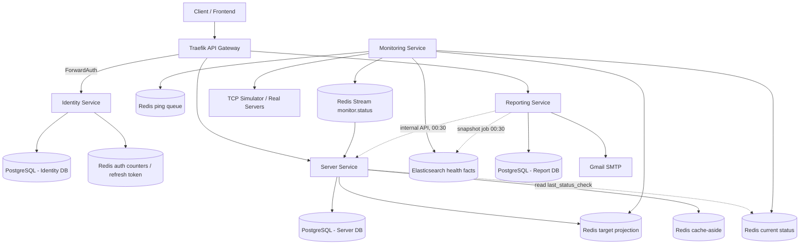

# Báo cáo mô tả và thiết kế hệ thống VCS Server Management System

**Tên hệ thống:** VCS Server Management System (VCS-SMS)
**Mục tiêu:** Quản lý danh sách khoảng 10.000 server, kiểm tra trạng thái định kỳ, tính uptime và gửi báo cáo cho quản trị viên.
**Phiên bản tài liệu:** 3.0
**Ngày cập nhật:** 16/07/2026

---

## Mục lục

1. [Tổng quan đề bài](#1-tổng-quan-đề-bài)
2. [Các bài toán quan trọng cần giải quyết](#2-các-bài-toán-quan-trọng-cần-giải-quyết)
3. [Nguyên tắc thiết kế](#3-nguyên-tắc-thiết-kế)
4. [Kiến trúc tổng thể](#4-kiến-trúc-tổng-thể)
5. [Phân rã service theo trách nhiệm](#5-phân-rã-service-theo-trách-nhiệm)
6. [Thiết kế dữ liệu và data ownership](#6-thiết-kế-dữ-liệu-và-data-ownership)
7. [Thiết kế Server Service](#7-thiết-kế-server-service)
8. [Thiết kế Monitoring Service](#8-thiết-kế-monitoring-service)
9. [Thiết kế Reporting Service](#9-thiết-kế-reporting-service)
10. [Thiết kế Identity Service](#10-thiết-kế-identity-service)
11. [Thiết kế Redis chi tiết](#11-thiết-kế-redis-chi-tiết)
12. [Thiết kế Elasticsearch cho uptime](#12-thiết-kế-elasticsearch-cho-uptime)
13. [Thiết kế API và response/error contract](#13-thiết-kế-api-và-responseerror-contract)
14. [Bảo mật và phân quyền](#14-bảo-mật-và-phân-quyền)
15. [Logging, observability và backup](#15-logging-observability-và-backup)
16. [OpenAPI, unit test và CI/CD](#16-openapi-unit-test-và-cicd)
17. [Phân tích Outbox, Reconciliation và các pattern phân tán](#17-phân-tích-outbox-reconciliation-và-các-pattern-phân-tán)
18. [Các phần cố ý chưa làm để tránh over-engineering](#18-các-phần-cố-ý-chưa-làm-để-tránh-over-engineering)
19. [Đối chiếu yêu cầu đề bài](#19-đối-chiếu-yêu-cầu-đề-bài)
20. [Kết luận](#20-kết-luận)

---

## 1. Tổng quan đề bài

Công ty VCS có khoảng **10.000 server** cần quản lý. Hệ thống VCS-SMS cung cấp API để người dùng quản lý danh sách server, kiểm tra trạng thái server định kỳ, tính uptime và gửi báo cáo cho quản trị viên.

Một server trong hệ thống có các thông tin cơ bản:

| Trường | Ý nghĩa |
|---|---|
| `server_id` | Mã định danh duy nhất của server |
| `server_name` | Tên duy nhất của server |
| `status` | Trạng thái hiện tại của server (ON/OFF/UNKNOWN) |
| `last_status_check` | Thời điểm server được kiểm tra lần gần nhất (display-only, đọc từ Redis — xem mục 6.3) |
| `status_changed_at` | Thời điểm status đổi giá trị lần gần nhất |
| `created_time` | Thời gian tạo server |
| `last_updated` | Thời gian cập nhật cuối |
| `ipv4` | Địa chỉ IPv4 của server |
| `tcp_port` | Cổng TCP dùng để kiểm tra trạng thái |
| `os`, `cpu_cores`, `ram_gb`, `disk_gb`, `location`, `description` | Các thông tin mở rộng phục vụ quản trị |

Hệ thống cần đáp ứng các nhóm chức năng chính:

1. Kiểm tra trạng thái server định kỳ.
2. Quản lý server: create, view, update, delete.
3. Import server từ Excel.
4. Export server ra Excel.
5. Báo cáo định kỳ qua email.
6. API báo cáo chủ động.
7. Đáp ứng các yêu cầu phi chức năng: OpenAPI, unit test coverage, chống SQL Injection, log file + logrotate, JWT + scope, Postgres, Redis Cache, Elasticsearch cho uptime.

---

## 2. Các bài toán quan trọng cần giải quyết

Đề bài không chỉ là CRUD đơn giản. Với quy mô 10.000 server và yêu cầu kiểm tra định kỳ, hệ thống phải giải quyết các bài toán quan trọng sau.

### 2.1 Quản lý catalog 10.000 server

Hệ thống phải lưu danh sách server, đảm bảo `server_id` và `server_name` không trùng, hỗ trợ filter, sort, pagination, import/export Excel và không bị SQL Injection.

**Cách giải quyết:**

- Server Service sở hữu bảng `servers` trong PostgreSQL.
- PostgreSQL là source of truth cho danh mục server.
- Redis không được dùng làm database nghiệp vụ chính.
- CRUD server dùng transaction và constraint ở database.
- List/export dùng chung `ServerQuerySpec` với allowlist filter/sort.

### 2.2 Kiểm tra trạng thái định kỳ cho 10.000 server

Nếu ping tuần tự 10.000 server, hệ thống có thể không hoàn thành trong 60 giây, đặc biệt khi nhiều server timeout.

**Cách giải quyết:**

- Monitoring Service chạy theo round 60 giây.
- Mỗi round, một instance thắng lock và nạp toàn bộ danh sách target vào Redis List.
- **Tất cả instance** (kể cả instance thắng lock) đều có worker pool lấy việc từ Redis List để ping song song.
- Kết quả ping được ghi vào Redis current status và Elasticsearch.

### 2.3 Tách danh sách server cần monitor và queue ping

Một điểm dễ nhầm là Redis target projection và Redis ping queue không phải một.

| Thành phần | Mục đích | Owner |
|---|---|---|
| Redis target projection | Trả lời câu hỏi: hiện có server nào cần monitor? | Server Service |
| Redis ping queue | Trả lời câu hỏi: trong round này worker nào ping server nào? | Monitoring Service |

Nếu chỉ đẩy server thay đổi vào queue ping thì server chỉ được ping khi create/update/delete, không đáp ứng yêu cầu kiểm tra định kỳ. Vì vậy hệ thống phải có target projection ổn định và queue tạm thời theo từng round.

### 2.4 Tính trạng thái ON/OFF/UNKNOWN

Đề bài cho phép tự định nghĩa server On/Off. Thiết kế chọn định nghĩa dựa trên TCP connect:

| Trạng thái | Định nghĩa |
|---|---|
| `ON` | Kết nối TCP thành công trong timeout cấu hình |
| `OFF` | Kết nối bị từ chối, lỗi mạng hoặc hết timeout |
| `UNKNOWN` | Server vừa được tạo, chưa từng được kiểm tra |

Hệ thống **không** dùng trạng thái dẫn xuất kiểu STALE. Thay vào đó, mỗi server có trường `last_status_check` cho biết thời điểm kiểm tra gần nhất. Dashboard hiển thị đồng thời `status` và `last_status_check`, để người vận hành tự đánh giá độ tin cậy của trạng thái. Cách này giữ data model đơn giản: chỉ có ba giá trị status hữu hạn, không có trạng thái phụ thuộc thời điểm đọc.

`last_status_check` **không** được lưu trong PostgreSQL. Monitoring vốn đã ghi `last_checked_at` vào `monitor:status:{id}` sau mỗi lần ping, nên API đọc thẳng từ đó. Lý do và ranh giới của quyết định này nằm ở mục 6.3.

### 2.5 Tính uptime và báo cáo

Uptime là dữ liệu lịch sử, không thể chỉ nhìn vào current status. Vì vậy hệ thống cần ghi lại các kết quả kiểm tra theo thời gian.

**Cách giải quyết:**

- Monitoring ghi mỗi kết quả ping hợp lệ vào Elasticsearch (kèm `server_name` denormalize).
- Job snapshot chạy 00:30 mỗi ngày: Reporting aggregate Elasticsearch bằng composite aggregation để tính uptime cho ngày hôm trước, rồi ghi vào bảng `daily_snapshots` trong PostgreSQL.
- Elasticsearch chỉ giữ raw fact 7 ngày (ILM). **Mọi báo cáo đều đọc từ `daily_snapshots`**, không query ES lúc chạy report (mục 9.2).
- Population của report lấy từ Server Service qua internal API phân trang, không suy ra từ dữ liệu ES — server chưa từng được ping vẫn phải xuất hiện với `no_data`.
- Báo cáo hiển thị coverage để không che giấu trường hợp thiếu dữ liệu.

### 2.6 Import partial success

Đề bài yêu cầu import Excel bỏ qua server đã tồn tại và trả danh sách thành công/thất bại. Vì vậy import không nên fail toàn bộ khi chỉ có một vài dòng lỗi.

**Cách giải quyết:**

- Lỗi cấp file: reject toàn bộ.
- Lỗi cấp dòng: chỉ loại dòng đó, các dòng hợp lệ vẫn được import.
- Duplicate `server_id`/`server_name`: đưa vào nhóm `skipped_duplicate`.
- Insert theo batch 500 dòng để hoàn thành trong thời gian một HTTP request.
- Batch nào dính unique violation do tranh chấp đồng thời thì fallback insert từng dòng cho riêng batch đó, không để một dòng làm hỏng 499 dòng còn lại (mục 7.8).

### 2.7 Đảm bảo consistency nhưng không dùng distributed transaction

Hệ thống có nhiều thành phần: PostgreSQL, Redis, Elasticsearch, SMTP. Không thể và không nên dùng distributed transaction cho tất cả.

**Cách giải quyết:**

- PostgreSQL là source of truth cho catalog **và là read model duy nhất cho status**.
- Redis projection có thể rebuild từ PostgreSQL.
- Redis Stream là at-least-once, consumer idempotent bằng `status_version`.
- Elasticsearch có thể thiếu fact khi outage, report phải hiển thị coverage/degraded.
- Email report có `report_jobs` state machine để tránh resend mù.

---

## 3. Nguyên tắc thiết kế

Hệ thống được thiết kế theo các nguyên tắc sau:

1. **PostgreSQL là source of truth** cho dữ liệu nghiệp vụ chính, bao gồm cả read model của status.
2. **Mỗi service sở hữu dữ liệu của mình**, service khác không đọc trực tiếp bảng của service đó.
3. **Một trường chỉ có một nguồn đọc.** Mỗi trường được đọc từ đúng một nơi. Trường có filter/sort đọc từ PostgreSQL; trường display-only có thể đọc từ Redis. Điều bị cấm là *cùng một trường* đến từ hai nguồn có thể lệch nhau (mục 6.3).
4. **Redis dùng đúng vai trò**: projection, queue, current status, cache-aside, rate-limit counter.
5. **Elasticsearch dùng cho lịch sử và aggregate uptime**, không dùng làm source of truth cho catalog.
6. **At-least-once delivery là mặc định**, consumer phải idempotent.
7. **Không dùng distributed transaction**, thay bằng eventual consistency có cơ chế tự sửa.
8. **Không thêm HA phức tạp khi chưa có SLO/metric yêu cầu**.
9. **API trả response/error thống nhất** để client xử lý nhất quán.
10. **Security by default**: JWT, scope riêng cho từng API, CIDR allowlist cho target monitoring, rate limit và audit log.
11. **Thiết kế có thể triển khai được**, không chỉ là sơ đồ kiến trúc.

---

## 4. Kiến trúc tổng thể



Lưu ý về sơ đồ:

- **Monitoring không có public endpoint**, nên không nằm sau Traefik. Yêu cầu "kiểm tra chủ động" của đề bài được hiểu là: người dùng gọi `GET /api/v1/servers` bất kỳ lúc nào để xem trạng thái mới nhất mà hệ thống đã kiểm tra, chứ không phải ép Monitoring ping ngay lập tức. Với chu kỳ 60 giây, độ mới của dữ liệu luôn nằm trong một phút.
- **`status` luôn đến từ PostgreSQL**, không bao giờ từ Redis (mục 6.3). Đường nét đứt `Server -.-> RedisStatus` chỉ đọc `last_status_check` — một trường display-only, không filter, không sort.
- **Hai đường nét đứt của Reporting chỉ chạy mỗi ngày một lần lúc 00:30**, không nằm trên đường đi của request người dùng. Lúc chạy report, Reporting chỉ đọc PostgreSQL của chính nó.

### 4.1 Thành phần chính

| Thành phần | Vai trò |
|---|---|
| Traefik | API Gateway, TLS, routing, ForwardAuth, rate limit |
| Identity Service | Login, JWT, RBAC, refresh token, brute-force protection |
| Server Service | CRUD/import/export server, quản lý catalog, Redis target projection, cache-aside, consume status event, internal API cho Reporting |
| Monitoring Service | Lập lịch ping, worker pool, TCP check, current status, publish event, ghi ES |
| Reporting Service | Job snapshot 00:30 (aggregate ES → `daily_snapshots`), tạo report từ snapshot, lưu report job, gửi email |
| PostgreSQL | Lưu dữ liệu nghiệp vụ bền vững |
| Redis | Target projection, queue ping, current status, stream event, cache, auth counters |
| Elasticsearch | Lưu lịch sử health facts (retention 7 ngày) để tính uptime |
| TCP Simulator | Test harness mô phỏng 10.000 server cho local/CI/staging |
| Gmail SMTP | Gửi email báo cáo |

---

## 5. Phân rã service theo trách nhiệm

### 5.1 Bảng phân rã service

| Service | Subdomain | Dữ liệu sở hữu | Trách nhiệm |
|---|---|---|---|
| Identity | Generic | users, roles, permissions | Xác thực, JWT, refresh token, RBAC, chống brute-force |
| Server | Supporting | servers, api_idempotency | CRUD/import/export, target projection, cache-aside, apply status event, cung cấp population qua internal API |
| Monitoring | Core | current status trong Redis, health facts trong ES | Lập lịch kiểm tra, TCP ping, phát hiện đổi trạng thái |
| Reporting | Supporting | report_jobs, daily_snapshots | Snapshot uptime hằng ngày, tạo report từ snapshot, gửi email |
| Traefik | Cross-cutting | Không sở hữu dữ liệu nghiệp vụ | Routing, ForwardAuth, rate limit, TLS |

### 5.2 Lý do không tách FileIO thành service riêng

Import/export Excel là adapter của Server Service, vì bản chất import là bulk mutation lên aggregate Server. Tách FileIO thành service riêng sẽ làm tăng độ phức tạp mà không đem lại lợi ích rõ ràng cho đề bài.

### 5.3 Lý do không dùng Kafka ở baseline

Hiện tại chỉ có một cặp producer/consumer chính cho status event:

```text
Monitoring Service → Redis Stream → Server Service
```

Redis Stream cung cấp đúng các primitive cần thiết: consumer group, at-least-once delivery, ACK, pending list và reclaim message mồ côi. Hệ thống có dùng consumer group — đây không phải thứ được né tránh.

Điều tránh được khi không dùng Kafka là **hạ tầng và ops overhead**: thêm một broker riêng, quản lý partition/replication factor, KRaft/ZooKeeper, schema registry, consumer rebalance tuning, và một backup/retention plane nữa. Với đúng một consumer group và lưu lượng event rất thấp (status chỉ đổi vài chục lần mỗi ngày trên 10.000 server ổn định), Redis Stream — vốn đã là dependency bắt buộc của hệ thống — là lựa chọn đủ và rẻ hơn nhiều.

Chỉ xem xét Kafka nếu sau này có nhiều consumer độc lập như Alerting, Audit pipeline, Analytics pipeline với retention và tốc độ tiêu thụ khác nhau.

---

## 6. Thiết kế dữ liệu và data ownership

### 6.1 Nguyên tắc ownership

Mỗi service có database riêng hoặc schema riêng, dùng DB user riêng. Không service nào đọc trực tiếp bảng của service khác. Khi cần dữ liệu từ service khác, dùng event, internal API có contract rõ ràng, hoặc denormalize tại thời điểm ghi.

### 6.2 Bản đồ dữ liệu

| Kho dữ liệu | Owner ghi | Consumer đọc | Nội dung |
|---|---|---|---|
| PostgreSQL Identity | Identity | Identity | users, roles, permissions |
| PostgreSQL Server | Server | Server | catalog server, status read model, lifecycle, idempotency |
| PostgreSQL Report | Reporting | Reporting | report_jobs, daily_snapshots, email outcome |
| Redis `server:monitor-target:*` | Server | Monitoring | projection active server_id, ipv4, tcp_port |
| Redis `monitor:status:*` | Monitoring | Monitoring (so sánh ping trước), Server (**chỉ** field `last_checked_at`) | current status |
| Redis `monitor:round:*` | Monitoring | Monitoring | round hiện tại, lock, ping queue |
| Redis `stream:monitor.status` | Monitoring | Server | event `status.changed` |
| Redis `server:list:cache:*` | Server | Server | cache metadata list/detail |
| Redis `auth:*` | Identity | Identity | login lockout, refresh token |
| Elasticsearch | Monitoring | Reporting (**chỉ** job snapshot 00:30) | immutable health facts (retention 7 ngày) |

Điểm quan trọng: `monitor:status:*` có hai consumer, nhưng đọc hai **field khác nhau** cho hai mục đích khác nhau — Monitoring đọc `status` để so sánh với lần ping trước, Server chỉ đọc `last_checked_at` để hiển thị. Không field nào bị hai nguồn cùng cung cấp. Xem mục 6.3.

### 6.3 Một nguồn đọc duy nhất cho mỗi trường

Đây là nguyên tắc quan trọng nhất của thiết kế, và nó có hai vế.

#### Vế 1: trường có filter/sort → PostgreSQL, không có ngoại lệ

Phiên bản đầu của thiết kế cho phép API list/detail đọc metadata từ PostgreSQL nhưng ghép `status` realtime từ Redis. Cách đó tạo ra một mâu thuẫn không thể sửa được ở tầng ứng dụng:

- Filter và sort theo status **buộc phải** chạy trên cột `status` của PostgreSQL, vì Redis không hỗ trợ filter/sort trên tập 10.000 key.
- Giá trị hiển thị lại lấy từ Redis.

Trong khoảng thời gian stream chưa consume xong, người dùng lọc `status=ON` nhưng nhận về dòng hiển thị `OFF`. Đây là bug lộ ngay khi demo.

**Quyết định:** PostgreSQL là read model duy nhất cho `status`.

```text
Monitoring ping
  → so sánh với monitor:status:{id}
  → nếu đổi: XADD stream:monitor.status
  → Server consumer: UPDATE servers SET status = ...
  → API đọc: SELECT ... FROM servers
```

Độ trễ end-to-end đo được dưới 1 giây, mục tiêu SLO là **dưới 5 giây**. So với chu kỳ ping 60 giây, độ trễ này không có ý nghĩa thực tế. Đổi lại, filter, sort và giá trị hiển thị luôn nhất quán vì cùng đến từ một câu SELECT.

#### Vế 2: trường display-only → đọc thẳng từ nơi nó được sinh ra

`last_status_check` **không** nằm trong bảng `servers`. Nó được đọc từ field `last_checked_at` của `monitor:status:{server_id}` — nơi Monitoring vốn đã ghi sẵn sau mỗi lần ping.

Đây **không** phải sự quay lại của vấn đề ở vế 1, và lý do nằm ở chỗ khác biệt then chốt: `last_status_check` được khai báo **display-only — không filter, không sort**. Nguyên tắc 3 nói *một trường chỉ có một nguồn đọc*; `last_status_check` có đúng một nguồn là Redis, nên nó tuân thủ nguyên tắc chứ không vi phạm. Nghịch lý ở vế 1 xảy ra vì `status` có **hai** nguồn cùng lúc, không phải vì nguồn đó là Redis.

Vì sao không lưu nó vào PostgreSQL cho đồng bộ? Vì cái giá rất cụ thể. Mọi server đều được ping trong mọi round, nên nếu lưu vào bảng `servers` thì:

- **10.000 UPDATE mỗi phút** = 14,4 triệu row update/ngày, để ghi 10.000 bản sao của cùng một con số.
- `list_version` bị bump **mỗi 60 giây** → toàn bộ cache-aside bị vô hiệu mỗi phút, biến Redis Cache thành vô dụng.
- Cần thêm một event `round.completed` mang danh sách 10.000 ID mỗi phút, kèm cơ chế gom danh sách server đã ping xong từ **mọi** instance Monitoring, kèm version guard riêng cho event đó.

Đọc thẳng từ Redis xóa cả ba cái giá này. Chi phí thay lại: list API pipeline thêm ~50 `HGET` cho các row của trang hiện tại (~1ms), detail API 1 `HGET`, export 10.000 `HGET` pipeline (~100ms).

**Hành vi degrade:** Redis chết thì `last_status_check` trả `null` và UI hiển thị `—`; `status` vẫn trả bình thường từ PostgreSQL. Một trường hiển thị mất giá trị, không có API nào chết.

#### Hệ quả lên cache

Cache-aside cache nguyên row từ PostgreSQL (gồm cả `status`), invalidate bằng `list_version`. `last_status_check` **không** nằm trong cache — nó luôn được đọc tươi từ Redis sau khi lấy row, dù cache hit hay miss. Vì `list_version` chỉ tăng khi có mutation thật hoặc khi status thực sự đổi (vài chục lần/ngày), cache có tỉ lệ hit cao.

### 6.4 Mức nhất quán chấp nhận

Hệ thống chấp nhận eventual consistency có kiểm soát:

- PostgreSQL commit thành công nhưng Redis projection update lỗi có thể tạo drift ngắn.
- Redis projection có thể rebuild từ PostgreSQL.
- Redis Stream có thể giao trùng, Server chỉ apply event có version mới hơn.
- Elasticsearch có thể thiếu dữ liệu khi outage, report hiển thị coverage/degraded.
- Cache-aside có thể stale tối đa bằng TTL hoặc đến khi `server:list:version` tăng.

Đây là thiết kế có cơ chế tự sửa, không phải distributed transaction.

---

## 7. Thiết kế Server Service

Server Service chịu trách nhiệm quản lý catalog server, cung cấp API CRUD/import/export, và duy trì read model của status.

### 7.1 Aggregate Server

| Trường | Kiểu gợi ý | Ghi chú |
|---|---|---|
| `id` | UUID/BIGINT | ID nội bộ |
| `server_id` | VARCHAR | Mã server, immutable, unique toàn cục |
| `server_name` | VARCHAR | Tên server, unique với server active |
| `ipv4` | INET | Địa chỉ IPv4 |
| `tcp_port` | INT | Cổng TCP cần monitor |
| `os` | VARCHAR | Hệ điều hành |
| `cpu_cores` | INT | Số core CPU |
| `ram_gb` | INT | RAM |
| `disk_gb` | INT | Dung lượng ổ đĩa |
| `location` | VARCHAR | Vị trí/datacenter |
| `description` | TEXT | Mô tả |
| `status` | ENUM | ON/OFF/UNKNOWN — read model, cập nhật qua event |
| `status_changed_at` | TIMESTAMPTZ NULL | Thời điểm status đổi giá trị |
| `status_version` | BIGINT | round_id mới nhất đã apply |
| `last_status_event_id` | VARCHAR | ID event cuối đã xử lý |
| `created_at` | TIMESTAMPTZ | Thời gian tạo |
| `updated_at` | TIMESTAMPTZ | Thời gian cập nhật |
| `deleted_at` | TIMESTAMPTZ NULL | Soft delete |

Server mới tạo có `status = UNKNOWN`, `status_changed_at = NULL`.

`last_status_check` **không** phải cột của bảng này. Nó là trường của response API, đọc từ Redis lúc serialize (mục 6.3, vế 2).

### 7.2 Constraint quan trọng

```sql
CREATE UNIQUE INDEX ux_servers_server_id
ON servers (server_id);

CREATE UNIQUE INDEX ux_servers_active_name
ON servers (server_name)
WHERE deleted_at IS NULL;

ALTER TABLE servers
ADD CONSTRAINT ck_servers_tcp_port
CHECK (tcp_port BETWEEN 1 AND 65535);

CREATE INDEX ix_servers_status
ON servers (status)
WHERE deleted_at IS NULL;
```

Giải thích:

- `server_id` unique toàn cục để ID đã soft delete không được tái sử dụng. Hệ quả có chủ đích: xóa nhầm rồi tạo lại đúng `server_id` sẽ trả 409. Đây là lựa chọn ưu tiên tính toàn vẹn lịch sử — `server_id` là mã định danh vật lý của một máy, tái sử dụng sẽ làm health fact cũ và mới lẫn vào nhau trong Elasticsearch. Nếu cần khôi phục, dùng thao tác vận hành restore thay vì tạo mới.
- `server_name` unique trên server active để cho phép giữ lịch sử server đã xóa.
- `tcp_port` giới hạn trong miền hợp lệ của TCP port.
- Index trên `status` phục vụ filter và `GET /servers/stats`.

### 7.3 CRUD server

#### Create server

```text
User → POST /api/v1/servers
→ Validate input (bao gồm CIDR allowlist cho ipv4)
→ Insert PostgreSQL trong transaction (status = UNKNOWN)
→ Commit
→ Update Redis target projection
→ Bump server:list:version
→ Return response
```

#### Update server

- Không cho phép cập nhật `server_id`.
- Không cho phép client cập nhật `status`, `status_changed_at` — các trường này do event driven. `last_status_check` không tồn tại trong DB nên cũng không thể cập nhật.
- Cho phép cập nhật `server_name`, `ipv4`, `tcp_port`, metadata khác.
- Sau khi update DB thành công, đồng bộ lại target projection và bump `list_version`.

#### Delete server

- Dùng soft delete bằng `deleted_at`.
- Public query mặc định lọc `deleted_at IS NULL`.
- Sau soft delete, remove server khỏi Redis target projection và bump `list_version`.

### 7.4 Đồng bộ Redis target projection

Redis target projection là danh sách server active mà Monitoring cần ping.

Create/update:

```text
HSET server:monitor-target:{server_id} ipv4 {ipv4} tcp_port {tcp_port}
SADD server:monitor-target:ids {server_id}
```

Delete:

```text
SREM server:monitor-target:ids {server_id}
DEL server:monitor-target:{server_id}
```

Thứ tự ghi có chủ đích:

- Create/update: ghi hash trước rồi mới add ID vào set, tránh Monitoring thấy ID nhưng chưa có metadata.
- Delete: remove ID khỏi set trước rồi mới xóa hash, tránh Monitoring tiếp tục lấy target đã xóa.

Nếu Redis lỗi, request vẫn có thể trả thành công vì PostgreSQL là source of truth. Hệ thống ghi log/metric và reconciliation sẽ sửa projection.

### 7.5 Rebuild target projection

Server Service có lệnh vận hành:

```bash
server-service rebuild-monitor-cache
```

Luồng rebuild:

1. Đọc tất cả active server từ PostgreSQL theo page.
2. Ghi target hash vào Redis bằng pipeline.
3. Dựng set tạm `server:monitor-target:ids:{generation}`.
4. Rename set tạm thành `server:monitor-target:ids`.
5. Đặt marker `server:monitor-target:ready = 1`.
6. Dọn hash mồ côi theo batch.

Monitoring chỉ bắt đầu schedule khi ready marker tồn tại.

### 7.6 Consumer status event

Server Service consume `stream:monitor.status` bằng consumer group. Mỗi replica là một consumer riêng, xác định bằng hostname.

```text
XGROUP CREATE stream:monitor.status server-svc $ MKSTREAM   (idempotent, lúc start)

Vòng lặp consumer:
  XREADGROUP GROUP server-svc {hostname} COUNT 100 BLOCK 2000 STREAMS stream:monitor.status >
  → apply status.changed với version guard
  → XACK stream:monitor.status server-svc {message_id}

Goroutine reclaim (mỗi 30 giây):
  XAUTOCLAIM stream:monitor.status server-svc {hostname} 60000 0 COUNT 100
```

`XAUTOCLAIM` với `min-idle-time = 60000` đảm bảo message của replica chết được replica khác nhận lại sau 60 giây.

Stream chỉ có **một** loại event: `status.changed`.

```sql
UPDATE servers
SET status = :status,
    status_changed_at = :changed_at,
    status_version = :version,
    last_status_event_id = :stream_id,
    updated_at = NOW()
WHERE server_id = :server_id
  AND deleted_at IS NULL
  AND status_version < :version;
```

Version guard (`status_version < :version`) xử lý được event trùng và event cũ đến sau event mới. Đây là điều kiện bắt buộc vì consumer group là at-least-once.

Nếu UPDATE có ảnh hưởng dòng, bump `server:list:version` để vô hiệu cache. Vì status chỉ đổi vài chục lần mỗi ngày trên 10.000 server ổn định, `list_version` gần như đứng yên và cache có tỉ lệ hit cao — trái ngược với thiết kế cũ nơi event mỗi phút làm cache vô dụng (mục 6.3).

### 7.7 Idempotency cho mutation

POST create và POST import yêu cầu `Idempotency-Key`.

Bảng `api_idempotency` lưu:

| Trường | Ý nghĩa |
|---|---|
| `actor_id` | Người gọi API |
| `endpoint` | Endpoint mutation |
| `idempotency_key` | Key client gửi |
| `request_hash` | Hash request body |
| `state` | processing/completed/failed |
| `status_code` | HTTP status đã trả |
| `response_body` | Response đã trả |
| `expires_at` | Thời điểm hết hạn |

Cùng key + cùng request hash trả lại response cũ. Cùng key + hash khác trả 409.

### 7.8 Import Excel

Import là đồng bộ trong một HTTP request, tối đa 10.000 dòng.

#### Template import

| Thứ tự | Cột | Bắt buộc |
|---:|---|---|
| 1 | `server_id` | Có |
| 2 | `server_name` | Có |
| 3 | `ipv4` | Có |
| 4 | `tcp_port` | Có |
| 5 | `os` | Không |
| 6 | `cpu_cores` | Không |
| 7 | `ram_gb` | Không |
| 8 | `disk_gb` | Không |
| 9 | `location` | Không |
| 10 | `description` | Không |

#### Lỗi cấp file

Các lỗi này reject toàn bộ file, trả `SERVER_IMPORT_FILE_REJECTED`:

- Không phải file `.xlsx` hợp lệ.
- File hỏng không parse được.
- Sai template.
- Vượt 10.000 data row.
- Vượt dung lượng hoặc uncompressed ZIP limit.
- Chứa macro, external link hoặc formula.

#### Lỗi cấp dòng

Các lỗi này chỉ loại dòng tương ứng, đưa vào nhóm `failed`:

- Thiếu field bắt buộc.
- IPv4 sai format.
- TCP port ngoài 1–65535.
- IP không thuộc CIDR allowlist.

Các dòng trùng đưa vào nhóm `skipped_duplicate`:

- Trùng `server_id` hoặc `server_name` trong DB.
- Trùng `server_id` hoặc `server_name` trong chính file.

#### Luồng xử lý

```text
1. Parse xlsx theo streaming reader, không load toàn bộ vào RAM
2. Validate từng dòng → tách nhóm valid / failed
3. Dedupe trong file (giữ dòng đầu tiên) → skipped_duplicate
4. Batch check trùng tên trong DB:
     SELECT server_name FROM servers
     WHERE server_name = ANY($1) AND deleted_at IS NULL
   → dòng trùng tên → skipped_duplicate
5. Batch insert 500 dòng/lần, mỗi batch một transaction riêng:
     INSERT INTO servers (server_id, server_name, ipv4, tcp_port, ..., status)
     VALUES (...), (...), ...
     ON CONFLICT (server_id) DO NOTHING
     RETURNING server_id
   → server_id không xuất hiện trong RETURNING = trùng ID → skipped_duplicate
   → nếu batch ném SQLSTATE 23505 trên ux_servers_active_name → fallback (xem dưới)
6. Update Redis target projection bằng pipeline
7. Bump server:list:version
8. Trả response
```

**Vì sao phải check trùng tên riêng ở bước 4:** PostgreSQL `ON CONFLICT` chỉ nhận **một** conflict target. Bảng `servers` có hai unique index (`server_id` toàn cục và partial unique trên `server_name` với server active). Không thể khai báo `ON CONFLICT` cho cả hai trong một câu lệnh, nên trùng tên được lọc trước bằng một query, còn trùng ID để `ON CONFLICT (server_id) DO NOTHING` xử lý.

**Race giữa bước 4 và bước 5 — bắt buộc phải xử lý:** giữa lúc `SELECT` check tên và lúc `INSERT` có một khoảng trống. Nếu một import khác hoặc một `POST /api/v1/servers` chèn trùng tên đúng lúc đó, `INSERT` ném unique violation trên `ux_servers_active_name` — mà `ON CONFLICT (server_id)` không bắt được. PostgreSQL abort **cả transaction**, và nếu không xử lý thì 500 dòng hợp lệ mất trắng, API trả 500 thay vì partial success. Đó đúng là thứ mục 2.6 muốn tránh.

Xử lý:

```text
Batch insert ném lỗi
→ kiểm tra SQLSTATE = 23505 và constraint_name = 'ux_servers_active_name'
→ rollback riêng batch đó, insert lại từng dòng một
     → dòng thành công  → succeeded
     → dòng ném 23505   → skipped_duplicate
→ các batch khác không bị ảnh hưởng
```

Fallback per-row chỉ chạy khi có tranh chấp thật, nên đường đi bình thường không tốn thêm gì. Mỗi batch phải là một transaction riêng để một batch hỏng không kéo theo batch khác.

#### Hiệu năng

Batch 500 dòng → 20 round-trip cho 10.000 dòng thay vì 10.000 round-trip.

| Giai đoạn | Thời gian đo (10.000 dòng) |
|---|---:|
| Parse xlsx | ~2s |
| Validate + dedupe | ~1s |
| Check trùng tên (1 query) | ~0,2s |
| Insert 20 batch | ~4s |
| Update Redis projection (pipeline) | ~0,5s |
| **Tổng** | **~8s** |

Route import cần timeout riêng ở Traefik:

```yaml
serversTransport:
  importTransport:
    forwardingTimeouts:
      responseHeaderTimeout: 120s
```

Response import trả thêm `meta.duration_ms` để đo được trên môi trường thật.

#### Response import

```json
{
  "status": "success",
  "code": 200,
  "message": "Import completed",
  "data": {
    "total_rows": 10000,
    "succeeded": {
      "count": 9940,
      "items": ["SRV-00001", "SRV-00002"]
    },
    "failed": {
      "count": 10,
      "items": [
        { "row": 42, "server_id": "SRV-00042", "reason": "INVALID_IPV4" }
      ]
    },
    "skipped_duplicate": {
      "count": 50,
      "items": ["SRV-00003"]
    }
  },
  "meta": {
    "request_id": "req-abc123",
    "duration_ms": 8120,
    "timestamp": "2026-07-16T10:00:00Z"
  }
}
```

### 7.9 Export Excel

Export dùng chung `ServerQuerySpec` với list API, chỉ bỏ pagination và chạy theo batch.

Các nguyên tắc:

- Không tự build SQL riêng cho export.
- Filter/sort dùng allowlist.
- Status lấy từ cột `status` của PostgreSQL, cùng nguồn với list API.
- `last_status_check` đọc từ Redis bằng pipeline theo batch (10.000 `HGET` pipeline ~100ms), giống list API.
- Cell bắt đầu bằng `=`, `+`, `-`, `@` phải escape để chống spreadsheet formula injection.

Export dùng `POST` thay vì `GET` dù là thao tác đọc, vì `ServerQuerySpec` có thể chứa filter phức tạp vượt giới hạn độ dài query string. Đây là lựa chọn có chủ đích, không phải nhầm lẫn về REST semantics.

### 7.10 List/detail và cache-aside

Vì status đã nằm trong PostgreSQL (mục 6.3, vế 1), cache-aside cache được nguyên row — filter, sort và pagination đều chạy trên một câu SELECT.

Luồng đọc:

1. Build `query_hash` từ `ServerQuerySpec` đã chuẩn hóa.
2. Đọc `server:list:version`.
3. GET cache theo key.
4. Cache hit → dùng row trong cache. Cache miss → query PostgreSQL, SET cache với TTL 30 giây.
5. **Dù hit hay miss**, pipeline `HGET monitor:status:{id} last_checked_at` cho các server_id của trang hiện tại (~50 key) để ghép `last_status_check`.

Bước 5 nằm ngoài cache có chủ đích: `last_status_check` đổi mỗi phút, cache nó sẽ hoặc trả giá trị cũ, hoặc buộc phải vô hiệu cache mỗi phút. Đọc tươi tốn ~1ms và giữ cache của các trường còn lại sống lâu.

Nếu Redis không phản hồi, `last_status_check` trả `null`; các trường còn lại vẫn trả bình thường từ PostgreSQL (mục 6.3).

Key cache:

```text
server:list:cache:{query_hash}:{list_version}
server:detail:cache:{server_id}:{list_version}
```

`list_version` tăng mỗi khi create/update/delete hoặc khi consumer apply `status.changed` → cache cũ bị vô hiệu ngay. TTL 30 giây chỉ là lớp bảo vệ thứ hai. Vì cả hai loại sự kiện này đều hiếm (mutation do người dùng, và vài chục lần đổi status mỗi ngày), cache thực sự phát huy tác dụng.

### 7.11 Public endpoint Server

| Method | Path | Scope |
|---|---|---|
| POST | `/api/v1/servers` | `server:create` |
| GET | `/api/v1/servers` | `server:list` |
| GET | `/api/v1/servers/{server_id}` | `server:view` |
| PUT | `/api/v1/servers/{server_id}` | `server:update` |
| DELETE | `/api/v1/servers/{server_id}` | `server:delete` |
| POST | `/api/v1/servers/import` | `server:import` |
| POST | `/api/v1/servers/export` | `server:export` |
| GET | `/api/v1/servers/stats` | `server:stats` |

`GET /api/v1/servers/stats` phục vụ dashboard:

```sql
SELECT status, COUNT(*)
FROM servers
WHERE deleted_at IS NULL
GROUP BY status;
```

Cache TTL 10 giây. Endpoint này trả số lượng ON/OFF **hiện tại** cho dashboard realtime. Báo cáo theo khoảng thời gian có số ON/OFF riêng, tính tại `end_at` của kỳ report và lấy từ nguồn khác — xem mục 9.4.

### 7.12 Internal endpoint cho Reporting

```http
GET /internal/servers?created_before=&deleted_after=&cursor=&limit=1000
```

Trả population server theo lifecycle, phân trang bằng cursor trên `server_id`:

```sql
SELECT server_id, server_name, created_at, deleted_at
FROM servers
WHERE created_at < :created_before
  AND (deleted_at IS NULL OR deleted_at > :deleted_after)
  AND server_id > :cursor
ORDER BY server_id
LIMIT :limit;
```

Response kèm `next_cursor`, rỗng khi hết trang.

Ba điểm về thiết kế endpoint này:

- **Cursor thay vì `?ids=`.** Phiên bản trước truyền toàn bộ ID cần lấy qua query string; với 10.000 `server_id` thì URL vượt giới hạn ~8KB của hầu hết proxy và HTTP server. Cursor pagination không có giới hạn đó và duyệt hết 10.000 server chỉ trong 10 request.
- **Chỉ Reporting gọi, mỗi ngày một lần lúc 00:30.** Endpoint không nằm trên đường đi của request người dùng, nên coupling ở đây rất nhẹ — đổi lại nó là thứ duy nhất cho phép report biết được "server nào tồn tại nhưng chưa từng được ping" (mục 9.2).
- **Route internal**, không publish ra public entrypoint của Traefik (mục 14.2).

---

## 8. Thiết kế Monitoring Service

Monitoring Service là core service, chịu trách nhiệm kiểm tra trạng thái server định kỳ. Service này không có public endpoint.

### 8.1 Mô hình chạy

Mỗi instance Monitoring chạy đồng thời hai loại goroutine:

- **1 scheduler goroutine**: mỗi 60 giây tranh lock để nạp queue cho round.
- **N worker goroutine** (mặc định 200): liên tục lấy việc từ queue để ping.

Điểm quan trọng: **instance thắng lock không làm hết việc ping**. Nó chỉ nạp queue, sau đó worker của nó ping cùng worker của tất cả instance khác. Instance thua lock vẫn ping bình thường.

```text
┌─ Instance A ───────────────┐  ┌─ Instance B ────────┐  ┌─ Instance C ────────┐
│ scheduler → thắng lock     │  │ scheduler → thua    │  │ scheduler → thua    │
│           → nạp queue      │  │           → bỏ qua  │  │           → bỏ qua  │
│ 200 worker goroutine ──────┼──┤ 200 worker ─────────┼──┤ 200 worker ─────────┤
└──────────────┬─────────────┘  └──────────┬──────────┘  └──────────┬──────────┘
               └───────────────────────────┴────────────────────────┘
                                      │
                        BRPOP monitor:ping:queue:{round_id}
```

### 8.2 Redis contract của Monitoring

| Key | Kiểu | Owner | TTL | Ý nghĩa |
|---|---|---|---|---|
| `server:monitor-target:ready` | String | Server | — | Marker projection sẵn sàng |
| `server:monitor-target:ids` | Set | Server | — | Danh sách active server ID |
| `server:monitor-target:{id}` | Hash | Server | — | Metadata cần ping: ipv4, tcp_port |
| `monitor:round:lock:{round_id}` | String | Monitoring | 120s | Lock để một scheduler nạp một round |
| `monitor:round:current` | String | Monitoring | 120s | Round hiện tại, worker đọc key này |
| `monitor:ping:queue:{round_id}` | List | Monitoring | 120s | Work queue riêng của round |
| `monitor:status:{id}` | Hash | Monitoring | — | Current status; Server đọc field `last_checked_at` để hiển thị (mục 6.3) |
| `stream:monitor.status` | Stream | Monitoring | MAXLEN ~ 100000 | Event `status.changed` |

TTL 120 giây cho lock/queue/current tương đương 2 round. Đây là điểm sửa quan trọng: phiên bản trước không có TTL, sinh 1440 key rác mỗi ngày tồn tại vĩnh viễn.

`monitor:status:{id}` **không** đặt TTL. Nếu đặt, key tự hết hạn sẽ khiến lần ping sau bị coi là "đổi trạng thái" và phát event thừa.

### 8.3 Scheduler goroutine

Chạy trên mọi instance, mỗi 60 giây:

```text
Redis TIME → round_id = floor(redis_unix_seconds / 60)

SET monitor:round:lock:{round_id} 1 NX EX 120
  ├─ thất bại → không làm gì; worker của instance này vẫn ping bình thường
  └─ thành công:
       kiểm tra server:monitor-target:ready, nếu chưa có → bỏ round này
       SSCAN server:monitor-target:ids COUNT 500
       → RPUSH monitor:ping:queue:{round_id} (pipeline, batch 500 phần tử)
       EXPIRE monitor:ping:queue:{round_id} 120
       SET monitor:round:current {round_id} EX 120
       ghi metric targets_expected
```

Dùng `SSCAN` thay vì `SMEMBERS` để không block Redis khi set lớn. `RPUSH` chia batch 500 phần tử qua pipeline thay vì một lệnh 10.000 argument.

Thứ tự có chủ đích: nạp queue **xong** rồi mới `SET monitor:round:current`, để worker không nhìn thấy round mới với queue rỗng.

Dùng thời gian từ `Redis TIME` chứ không dùng đồng hồ cục bộ, để các instance thống nhất `round_id` kể cả khi clock drift.

### 8.4 Worker goroutine

```text
vòng lặp:
  round = GET monitor:round:current
  nếu round rỗng → sleep 1s, lặp lại

  server_id = BRPOP monitor:ping:queue:{round} timeout=1
    ├─ timeout/rỗng → lặp lại (đọc lại monitor:round:current)
    └─ có việc:
         HGETALL server:monitor-target:{server_id}
         → nếu hash rỗng (server vừa bị xóa) → bỏ qua
         → TCP dial ipv4:tcp_port, timeout 3s
         → status = ON nếu connect thành công, OFF nếu ngược lại
         → chạy Lua script cập nhật monitor:status:{server_id}
         → đẩy health fact vào bulk buffer ES
```

**Cơ chế chuyển round** nằm gọn ở hai chi tiết:

1. Worker **không nhớ** round. Mỗi vòng lặp đọc lại `monitor:round:current`.
2. `BRPOP` dùng timeout ngắn (1 giây), không block vô hạn.

Khi round mới bắt đầu, worker đọc `monitor:round:current` thấy giá trị mới và tự chuyển sang queue mới. Việc còn sót trong queue round cũ bị TTL dọn — đây là hành vi **đúng**, vì ping của một round đã trôi qua là vô nghĩa: nó sẽ ghi ES với `round_id` cũ và có thể ghi đè `monitor:status` bằng dữ liệu lỗi thời.

Không cần fencing token, không cần graceful drain, không cần trạng thái nào khác.

### 8.5 Capacity planning

Công thức sizing:

```text
worker_goroutines >= ceil(total_targets × worst_case_ping_seconds / round_seconds)
```

Với 10.000 target, timeout 3 giây, round 60 giây:

```text
worker_goroutines >= ceil(10000 × 3 / 60) = 500
```

Cộng 20% headroom → **600 goroutine**, triển khai bằng **3 instance × 200 goroutine**.

**Lưu ý quan trọng về thuật ngữ:** "worker" ở đây là **goroutine**, không phải process hay container. 200 goroutine chờ I/O trong một process Go là chuyện bình thường — chi phí mỗi goroutine chỉ vài KB stack. Hệ thống không cần 500 container.

Metric bắt buộc:

| Metric | Ý nghĩa |
|---|---|
| `round_duration` | Thời gian hoàn thành một round |
| `targets_expected` | Số target scheduler nạp vào queue |
| `checks_completed` | Số ping hoàn thành trong round |
| `checks_missing` | `LLEN monitor:ping:queue:{round_id}` đo lúc round kết thúc — số việc chưa kịp ping |
| `queue_depth` | Độ sâu queue hiện tại |
| `tcp_latency` | Histogram độ trễ TCP connect |
| `es_bulk_failure` | Số lần bulk write ES thất bại |

`checks_missing > 0` liên tục là tín hiệu cần tăng worker hoặc instance.

### 8.6 Cập nhật current status atomically

Sau mỗi TCP result, Lua script thực hiện atomically:

1. Đọc `round_id` và `status` hiện tại trong `monitor:status:{server_id}`.
2. Nếu incoming `round_id` cũ hơn hoặc bằng current round → bỏ qua (chống out-of-order).
3. `HSET` status, `last_checked_at`, `latency_ms`, `round_id`.
4. Nếu status khác previous status → `XADD stream:monitor.status MAXLEN ~ 100000 *` với event `status.changed`.

Gộp bước 3 và 4 trong một script giúp tránh dual-write window giữa current status và status event.

### 8.7 Event schema

#### `status.changed`

Phát khi trạng thái ON/OFF thực sự đổi. Lần check đầu tiên (UNKNOWN → ON/OFF) cũng phát event.

| Field | Ý nghĩa |
|---|---|
| `schema_version` | Version schema event |
| `event_type` | `status.changed` |
| `event_id` | ID event |
| `server_id` | Server bị đổi trạng thái |
| `status` | ON/OFF mới |
| `changed_at` | Thời điểm đổi trạng thái |
| `checked_at` | Thời điểm check |
| `status_version` | round_id |
| `trace_id` | Trace correlation |

Lưu lượng thực tế rất thấp: với 10.000 server ổn định, status chỉ đổi vài chục lần mỗi ngày.

#### Vì sao chỉ có một loại event

`status.changed` chỉ phát khi status **đổi**, nên nó không thể dùng để duy trì `last_status_check` — trường này đổi mỗi phút cho cả 10.000 server. Thiết kế trước từng giải quyết bằng một event `round.completed` mang danh sách server đã ping xong trong round. Cách đó bị bỏ vì ba lý do, xếp theo mức nghiêm trọng:

1. **Nó không chạy được như mô tả.** Worker của *mọi* instance cùng ăn chung một queue (mục 8.1), nên instance thắng lock chỉ biết những server mà worker của chính nó đã ping. Muốn gom đủ danh sách phải thêm một set `monitor:round:done:{round_id}` và một pha đọc-gom-publish giữa các round — thêm hẳn một cơ chế đồng bộ liên instance.
2. **Nó làm Redis Cache trở nên vô dụng.** Consumer apply event mỗi phút → bump `list_version` mỗi phút → toàn bộ cache list/detail bị vô hiệu mỗi 60 giây.
3. **Nó tạo 14,4 triệu row update/ngày** trên PostgreSQL để ghi 10.000 bản sao của cùng một mốc thời gian.

Cách giải quyết: **không truyền `last_status_check` qua event nữa.** Monitoring đã ghi `last_checked_at` vào `monitor:status:{id}` sau mỗi ping; Server Service đọc thẳng field đó lúc serialize response (mục 6.3, vế 2). Một quyết định xóa được cả ba vấn đề trên, và xóa luôn một event schema khỏi hệ thống.

### 8.8 Ghi Elasticsearch

Monitoring ghi ES bằng bounded bulk buffer:

- Batch 1.000 document hoặc flush mỗi 5 giây, tùy điều kiện nào đến trước.
- Retry có bound cho 429/5xx với exponential backoff.
- Nếu ES outage dài, buffer **không** tăng vô hạn — drop và ghi metric `es_bulk_failure`.
- **Current status path không chờ Elasticsearch.** Ping → cập nhật Redis → phát event là đường độc lập; ghi ES là đường phụ.

Nếu thiếu health fact, report hiển thị coverage thấp/degraded (mục 9.5).

### 8.9 TCP Simulator

TCP Simulator là test harness cho local/CI/staging, không phải microservice nghiệp vụ.

Vai trò:

- Mô phỏng 10.000 server bằng 10.000 TCP listener.
- Dải port cố định: 9001–19000.
- Mapping: `SRV-00001 → 9001`, ..., `SRV-10000 → 19000`.
- Mô phỏng ON/OFF theo pattern để load test monitoring.

Production không chạy TCP Simulator; `ipv4/tcp_port` trỏ đến server thật.

---

## 9. Thiết kế Reporting Service

Reporting Service tạo báo cáo định kỳ và báo cáo chủ động.

### 9.1 Ngữ nghĩa thời gian

Mọi report dùng interval half-open:

```text
[start_at, end_at)
```

Input ngày được đổi theo timezone `Asia/Ho_Chi_Minh`, sau đó query Elasticsearch bằng UTC.

### 9.2 Nguồn dữ liệu: mọi report đọc từ `daily_snapshots`

Đề bài quy định input của report là **ngày** bắt đầu và ngày kết thúc. Kết hợp với việc job snapshot chạy 00:30 mỗi ngày cho ngày hôm trước, ta có một tính chất rất mạnh:

> Mọi report hợp lệ đều nằm trọn trong các ngày đã có snapshot.

Vì vậy thiết kế chọn phân tách dứt khoát:

```text
Job snapshot (00:30 hằng ngày)  : Elasticsearch + internal API → daily_snapshots
Report (định kỳ và chủ động)    : daily_snapshots → response/email
```

**Reporting không query Elasticsearch lúc chạy report.** Điều này xóa bỏ: logic routing ES/snapshot theo tuổi dữ liệu, logic hợp nhất hai nguồn khi khoảng report bắc cầu qua ranh giới 7 ngày, và trường hợp ES chết làm API report chết. ES chết chỉ ảnh hưởng job snapshot đêm nay, không ảnh hưởng report của những ngày đã snapshot.

Yêu cầu "Sử dụng Elasticsearch để tính toán thời gian Uptime" của đề bài vẫn được đáp ứng nguyên vẹn: ES vẫn là thứ tính uptime bằng composite aggregation (mục 12.5), chỉ là tính lúc 00:30 thay vì lúc có người bấm nút.

**Ràng buộc kèm theo:** `start_date` và `end_date` phải là ngày **đã kết thúc** theo `Asia/Ho_Chi_Minh`. Report có `end_date` là hôm nay bị từ chối bằng `REPORT_INVALID_RANGE`. Đây là ràng buộc đúng về ngữ nghĩa: "tỉ lệ uptime của một ngày chưa trôi qua" là câu hỏi chưa có câu trả lời. Ai cần biết trạng thái ngay lúc này thì dùng `GET /api/v1/servers/stats` (mục 7.11).

#### Population lấy từ Server Service, không suy ra từ fact

Job snapshot gọi `GET /internal/servers` (mục 7.12) theo cursor, 10 request cho 10.000 server, rồi **LEFT JOIN** population với kết quả aggregate ES:

```text
population (từ internal API)  ⟕  aggregate ES (theo server_id)
  → server có fact      → on_checks, actual_checks từ ES
  → server không có fact → actual_checks = 0, uptime_pct = NULL → servers_no_data
```

Đây là lý do population **không** được suy ra từ chính dữ liệu ES. Nếu làm vậy, một server tồn tại nhưng chưa từng được ping sẽ không nằm trong population, nên cũng không đóng góp vào `expected_checks` — tử số và mẫu số cùng bỏ qua nó, `coverage_pct` không đổi, và server **biến mất khỏi báo cáo một cách im lặng**. Đúng thứ mà toàn bộ triết lý "coverage thay vì che giấu" muốn chống lại. Population phải đến từ nguồn độc lập với dữ liệu đo thì mới phát hiện được lỗ hổng trong dữ liệu đo.

Lifecycle của population:

```sql
created_at < :end_at
AND (deleted_at IS NULL OR deleted_at > :start_at)
```

Nhờ vậy `expected_checks` tính đúng cho cả server được tạo giữa kỳ — nó kỳ vọng ít check hơn server tồn tại suốt kỳ.

#### Denormalize `server_name`

`server_name` được ghi kèm ở hai nơi: trong health fact document của Elasticsearch (Monitoring ghi khi ping) và trong `daily_snapshots` (Reporting ghi khi tạo snapshot).

Ngoài việc làm report tự đủ, denormalize còn có lợi ích ngữ nghĩa: báo cáo lịch sử hiển thị đúng tên **tại thời điểm đó**, kể cả khi server sau này bị đổi tên hoặc xóa.

### 9.3 Bảng `daily_snapshots`

```sql
CREATE TABLE daily_snapshots (
    server_id       VARCHAR      NOT NULL,
    date            DATE         NOT NULL,
    server_name     VARCHAR      NOT NULL,   -- denormalize, tên tại thời điểm snapshot
    on_checks       INT          NOT NULL,
    actual_checks   INT          NOT NULL,   -- 0 nếu server không có fact nào
    expected_checks INT          NOT NULL,   -- theo lifecycle của server trong ngày
    uptime_pct      NUMERIC(5,2) NULL,       -- NULL khi actual_checks = 0 (no_data)
    last_status     VARCHAR      NULL,       -- ON/OFF: status cuối cùng trong ngày; NULL khi no_data
    created_at      TIMESTAMPTZ  NOT NULL DEFAULT NOW(),
    PRIMARY KEY (server_id, date)
);

CREATE INDEX ix_daily_snapshots_date_uptime
ON daily_snapshots (date, uptime_pct);
```

Ba lựa chọn kiểu dữ liệu có chủ đích:

- `uptime_pct` **nullable**. Server không có fact nào thì uptime của nó không phải 0% — nó là *không biết*. Dùng 0 sẽ kéo `avg_uptime_pct` xuống và biến một sự cố thu thập dữ liệu thành một báo cáo sai. `NULL` khiến `AVG()` tự bỏ qua nó, đúng ngữ nghĩa "trung bình trên các server có data".
- `last_status` nullable, phục vụ `servers_on_at_end_at` / `servers_off_at_end_at` (mục 9.4) cho báo cáo cũ hơn 7 ngày, khi raw fact trong ES đã bị ILM xóa.
- `expected_checks` lưu per-row vì mỗi server có lifecycle riêng — server tạo lúc 18:00 chỉ kỳ vọng 360 check trong ngày, không phải 1.440.

10.000 row/ngày → PostgreSQL giữ được nhiều năm mà không cần partition. Index `(date, uptime_pct)` phục vụ truy vấn top N uptime thấp nhất.

Job snapshot chạy 00:30 `Asia/Ho_Chi_Minh` cho ngày hôm trước, ghi bằng `INSERT ... ON CONFLICT (server_id, date) DO UPDATE` để rerun được an toàn.

### 9.4 Công thức uptime và các chỉ số report

Với mỗi server có data:

```text
uptime_pct = on_checks / actual_checks × 100
```

Aggregate report:

| Field | Ý nghĩa |
|---|---|
| `total_servers` | Tổng server thuộc population của report (mục 9.2) |
| `servers_on_at_end_at` | Số server có status cuối kỳ là ON |
| `servers_off_at_end_at` | Số server có status cuối kỳ là OFF |
| `avg_uptime_pct` | Uptime trung bình trên các server có data |
| `servers_uptime_100` | Số server có uptime 100% |
| `servers_uptime_partial` | Số server uptime > 0% và < 100% |
| `servers_uptime_0` | Số server có data nhưng uptime 0% |
| `servers_no_data` | Server thuộc population nhưng không có fact nào |
| `expected_checks` | Tổng `expected_checks` của population, tính theo lifecycle từng server |
| `actual_checks` | Tổng `actual_checks` của population |
| `coverage_pct` | `actual_checks / expected_checks × 100` |
| `top_10_lowest_uptime` | 10 server có uptime thấp nhất, kèm `server_name` |

Ba nhóm bất biến giúp bắt lỗi sớm khi test:

```text
total_servers = servers_uptime_100 + servers_uptime_partial + servers_uptime_0 + servers_no_data
total_servers = servers_on_at_end_at + servers_off_at_end_at + servers_no_data
avg_uptime_pct chỉ tính trên (total_servers - servers_no_data) server
```

#### Về `servers_on_at_end_at` / `servers_off_at_end_at`

Đề bài yêu cầu báo cáo có "Số lượng server On" và "Số lượng server Off". Hai trường này đáp ứng đúng yêu cầu đó, nhưng **tên của chúng cố ý dài** để không ai hiểu nhầm ý nghĩa:

> Số lượng ON/OFF là **ảnh chụp tại một thời điểm** — ở đây là thời điểm cuối kỳ report. Nó không đại diện cho cả khoảng thời gian. Một server ON tại 23:59 có thể đã OFF suốt 8 tiếng trước đó. Chỉ số phản ánh đúng chất lượng một khoảng thời gian là **uptime %**, và phân bố uptime (`servers_uptime_100/partial/0`) cho biết chi tiết hơn nhiều so với hai con số ON/OFF. Vì vậy báo cáo trả cả hai: ON/OFF vì đó là thứ được hỏi, phân bố uptime vì đó là thứ thực sự trả lời câu hỏi "hôm qua hệ thống thế nào".

Nguồn dữ liệu của hai trường này là cột `last_status` trong `daily_snapshots`, vốn được job snapshot lấy từ `top_hits` sort `checked_at: desc` — chính aggregation đã dùng để lấy `server_name`, nên chi phí bằng 0 (mục 12.5).

Lưu ý phân biệt với `GET /api/v1/servers/stats`: endpoint đó trả số ON/OFF **hiện tại** cho dashboard realtime; hai trường ở đây trả số ON/OFF **tại cuối kỳ report**. Hai câu hỏi khác nhau, hai nguồn khác nhau, và tên của chúng phải phản ánh điều đó.

### 9.5 Coverage

```text
coverage_pct = actual_checks / expected_checks × 100
```

Nếu coverage thấp hơn threshold (mặc định 95%), report có trạng thái `degraded` và email hiển thị cảnh báo. Coverage khiến việc thiếu dữ liệu trở nên **nhìn thấy được** thay vì bị che giấu bằng một con số uptime đẹp nhưng vô nghĩa.

Coverage chỉ hoạt động được vì `expected_checks` đến từ population độc lập (internal API), không suy ra từ dữ liệu ES. Một server không có fact nào vẫn đóng góp `expected_checks` của nó vào mẫu số nhưng không đóng góp gì vào tử số → coverage tụt xuống và `servers_no_data` tăng lên. Nếu population suy ra từ chính fact, server đó sẽ biến mất khỏi cả tử số lẫn mẫu số và coverage không đổi — xem mục 9.2.

### 9.6 Nội dung email báo cáo

```text
Báo cáo VCS-SMS — ngày 15/07/2026
────────────────────────────────────────────
Tổng số server trong hệ thống:        10.000
Số server On  (lúc 23:59:59):          9.940
Số server Off (lúc 23:59:59):             58
Uptime trung bình:                     99,2%

Phân bố uptime trong ngày
  Uptime 100%:                          9.512
  Uptime một phần:                        428
  Uptime 0%:                               60
  Không có dữ liệu:                         2

Top 10 server có uptime thấp nhất
  SRV-04412   web-prod-12          0,0%
  SRV-08871   db-replica-3         2,1%
  SRV-01923   cache-node-7        11,4%
  ...

Coverage dữ liệu:                      99,8%
────────────────────────────────────────────
VCS Server Management System
```

Bốn dòng đầu là đúng bốn thông tin đề bài yêu cầu: tổng số server, số On, số Off, uptime trung bình. Phần còn lại là thông tin bổ sung giúp báo cáo thực sự dùng được. Nhãn "(lúc 23:59:59)" hiển thị ngay trong email để người đọc không hiểu nhầm đó là số liệu đại diện cho cả ngày (mục 9.4).

Top 10 lấy bằng một query:

```sql
SELECT server_id, server_name, uptime_pct
FROM daily_snapshots
WHERE date = :report_date
  AND uptime_pct IS NOT NULL
ORDER BY uptime_pct ASC, server_id ASC
LIMIT 10;
```

Điều kiện `uptime_pct IS NOT NULL` loại server `no_data` khỏi bảng xếp hạng — chúng đã được đếm riêng ở dòng "Không có dữ liệu", và xếp chúng vào top uptime thấp nhất sẽ là khẳng định sai về thứ ta không đo được.

Nếu `coverage_pct` dưới threshold, email thêm dòng cảnh báo ở đầu:

```text
⚠ CẢNH BÁO: Coverage chỉ đạt 82,3%. Số liệu uptime có thể không đầy đủ.
```

### 9.7 Report job state machine

Bảng `report_jobs`:

| Field | Ý nghĩa |
|---|---|
| `id` | ID job |
| `report_type` | daily/on-demand |
| `requester_id` | Người yêu cầu |
| `idempotency_key` | Idempotency key |
| `start_at`, `end_at` | Khoảng report |
| `recipient_email` | Email nhận report |
| `state` | processing/generated/sending/sent/failed/delivery_unknown |
| `response_json` | Kết quả report |
| `smtp_message_id` | Message-ID email |
| `created_at`, `updated_at`, `sent_at` | Thời gian xử lý |

```text
processing → generated → sending → sent
                              ├──→ failed
                              └──→ delivery_unknown
```

### 9.8 Xử lý email mơ hồ

Khi gửi SMTP, có thể mất kết nối sau khi gửi DATA nhưng trước khi nhận response. Khi đó không biết email đã được mail server nhận chưa.

Thiết kế xử lý bằng state `delivery_unknown`:

- Không retry mù.
- Operator kiểm tra Message-ID trong log hoặc trong hộp thư Sent của tài khoản Gmail.
- Nếu cần gửi lại thì tạo job mới với `Idempotency-Key` mới.

### 9.9 Gửi email qua Gmail SMTP

Hệ thống dùng trực tiếp Gmail SMTP, không dùng MailHog.

```text
SMTP_HOST=smtp.gmail.com
SMTP_PORT=587
SMTP_TLS=starttls
SMTP_USERNAME=<account>@gmail.com
SMTP_PASSWORD=<App Password 16 ký tự, không dấu cách>
SMTP_FROM=<account>@gmail.com
```

**Yêu cầu bắt buộc:** Google đã ngừng hỗ trợ "less secure apps". Tài khoản phải bật **2-Step Verification**, sau đó tạo **App Password** tại Google Account → Security → 2-Step Verification → App passwords. Hệ thống dùng App Password này, **không** dùng mật khẩu tài khoản.

Các ràng buộc cần lưu ý:

| Vấn đề | Xử lý |
|---|---|
| Giới hạn ~500 email/ngày (Gmail free) | Daily report chỉ 1 email/ngày → thoải mái. `POST /api/v1/reports` cần rate limit chặt ở Traefik để không bị spam chạm giới hạn |
| Message-ID | Gmail trả `250 2.0.0 OK <message-id>` → parse được, giữ nguyên logic `smtp_message_id` và state `delivery_unknown` |
| Bảo mật credential | App Password **không commit vào repo**. Dùng `.env` trong `.gitignore` kèm `.env.example`; production dùng Docker secret |
| Spam relay | Giữ allowlist domain cho `recipient_email`. Với SMTP thật, đây là bảo vệ chống hệ thống bị lợi dụng làm relay. Vi phạm trả `REPORT_RECIPIENT_NOT_ALLOWED` |

### 9.10 Endpoint Reporting

| Method | Path | Scope |
|---|---|---|
| GET | `/api/v1/reports/summary` | `report:view` |
| POST | `/api/v1/reports` | `report:send` |
| GET | `/api/v1/reports/{id}` | `report:view_detail` |

Daily report job chạy 10:00 `Asia/Ho_Chi_Minh` và báo cáo cho ngày hôm trước, sau khi job snapshot 00:30 đã hoàn thành.

Validate input của `POST /api/v1/reports`, trả `REPORT_INVALID_RANGE` nếu vi phạm:

- `start_date` và `end_date` là ngày hợp lệ theo `Asia/Ho_Chi_Minh`.
- `start_date <= end_date`.
- `end_date < hôm nay` — ngày chưa kết thúc thì chưa có snapshot và uptime chưa có nghĩa (mục 9.2).
- Khoảng report không vượt 31 ngày (chặn query quét quá rộng).

Nếu khoảng hợp lệ nhưng thiếu snapshot của một ngày nào đó (job 00:30 hôm đó fail), trả `REPORT_DATA_UNAVAILABLE` kèm danh sách ngày thiếu, thay vì âm thầm báo cáo trên dữ liệu khuyết.

---

## 10. Thiết kế Identity Service

Identity Service quản lý xác thực và phân quyền.

### 10.1 Mô hình dữ liệu

| Bảng | Nội dung |
|---|---|
| `users` | email, password_hash, role_id |
| `roles` | role name |
| `permissions` | scope |
| `role_permissions` | mapping role-scope |

Password dùng Argon2id. Email có unique constraint ở database.

### 10.2 JWT và refresh token

- Access token là JWT, sống ngắn (15 phút), chứa scope snapshot.
- Refresh token là opaque token, lưu digest trong Redis.
- Refresh rotation dùng Lua script atomic để tránh reuse race.
- Logout xóa refresh token.

### 10.3 Brute-force protection

Identity kết hợp:

- Rate limit theo IP tại Traefik.
- Account-level lockout theo email trong Redis.

Redis key:

```text
auth:login-fail:{email}
auth:login-lock:{email}
```

Sau nhiều lần login sai trong cửa sổ 15 phút, account bị khóa tạm.

### 10.4 Endpoint Identity

| Method | Path | Quyền |
|---|---|---|
| POST | `/api/v1/auth/register` | Public local/CI, tắt mặc định production |
| POST | `/api/v1/auth/login` | Public |
| POST | `/api/v1/auth/refresh` | Public + refresh cookie + CSRF |
| POST | `/api/v1/auth/logout` | Authenticated + CSRF |
| GET | `/api/v1/auth/profile` | Authenticated (không cần scope — mọi user đọc chính mình) |
| GET | `/api/v1/auth/users` | `user:list` |
| PUT | `/api/v1/auth/users/{id}/role` | `user:manage_role` |
| GET | `/internal/verify` | Chỉ ForwardAuth/internal |

---

## 11. Thiết kế Redis chi tiết

Redis được dùng cho nhiều mục đích khác nhau, nhưng mỗi namespace có owner rõ ràng.

### 11.1 Redis target projection

Target projection trả lời câu hỏi:

```text
Hiện tại có những server nào cần monitor?
```

Key:

```text
server:monitor-target:ids          (Set)
server:monitor-target:{server_id}  (Hash: ipv4, tcp_port)
server:monitor-target:ready        (String marker)
```

Không dùng `KEYS server:monitor-target:*` vì `KEYS` block Redis và scan toàn keyspace. Thay vào đó dùng Set `server:monitor-target:ids` làm index rõ ràng, và duyệt bằng `SSCAN`.

### 11.2 Redis ping queue

Ping queue trả lời câu hỏi:

```text
Trong round này, worker nào lấy server nào để ping?
```

Key:

```text
monitor:round:current              (String, TTL 120s)
monitor:round:lock:{round_id}      (String, TTL 120s)
monitor:ping:queue:{round_id}      (List,   TTL 120s)
```

Queue được tạo mới mỗi round từ target projection, và tự biến mất theo TTL.

### 11.3 Vì sao không đẩy server thay đổi thẳng vào ping queue?

Nếu create/update/delete server rồi push vào ping queue, server chỉ được ping khi metadata thay đổi. Nhưng đề bài yêu cầu kiểm tra **định kỳ**. Một server không thay đổi metadata trong nhiều ngày vẫn phải được ping mỗi 60 giây.

Vì vậy thiết kế tách:

```text
Target projection = ping ai        (bền, do Server Service duy trì)
Ping queue        = round này chia việc ping thế nào  (tạm, do Monitoring tạo mỗi phút)
```

### 11.4 Redis current status

Key:

```text
monitor:status:{server_id}
```

| Field | Ý nghĩa |
|---|---|
| `status` | ON/OFF |
| `last_checked_at` | Thời điểm check cuối |
| `latency_ms` | Độ trễ TCP connect |
| `round_id` | Round đã cập nhật |

**Owner ghi duy nhất là Monitoring Service.** Key có hai người đọc, nhưng đọc hai field khác nhau cho hai mục đích khác nhau:

| Người đọc | Field | Mục đích |
|---|---|---|
| Monitoring | `status` | So sánh với kết quả ping mới để quyết định có phát event hay không |
| Server Service | `last_checked_at` | Ghép vào response API dưới tên `last_status_check` |

Server Service **không** đọc field `status` từ đây — `status` chỉ đến từ PostgreSQL. Ranh giới này là điều làm nguyên tắc "một trường một nguồn đọc" được giữ nguyên vẹn; xem mục 6.3.

Status key không đặt TTL. Nếu đặt TTL, key tự hết hạn sẽ khiến lần ping kế tiếp bị hiểu nhầm là "đổi trạng thái" và phát event thừa.

### 11.5 Redis Stream

Key:

```text
stream:monitor.status
```

Producer: Monitoring. Consumer: Server Service, qua consumer group `server-svc`.

```text
Producer (trong Lua script ở mục 8.6):
  XADD stream:monitor.status MAXLEN ~ 100000 * event_type status.changed server_id ...

Consumer setup (idempotent):
  XGROUP CREATE stream:monitor.status server-svc $ MKSTREAM

Consumer loop:
  XREADGROUP GROUP server-svc {hostname} COUNT 100 BLOCK 2000 STREAMS stream:monitor.status >
  → apply với version guard
  → XACK stream:monitor.status server-svc {message_id}

Reclaim (mỗi 30s):
  XAUTOCLAIM stream:monitor.status server-svc {hostname} 60000 0 COUNT 100
```

Hai điểm bắt buộc:

- **Consumer group.** Server Service chạy nhiều replica sau Traefik. Nếu dùng `XREAD` thường, mỗi event bị xử lý N lần (version guard cứu được về tính đúng đắn, nhưng lãng phí). Consumer group đảm bảo mỗi message chỉ giao cho một consumer.
- **`MAXLEN ~ 100000`.** Không có trimming, stream tăng vô hạn cho tới khi Redis hết RAM. Dạng approximate (`~`) gần như miễn phí về performance. 100.000 là dư thừa lớn so với lưu lượng thực tế (vài chục event/ngày), ngưỡng này chỉ để chặn trường hợp bất thường như network flap hàng loạt.

Version guard ở consumer:

```sql
UPDATE servers
SET status = :status,
    status_changed_at = :changed_at,
    status_version = :version,
    last_status_event_id = :stream_id
WHERE server_id = :server_id
  AND deleted_at IS NULL
  AND status_version < :version;
```

Version guard xử lý được event trùng (at-least-once) và event cũ đến sau event mới. Consumer group **không** thay thế được version guard.

### 11.6 Redis cache-aside

Key:

```text
server:list:cache:{query_hash}:{list_version}
server:detail:cache:{server_id}:{list_version}
server:stats:cache
```

Cache lưu nguyên row từ PostgreSQL, bao gồm cả `status` — vì PostgreSQL đã là nguồn duy nhất của status (mục 6.3, vế 1).

Cache **không** lưu `last_status_check`. Trường này đổi mỗi phút cho mọi server; cache nó sẽ hoặc trả giá trị cũ, hoặc buộc phải vô hiệu toàn bộ cache mỗi 60 giây. Nó luôn được đọc tươi từ `monitor:status:{id}` bằng pipeline sau khi lấy row (mục 7.10).

`server:stats:cache` có TTL 10 giây, phục vụ `GET /servers/stats` cho dashboard.

---

## 12. Thiết kế Elasticsearch cho uptime

Elasticsearch lưu lịch sử health facts để phục vụ report.

### 12.1 Index và mapping

Daily index:

```text
server-status-logs-YYYY.MM.DD
```

Mapping:

| Field | Type | Ý nghĩa |
|---|---|---|
| `server_id` | keyword | ID server |
| `server_name` | keyword | Tên server tại thời điểm check (denormalize, xem mục 9.2) |
| `status` | keyword | ON/OFF |
| `checked_at` | date | Thời điểm check |
| `round_id` | long | Round check |
| `latency_ms` | integer | Độ trễ |
| `error_code` | keyword | Lỗi nếu OFF do error |

### 12.2 Deterministic document ID

```text
_id = server_id + ':' + round_id
```

Nhờ vậy retry bulk không tạo duplicate document. Đây là điều kiện để `actual_checks` không bị đếm thừa khi có retry.

### 12.3 Khối lượng dữ liệu

```text
10.000 server × 1.440 round/ngày = 14,4 triệu document/ngày
                                 ≈ 2–3 GB/ngày
```

Con số này khiến retention trở thành yêu cầu bắt buộc, không phải tùy chọn.

### 12.4 ILM retention policy

| Phase | Điều kiện | Hành động |
|---|---|---|
| Hot | 0–7 ngày | Index mở, query trực tiếp |
| Delete | > 7 ngày | Xóa index |

7 ngày × 14,4M = ~100 triệu document, ~15–20 GB — một node ES xử lý được.

**Dữ liệu cũ hơn 7 ngày không bị mất** mà được cô đọng vào `daily_snapshots` (mục 9.3) trước khi index bị xóa:

```text
00:30 mỗi ngày:
  Reporting lấy population qua GET /internal/servers (cursor, 10 request)
  → composite-aggregate ES cho ngày hôm trước
  → LEFT JOIN population ⟕ aggregate
  → INSERT INTO daily_snapshots ... ON CONFLICT DO UPDATE
  → 10.000 row/ngày trong PostgreSQL, giữ được nhiều năm

Job xóa index chỉ chạy sau khi snapshot của ngày đó tồn tại.
```

Đây là mắt xích nối `daily_snapshots` vào câu chuyện retention — bảng này tồn tại chính vì lý do đó.

**Job snapshot là consumer duy nhất của Elasticsearch.** Không có đường nào khác đọc ES: report đọc `daily_snapshots`, API đọc PostgreSQL. Nhờ vậy ES chết chỉ ảnh hưởng snapshot đêm nay, không làm chết bất kỳ API nào (mục 9.2).

### 12.5 Composite aggregation

Đây là chi tiết bắt buộc, không phải tối ưu tùy chọn:

- `terms` aggregation mặc định chỉ trả **10 bucket**.
- Nâng `size` lên 10.000 đụng `search.max_buckets` (mặc định 65.536) và tốn bộ nhớ trên coordinating node.

Với 10.000 server phải dùng **composite aggregation** kèm `after_key` để phân trang:

```json
{
  "size": 0,
  "query": {
    "range": {
      "checked_at": {
        "gte": "2026-07-15T00:00:00+07:00",
        "lt":  "2026-07-16T00:00:00+07:00"
      }
    }
  },
  "aggs": {
    "by_server": {
      "composite": {
        "size": 1000,
        "sources": [
          { "server_id": { "terms": { "field": "server_id" } } }
        ]
      },
      "aggs": {
        "last_fact": {
          "top_hits": {
            "size": 1,
            "_source": ["server_name", "status"],
            "sort": [{ "checked_at": "desc" }]
          }
        },
        "on_checks": {
          "filter": { "term": { "status": "ON" } }
        }
      }
    }
  }
}
```

Request đầu tiên không có `after`. Từ trang thứ hai, thêm `"after": <after_key của response trước>` vào khối `composite`, lặp cho tới khi response không còn `after_key` → **10 vòng** cho 10.000 server với `size: 1000`.

Với mỗi bucket:

```text
actual_checks = bucket.doc_count
on_checks     = bucket.on_checks.doc_count
uptime_pct    = on_checks / actual_checks × 100
server_name   = bucket.last_fact.hits.hits[0]._source.server_name
last_status   = bucket.last_fact.hits.hits[0]._source.status
```

`top_hits` sort `checked_at: desc` size 1 cho ra **fact cuối cùng của server trong kỳ**, nên nó trả về cả `server_name` (denormalize, mục 9.2) lẫn `last_status` (nguồn của `servers_on_at_end_at` / `servers_off_at_end_at`, mục 9.4) trong cùng một lần. Thêm `status` vào `_source` không tốn thêm gì vì document đã được nạp sẵn.

**Chi phí cần đo:** `top_hits` chạy trên 10 trang × 1.000 bucket không rẻ với 14,4 triệu document/ngày. Load test phải ghi lại thời gian thực tế của job snapshot vào tài liệu (làm giống bảng hiệu năng import ở mục 7.8). Nếu vượt ngưỡng chấp nhận, phương án thay thế là bỏ `top_hits` và lấy `last_status` bằng một truy vấn `search` riêng sort `checked_at: desc` với `collapse` theo `server_id`. Job chạy 00:30 nên có ngân sách thời gian rộng rãi — đây là lý do nữa để ES chỉ được đọc bởi job snapshot, không phải bởi API.

### 12.6 Bulk writer

Monitoring ghi ES bằng bounded bulk buffer:

- Batch 1.000 document hoặc flush mỗi 5 giây.
- Retry có bound cho 429/5xx, exponential backoff.
- Buffer có giới hạn cứng — ES outage dài thì drop và ghi metric, không để OOM.
- Current status path không chờ Elasticsearch.

Nếu thiếu health fact, report hiển thị coverage thấp/degraded thay vì che giấu.

---

## 13. Thiết kế API và response/error contract

### 13.1 Response thành công

```json
{
  "status": "success",
  "code": 200,
  "message": "Server created",
  "data": {},
  "meta": {
    "request_id": "req-abc123",
    "timestamp": "2026-07-16T10:00:00Z"
  }
}
```

### 13.2 Response lỗi

```json
{
  "status": "error",
  "code": "SERVER_VALIDATION_FAILED",
  "message": "Validation failed",
  "errors": [
    {
      "field": "ipv4",
      "code": "INVALID_FORMAT",
      "message": "Invalid IPv4 format"
    }
  ],
  "meta": {
    "request_id": "req-abc123",
    "timestamp": "2026-07-16T10:00:00Z"
  }
}
```

### 13.3 Error code catalog

| Code | HTTP | Ý nghĩa |
|---|---:|---|
| `COMMON_VALIDATION_FAILED` | 422 | Input không hợp lệ |
| `COMMON_UNAUTHORIZED` | 401 | Thiếu/hết hạn token |
| `COMMON_FORBIDDEN_SCOPE` | 403 | Thiếu scope |
| `COMMON_NOT_FOUND` | 404 | Không tìm thấy resource |
| `COMMON_RATE_LIMITED` | 429 | Vượt rate limit |
| `COMMON_INTERNAL_ERROR` | 500 | Lỗi hệ thống |
| `AUTH_INVALID_CREDENTIALS` | 401 | Sai email/password |
| `AUTH_ACCOUNT_LOCKED` | 423 | Account bị khóa tạm |
| `SERVER_DUPLICATE_ID` | 409 | Trùng server_id |
| `SERVER_DUPLICATE_NAME` | 409 | Trùng server_name |
| `SERVER_VALIDATION_FAILED` | 422 | Input server không hợp lệ |
| `SERVER_IP_NOT_ALLOWED` | 422 | IPv4 ngoài CIDR allowlist |
| `SERVER_IMPORT_FILE_REJECTED` | 422 | Lỗi cấp file import |
| `SERVER_IDEMPOTENCY_CONFLICT` | 409 | Idempotency-Key conflict |
| `REPORT_INVALID_RANGE` | 422 | Khoảng report không hợp lệ (sai thứ tự, quá 31 ngày, hoặc `end_date` chưa kết thúc) |
| `REPORT_RECIPIENT_NOT_ALLOWED` | 422 | Email nhận không thuộc allowlist |
| `REPORT_IDEMPOTENCY_CONFLICT` | 409 | Idempotency-Key conflict report |
| `REPORT_DATA_UNAVAILABLE` | 503 | Thiếu snapshot của một hoặc nhiều ngày trong khoảng report |

---

## 14. Bảo mật và phân quyền

### 14.1 JWT và scope 1:1 theo endpoint

Mọi public API yêu cầu JWT, trừ login/register/refresh. Đề bài yêu cầu **mỗi API có một scope riêng**, nên hệ thống tách scope 1:1 theo endpoint thay vì gom theo nhóm.

| Endpoint | Scope |
|---|---|
| `POST /api/v1/servers` | `server:create` |
| `GET /api/v1/servers` | `server:list` |
| `GET /api/v1/servers/{id}` | `server:view` |
| `PUT /api/v1/servers/{id}` | `server:update` |
| `DELETE /api/v1/servers/{id}` | `server:delete` |
| `POST /api/v1/servers/import` | `server:import` |
| `POST /api/v1/servers/export` | `server:export` |
| `GET /api/v1/servers/stats` | `server:stats` |
| `GET /api/v1/reports/summary` | `report:view` |
| `POST /api/v1/reports` | `report:send` |
| `GET /api/v1/reports/{id}` | `report:view_detail` |
| `GET /api/v1/auth/profile` | (authenticated, không cần scope) |
| `GET /api/v1/auth/users` | `user:list` |
| `PUT /api/v1/auth/users/{id}/role` | `user:manage_role` |

Chi phí của việc tách 1:1 chỉ là vài row trong `permissions` và `role_permissions`. Role gom lại để UX không phức tạp hơn:

| Role | Scopes |
|---|---|
| Viewer | `server:list`, `server:view`, `server:stats`, `report:view` |
| Operator | Viewer + `server:create`, `server:update`, `server:delete`, `server:import`, `server:export`, `report:send`, `report:view_detail` |
| Admin | Toàn bộ + `user:list`, `user:manage_role` |

Backend enforce scope, frontend chỉ ẩn nút để hỗ trợ UX.

### 14.2 Gateway và internal route

Client chỉ đi qua Traefik. Internal route không publish ra public entrypoint.

Traefik ForwardAuth:

1. Xóa header giả mạo từ client.
2. Gọi Identity `/internal/verify`.
3. Copy header user/scope đã xác thực sang service đích.
4. Service đích kiểm tra scope endpoint.

ForwardAuth khiến Identity nằm trên đường đi của mọi request. Đây là điểm cần lường trước khi scale: có thể cache kết quả verify trong Traefik với TTL rất ngắn (5–10 giây) vì JWT tự verify được bằng chữ ký, nhưng baseline chưa làm vì chưa có metric chứng minh cần thiết.

### 14.3 CIDR allowlist chống SSRF/port scanning

Monitoring có khả năng TCP connect tới địa chỉ do user nhập, nên phải kiểm soát IP.

Server Service validate khi create/update/import:

- Từ chối loopback.
- Từ chối link-local.
- Từ chối multicast.
- Từ chối unspecified.
- Từ chối cloud metadata IP (169.254.169.254).
- Chỉ cho phép IP thuộc CIDR allowlist cấu hình.

Vi phạm trả `SERVER_IP_NOT_ALLOWED`. Local/CI/staging cần allowlist IP của TCP Simulator.

### 14.4 Rate limiting

Traefik áp dụng:

- Rate limit toàn cục cho mọi route.
- Rate limit chặt hơn cho `/api/v1/auth/login`, `/register`, `/refresh`.
- Rate limit chặt riêng cho `POST /api/v1/reports` — vì mỗi request gửi một email thật qua Gmail, và Gmail free giới hạn ~500 email/ngày (mục 9.9).

Identity thêm account-level lockout để chống brute-force phân tán nhiều IP.

### 14.5 Audit log

Các hành động nhạy cảm phải ghi audit:

- Login success/fail.
- Account lockout.
- Logout/refresh token reused.
- Đổi role user.
- Create/update/delete server.
- Import/export.
- Gửi report.

Audit log có `timestamp`, `actor_id`, `action`, `request_id`, `result`. Không ghi password, token, cookie, App Password hoặc nội dung file import.

---

## 15. Logging, observability và backup

### 15.1 Structured logging ra file với lumberjack

Đề bài yêu cầu **ghi log ra file và có logrotate**. Hệ thống ghi JSON log ra file thật bằng `lumberjack`, rotate in-process, không cần cron hay logrotate daemon.

```go
logWriter := &lumberjack.Logger{
    Filename:   "/var/log/vcs-sms/server-service.log",
    MaxSize:    100,   // MB, rotate khi vượt
    MaxBackups: 7,     // giữ 7 file cũ
    MaxAge:     14,    // ngày
    Compress:   true,  // gzip file cũ
}

logger := zerolog.New(
    zerolog.MultiLevelWriter(logWriter, os.Stdout),
).With().Timestamp().Str("service", "server").Logger()
```

`MultiLevelWriter` ghi đồng thời ra **file** (đáp ứng yêu cầu đề bài) và **stdout** (để `docker logs` vẫn dùng được). Thư mục log được mount ra host:

```yaml
services:
  server-service:
    volumes:
      - ./logs/server-service:/var/log/vcs-sms
```

Kết quả trên host là file JSON đọc được trực tiếp:

```text
logs/server-service/
  server-service.log
  server-service-2026-07-15T10-00-00.000.log.gz
  server-service-2026-07-14T10-00-00.000.log.gz
```

Phiên bản trước dùng Docker `local` logging driver. Cách đó **có** rotate, nhưng ghi ra file định dạng protobuf trong `/var/lib/docker/containers/...`, không phải file log đọc được — nhiều khả năng bị coi là chưa đáp ứng chữ "ghi log ra file". lumberjack có chi phí gần bằng 0 và loại bỏ rủi ro này.

Log bắt buộc có:

- `timestamp` (UTC)
- `level`
- `service`
- `environment`
- `request_id` / `trace_id`
- `message`
- `error_code` nếu có

### 15.2 Metrics

Metric tối thiểu:

- HTTP latency/error rate.
- DB pool utilization.
- Redis latency/error.
- Stream lag / pending entries count.
- `round_duration`, `targets_expected`, `checks_completed`, `checks_missing`.
- `tcp_latency` histogram.
- `es_bulk_failure`.
- `report_coverage_pct`.
- Email outcome (sent/failed/delivery_unknown).
- Cache hit/miss ratio.
- Login lockout count.

### 15.3 Health endpoint

| Endpoint | Ý nghĩa |
|---|---|
| `/health` | Process còn sống |
| `/ready` | Dependency thiết yếu sẵn sàng |

Monitoring chưa thấy `server:monitor-target:ready` thì `/ready` trả not-ready và scheduler không nạp round.

### 15.4 Backup và restore

| Thành phần | Backup/restore |
|---|---|
| PostgreSQL | pgBackRest/WAL archiving, kiểm thử restore định kỳ |
| Redis | AOF everysec + persistent volume |
| Elasticsearch | Snapshot theo ILM retention 7 ngày (mục 12.4) |
| `daily_snapshots` | Nằm trong PostgreSQL Report DB, được backup cùng Postgres — đây mới là nơi lưu trữ dài hạn của dữ liệu uptime |

Điểm quan trọng: **ES không phải kho lưu trữ dài hạn.** ES giữ raw fact 7 ngày để query linh hoạt; giá trị lịch sử nằm ở `daily_snapshots` trong PostgreSQL, vốn đã có backup/WAL đầy đủ.

Redis target projection và cache-aside rebuild được. Current status, refresh token, login lockout có thể mất theo RPO Redis — chấp nhận được vì round kế tiếp sẽ tái tạo current status.

---

## 16. OpenAPI, unit test và CI/CD

### 16.1 OpenAPI

Mỗi HTTP service sinh OpenAPI từ annotation đặt sát handler.

Yêu cầu:

- Có request/response schema.
- Có response envelope.
- Có error code.
- Có security scheme.
- Có scope yêu cầu cho endpoint.
- Commit generated `swagger.json`, `swagger.yaml`.
- CI fail nếu annotation đổi nhưng generated artifact chưa cập nhật.

### 16.2 Unit test coverage

Coverage là quality gate:

```bash
go test ./... -coverpkg=./... -covermode=atomic -coverprofile=coverage.out
go tool cover -func=coverage.out
```

Yêu cầu:

- Coverage từng module nghiệp vụ >= 90%.
- Không để module coverage cao che module thấp.
- Chạy `go test -race` cho package có concurrency (đặc biệt Monitoring worker pool).
- Unit test không gọi mạng thật, không dùng sleep dài.

### 16.3 Test bắt buộc

1. Unit test validate input CRUD.
2. Unit test CIDR allowlist (loopback, link-local, metadata IP).
3. Unit test import Excel partial success (file-level reject, row-level fail, dedupe trong file).
4. Unit test import batch insert + `ON CONFLICT` phân loại đúng `skipped_duplicate`.
5. Unit test `ServerQuerySpec` allowlist chống SQL Injection.
6. Unit test version guard status consumer (event trùng, event out-of-order).
7. Unit test escape formula injection khi export.
8. Unit test validate range report: `end_date` là hôm nay → `REPORT_INVALID_RANGE`; khoảng > 31 ngày → `REPORT_INVALID_RANGE`.
9. Unit test bất biến của report: `total_servers` = tổng bốn nhóm uptime = tổng ON/OFF/no_data (mục 9.4).
10. Integration test Redis target projection + rebuild.
11. Integration test round lifecycle: worker chuyển round khi `monitor:round:current` đổi; queue cũ hết TTL.
12. Integration test consumer group: 2 replica không xử lý trùng; `XAUTOCLAIM` nhận message của replica chết.
13. **Integration test import race:** trong lúc batch đang chạy, chèn một server trùng `server_name` từ connection khác → batch ném 23505 → fallback per-row → các dòng hợp lệ vẫn vào `succeeded`, dòng trùng vào `skipped_duplicate`, không có dòng nào mất (mục 7.8).
14. **Integration test `last_status_check`:** đọc từ Redis đúng giá trị Monitoring vừa ghi; Redis down → trường trả `null` còn `status` vẫn trả bình thường từ PostgreSQL (mục 6.3).
15. **Integration test cache không bị vô hiệu bởi ping:** chạy nhiều round liên tiếp mà không có server nào đổi status → `server:list:version` **không** tăng → cache list vẫn hit. Đây là test bảo vệ chống việc vô tình đưa `last_status_check` trở lại PostgreSQL.
16. Integration test ES deterministic document ID (bulk retry không tạo duplicate).
17. Integration test composite aggregation với > 1.000 server (kiểm tra `after_key` pagination, và `last_fact` trả đúng `server_name` + `status` cuối kỳ).
18. **Integration test `servers_no_data`:** tạo server trong population nhưng không ghi fact nào vào ES → snapshot có row với `actual_checks = 0`, `uptime_pct = NULL` → report đếm vào `servers_no_data` và `coverage_pct` tụt xuống (mục 9.2). Đây là test bảo vệ chống việc suy population từ chính dữ liệu ES.
19. Integration test snapshot job idempotent: chạy lại hai lần cho cùng một ngày → `ON CONFLICT DO UPDATE` cho kết quả giống hệt.
20. Load test 10.000 target với TCP Simulator, đo `round_duration` và `checks_missing`.
21. Đo thời gian job snapshot với 14,4M document, ghi số vào mục 12.5.
22. Test lumberjack rotation (ghi vượt MaxSize → sinh file `.gz`).
23. Test artifact OpenAPI đồng bộ với annotation.

Ba test in đậm (13, 15, 18) đáng chú ý: chúng không kiểm tra tính năng, mà **khóa lại ba quyết định thiết kế** dễ bị vô tình đảo ngược khi refactor sau này.

---

## 17. Phân tích Outbox, Reconciliation và các pattern phân tán

### 17.1 Server DB → Redis target projection

Baseline hiện tại dùng:

```text
PostgreSQL commit
→ best-effort update Redis target projection
→ nếu Redis lỗi, reconciliation/rebuild sửa lại sau
```

Lý do không cần Outbox ở baseline:

- PostgreSQL là source of truth.
- Redis target projection chỉ là read projection.
- Projection có thể rebuild từ PostgreSQL bằng một lệnh vận hành.
- Chấp nhận drift ngắn là phù hợp với yêu cầu đề bài. Hậu quả xấu nhất của drift: một server bị bỏ ping trong vài round, thể hiện thành coverage thấp — không mất dữ liệu.

Nếu muốn guarantee mạnh hơn, có thể nâng cấp sang Transactional Outbox:

```text
BEGIN
  ghi bảng servers
  ghi bảng server_outbox_events
COMMIT
Outbox relay đọc event → update Redis projection
```

Tuy nhiên với project này, Outbox sẽ làm tăng độ phức tạp: thêm bảng outbox, relay worker, retry, cleanup, monitoring cho outbox lag. Baseline ưu tiên reconciliation.

### 17.2 Có nên dùng Debezium không?

Không dùng Debezium ở baseline.

Debezium phù hợp khi có CDC pipeline lớn, nhiều consumer độc lập, Kafka/Kafka Connect đã có sẵn, hoặc cần publish change event ra nhiều hệ thống. Trong VCS-SMS, catalog event chỉ phục vụ một consumer nội bộ là Redis target projection, nên polling relay hoặc reconciliation đơn giản hơn nhiều.

### 17.3 Monitoring → Server status event

Redis Stream với consumer group là at-least-once. Server consumer phải idempotent.

Baseline dùng `status_version = round_id` để xử lý:

- Event trùng (delivery lặp).
- Event cũ đến sau event mới.
- Consumer crash trước `XACK` → `XAUTOCLAIM` giao lại → apply lần hai bị version guard chặn.

Outbox không thay thế được version guard: Outbox giải quyết producer publish event bị mất sau DB commit, còn version guard giải quyết duplicate/out-of-order ở consumer. Ở đây producer là Monitoring và nguồn sự thật của nó là Redis, không phải DB — nên bài toán Outbox không tồn tại ở phía này.

### 17.4 Health fact Elasticsearch

Không dùng health-fact Outbox ở baseline.

Lý do:

- Current status không phụ thuộc Elasticsearch (mục 8.8).
- ES dùng cho report lịch sử, không phải cho tính đúng đắn của trạng thái.
- Nếu ES thiếu dữ liệu, report công bố coverage/degraded thay vì âm thầm sai.
- Đề bài không yêu cầu không được mất bất kỳ health fact nào.

Chỉ nâng cấp health-fact Outbox nếu có yêu cầu mọi ping result phải eventually ghi vào ES, kể cả khi ES outage dài.

### 17.5 Email report

Không cần Email Outbox riêng vì `report_jobs` đã là durable state machine:

```text
processing → generated → sending → sent/failed/delivery_unknown
```

Nếu sau này hệ thống có nhiều loại email như alert, invitation, password reset, notification digest thì có thể tách email outbox/pipeline riêng.

### 17.6 Saga/distributed transaction

Không cần Saga hoặc 2PC vì không có nghiệp vụ nào bắt buộc commit/rollback atomic qua nhiều service.

Thiết kế chọn eventual consistency có kiểm soát:

- Redis projection rebuild được.
- Status event có version guard.
- ES missing được phản ánh bằng coverage.
- Email có `delivery_unknown`.

---

## 18. Các phần cố ý chưa làm để tránh over-engineering

Baseline chưa làm các phần sau:

- PostgreSQL Patroni/DCS/synchronous quorum.
- Redis Sentinel/Cluster hoặc tách nhiều Redis plane.
- Elasticsearch cluster 3 node.
- Kafka.
- Saga/distributed transaction.
- Debezium CDC.
- Health-fact Outbox.
- Catalog Outbox.
- Import async với checkpoint/lease/fencing.
- Email outbox riêng.
- SIEM/audit pipeline tập trung.
- mTLS east-west với credential riêng cho từng cặp service.
- Cache kết quả ForwardAuth ở Traefik.
- Rollup index ES (thay bằng `daily_snapshots` trong PostgreSQL, đơn giản hơn).
- Event `round.completed` và việc lưu `last_status_check` trong PostgreSQL (thay bằng đọc thẳng Redis, mục 6.3).

Các phần này không bị quên, mà là upgrade option khi có SLO, metric hoặc yêu cầu nghiệp vụ chứng minh baseline không còn đủ.

**Một ràng buộc cần biết trước:** Lua script ở mục 8.6 ghi vào hai key khác nhau (`monitor:status:{id}` và `stream:monitor.status`), vốn thuộc hai hash slot khác nhau. Redis standalone không quan tâm điều này, nhưng nếu sau này chuyển sang **Redis Cluster** thì script sẽ không chạy được nếu không hash tag lại key hoặc tách atomic thành hai bước. Đây không phải lỗi của baseline — chỉ là cái giá đã biết trước của việc chọn Cluster về sau, cần được cân nhắc cùng lúc với quyết định đó.

---

## 19. Đối chiếu yêu cầu đề bài

| Yêu cầu đề bài | Thiết kế đáp ứng |
|---|---|
| Quản lý 10.000 server | Server Service + PostgreSQL source of truth |
| `server_id` không trùng | Unique index toàn cục |
| `server_name` không trùng | Partial unique index trên server active |
| Status On/Off | TCP connect definition; ON/OFF/UNKNOWN (mục 2.4) |
| `created_time`, `last_updated` | `created_at`, `updated_at` |
| `ipv4` | Cột `ipv4` (INET) + CIDR allowlist |
| Kiểm tra định kỳ | Monitoring round 60 giây + Redis ping queue + worker pool đa instance |
| Cập nhật status về hệ thống tập trung | Redis Stream + consumer group → PostgreSQL read model |
| Create server | `POST /api/v1/servers`, scope `server:create` |
| View server (filter/sort/pagination) | `GET /api/v1/servers`, scope `server:list`, `ServerQuerySpec` allowlist |
| Update server (không đổi `server_id`) | `PUT /api/v1/servers/{server_id}`, scope `server:update` |
| Delete server | `DELETE /api/v1/servers/{server_id}`, soft delete + remove projection |
| Import Excel (bỏ qua trùng, trả danh sách thành công/thất bại) | Partial success, batch insert 500, `succeeded`/`failed`/`skipped_duplicate` |
| Export Excel | Export theo filter/sort, batch, chống formula injection |
| Báo cáo định kỳ qua email | Daily report job 10:00 + Gmail SMTP |
| API báo cáo chủ động | `POST /api/v1/reports`, input start/end + email |
| Số lượng server trong hệ thống | `total_servers` trong report (population từ internal API, mục 9.2); `GET /servers/stats` cho dashboard |
| Số lượng server On/Off | `servers_on_at_end_at` / `servers_off_at_end_at` trong report và trong email (mục 9.4, 9.6). Ngoài ra `GET /api/v1/servers/stats` trả số ON/OFF hiện tại cho dashboard |
| Uptime trung bình | `avg_uptime_pct`, tính từ ES bằng composite aggregation lúc 00:30 rồi lưu vào `daily_snapshots` |
| OpenAPI | swaggo/swag + generated artifact, CI gate |
| Unit test coverage >= 90% | CI coverage gate từng module |
| Chống SQL Injection | GORM bind parameter + allowlist ORDER BY/filter |
| API success/error rõ ràng | Response envelope + error code catalog (mục 13) |
| Ghi log ra file + logrotate | lumberjack ghi JSON ra `/var/log/vcs-sms/*.log`, rotate + gzip, mount ra host |
| JWT cho tất cả API | Identity + JWT + Traefik ForwardAuth |
| Mỗi API có 1 scope riêng | Scope 1:1 theo endpoint (mục 14.1) |
| Elasticsearch tính uptime | Daily index + composite aggregation + ILM 7 ngày + `daily_snapshots` |
| Postgres | Database riêng theo service trên cùng PostgreSQL instance |
| Redis Cache | Cache-aside list/detail/stats; ngoài ra target projection, ping queue, current status, stream |
| Công nghệ khác | Traefik, Elasticsearch ILM, TCP Simulator, lumberjack, Gmail SMTP |

---

## 20. Kết luận

Thiết kế VCS-SMS tập trung giải quyết đúng các bài toán quan trọng của đề bài:

```text
PostgreSQL lưu sự thật nghiệp vụ, và là nguồn đọc duy nhất của status.
Redis target projection trả lời: ping ai?
Redis ping queue trả lời: round này chia việc ping thế nào?
Redis current status trả lời: kết quả ping lần trước là gì, và lần đó lúc nào?
Redis Stream + consumer group truyền đúng một event: status đã đổi.
Elasticsearch lưu raw fact 7 ngày; job 00:30 tính uptime từ đó.
daily_snapshots là nguồn đọc của mọi report, và là kho lưu trữ dài hạn.
Population đến từ Server Service, độc lập với dữ liệu đo — nhờ vậy coverage mới phát hiện được lỗ hổng.
```

Các quyết định quan trọng nhất và lý do:

| Quyết định | Lý do |
|---|---|
| `status` chỉ đọc từ PostgreSQL | Filter/sort/hiển thị cùng một nguồn → không có nghịch lý "lọc ON thấy OFF" |
| `last_status_check` chỉ đọc từ Redis, không lưu DB | Display-only nên không có nghịch lý; tránh 14,4M update/ngày và tránh vô hiệu cache mỗi phút |
| Không có event `round.completed` | Hệ quả của quyết định trên: xóa luôn một event schema và cơ chế gom danh sách liên instance |
| Bỏ STALE, thêm `last_status_check` | Data model chỉ ba giá trị hữu hạn; độ tươi của dữ liệu hiển thị trực tiếp cho người dùng tự đánh giá |
| Mọi instance đều ping, chỉ một instance nạp queue | Tận dụng toàn bộ capacity; lock chỉ để tránh nạp queue trùng |
| Worker đọc `monitor:round:current` mỗi vòng lặp | Chuyển round không cần cơ chế nào khác ngoài BRPOP timeout ngắn |
| TTL 120s cho lock/queue | Không sinh key rác; việc ping trễ của round cũ bị bỏ đúng ý đồ |
| Consumer group + `MAXLEN ~` | Nhiều replica không xử lý trùng; stream không tăng vô hạn |
| Import: fallback per-row khi dính 23505 | Race với create/import khác không được phép làm mất 499 dòng hợp lệ |
| Composite aggregation + `top_hits` | `terms` agg không phân trang được cho 10.000 bucket; `top_hits` cho cả `server_name` lẫn `last_status` miễn phí |
| ILM 7 ngày + `daily_snapshots` | 14,4M doc/ngày buộc phải có retention; snapshot giữ giá trị lịch sử |
| Mọi report đọc từ `daily_snapshots` | Input là ngày → snapshot luôn đủ → xóa logic routing/merge và tách ES khỏi đường đi của API |
| Report có ON/OFF, tên `_at_end_at` | Đề bài yêu cầu ON/OFF; tên dài để không ai nhầm đó là số liệu của cả khoảng |
| Population từ internal API phân trang | Suy population từ chính fact khiến coverage không thể phát hiện server no-data — sai về mặt toán học |
| Scope 1:1 theo endpoint | Đúng chữ đề bài, chi phí chỉ là vài row config |
| lumberjack thay Docker log driver | Ghi ra file JSON đọc được, đúng chữ "ghi log ra file" |
| Gmail SMTP + App Password | Email thật, không cần MailHog trong compose |

Hệ thống không cố dùng distributed transaction, Kafka, Debezium hoặc HA phức tạp ngay từ đầu. Thay vào đó, baseline chọn các pattern vừa đủ:

- Idempotency-Key cho mutation quan trọng.
- Version guard cho status consumer.
- Reconciliation/rebuild cho Redis projection.
- Deterministic document ID cho Elasticsearch.
- Report job state machine cho email.
- Coverage để phản ánh chất lượng dữ liệu report.

Với phạm vi project đào tạo, thiết kế này đủ chi tiết để triển khai code, đủ rõ để bảo vệ khi review, đồng thời vẫn tránh over-engineering ở những phần chưa cần thiết.