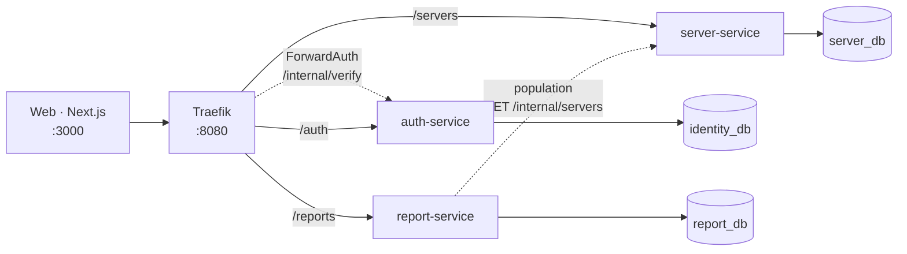
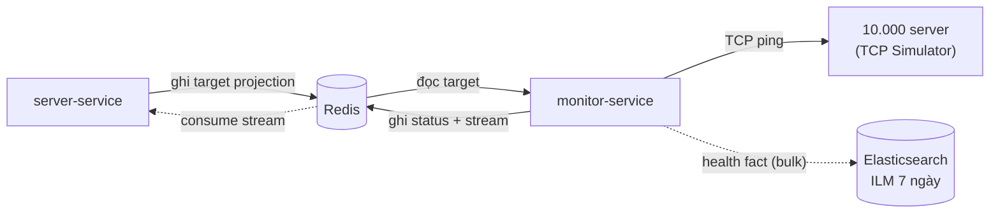
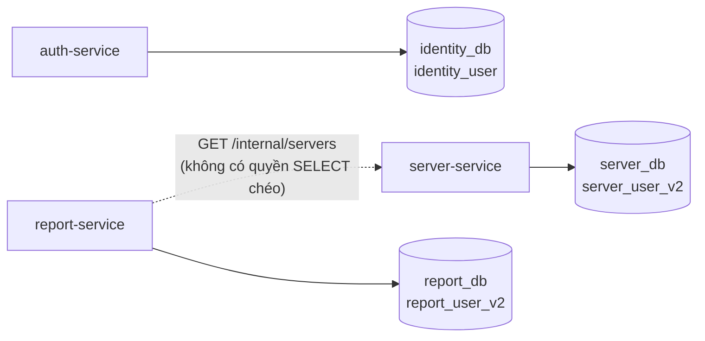
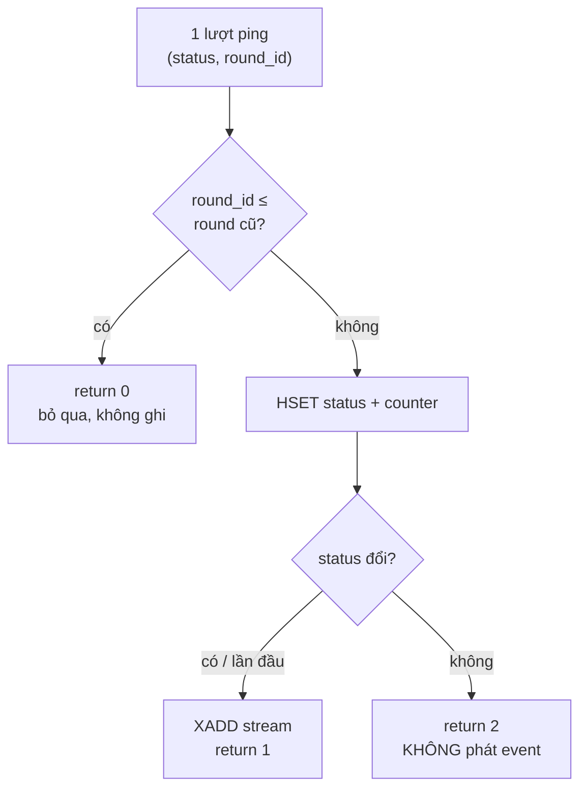
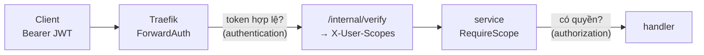
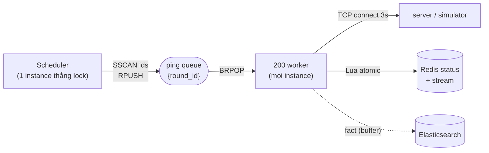
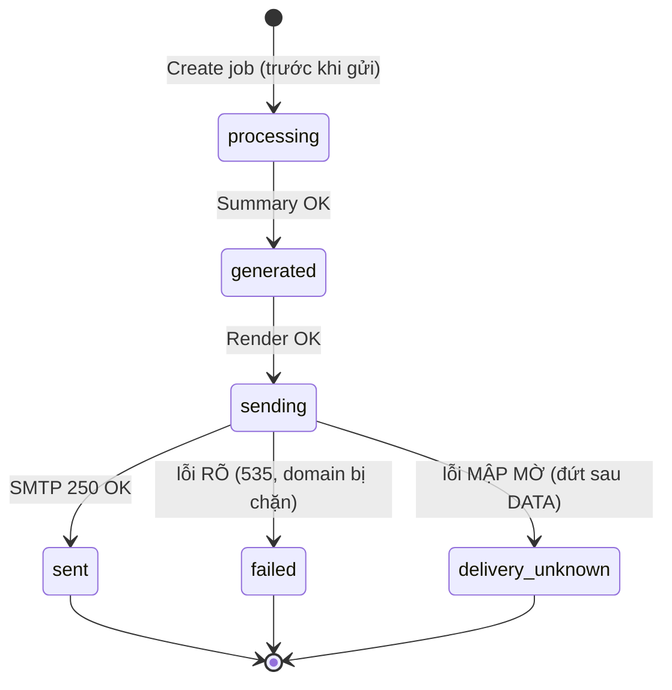
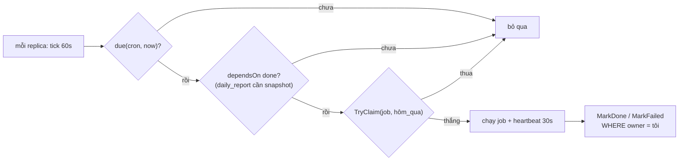
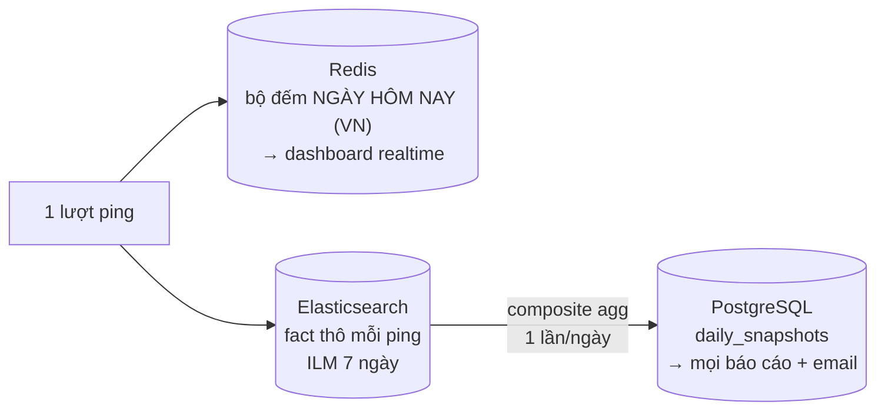

# BÁO CÁO MÔ TẢ VÀ THIẾT KẾ HỆ THỐNG
## VCS Server Management System (VCS-SMS)

> **Chương trình:** VCS Passport
> **Phiên bản:** 2.1 — thiết kế sau refactor, bổ sung HA cho report-service
> **Ngày:** 2026-07-24
> **Ngôn ngữ:** Go 1.24+ (service dùng Go 1.25)
> **Kiến trúc:** 4 microservice + Traefik ForwardAuth + Redis Stream + database-per-service

> **Ghi chú phiên bản:** Bản 1.0 (Checkpoint 1, 2026-06-19) mô tả kiến trúc cũ —
> 5 service + API Gateway tự viết + Kafka + shared schema — và vẫn nằm trong lịch sử
> git. Tài liệu này mô tả hệ thống **hiện tại**. Đặc tả đầy đủ ở `design.md`, đối chiếu
> chi tiết cũ↔mới ở `refactor.md`.

---

## Mục lục

1. [Tổng quan dự án](#1-tổng-quan-dự-án)
2. [Phân tích yêu cầu](#2-phân-tích-yêu-cầu)
3. [Kiến trúc tổng quan](#3-kiến-trúc-tổng-quan)
4. [Thiết kế cơ sở dữ liệu](#4-thiết-kế-cơ-sở-dữ-liệu)
5. [Event-driven với Redis Stream](#5-event-driven-với-redis-stream)
6. [Bảo mật — JWT, ForwardAuth, RBAC](#6-bảo-mật--jwt-forwardauth-rbac)
7. [Thiết kế API](#7-thiết-kế-api)
8. [Các luồng nghiệp vụ chính](#8-các-luồng-nghiệp-vụ-chính)
9. [Caching](#9-caching)
10. [Logging & Observability](#10-logging--observability)
11. [Kiểm thử](#11-kiểm-thử)
12. [Triển khai & vận hành](#12-triển-khai--vận-hành)
13. [Công nghệ sử dụng](#13-công-nghệ-sử-dụng)
14. [Tổng kết](#14-tổng-kết)

---

## 1. Tổng quan dự án

### 1.1. Bài toán

Quản lý và giám sát **10.000 server**: CRUD, import/export Excel, health check định kỳ,
báo cáo uptime và gửi email hằng ngày.

### 1.2. Định nghĩa trạng thái

| Trạng thái | Ý nghĩa |
|---|---|
| `ON` | TCP connect tới `ipv4:tcp_port` thành công |
| `OFF` | TCP connect thất bại (timeout / refused / ...) |
| `UNKNOWN` | Chưa từng được check |

`UNKNOWN` là giá trị hợp lệ của cột, nhưng **không bao giờ** là transition hợp lệ trên
stream — event chỉ mang `ON` hoặc `OFF`.

### 1.3. Năm quyết định định hình hệ thống

| # | Quyết định | Lý do |
|---|---|---|
| 1 | **Database-per-service** | Ranh giới service được cưỡng chế bằng quyền DB, không phải bằng quy ước |
| 2 | **Redis Stream thay Kafka** | 1 event, 1 producer, 1 consumer group, vài chục event/ngày — Kafka là chi phí không đổi lấy được gì |
| 3 | **Traefik ForwardAuth thay Gateway tự viết** | Không tự viết lại routing / rate-limit / TLS |
| 4 | **Round-based monitoring** | `round_id` từ Redis TIME cho nhiều instance thống nhất mà không cần điều phối |
| 5 | **Snapshot hằng ngày thay aggregate on-demand** | Report đọc bảng đã cô đọng → ES chết không làm chết report |
| 6 | **Leader election bằng một dòng bảng** (`cron_runs`) | report-service chạy 3 replica; PK của bảng là trọng tài bền vững, lại để lại lịch sử chạy để kiểm tra sau |
| 7 | **Bộ đếm uptime reset theo ngày VN** | Dashboard trả lời "hôm nay thế nào", nên số đếm phải quên quá khứ; lịch sử thật đã nằm ở `daily_snapshots` |

### 1.4. Luận điểm trung tâm

> Monitoring ping 10.000 server mỗi phút, nhưng **chỉ phát event khi status thực sự
> đổi** — vài chục lần/ngày. Nhờ vậy `server:list:version` gần như đứng yên và cache
> có tỉ lệ hit rất cao.

Ở thiết kế cũ, mỗi lần check là một event → cache bị vô hiệu liên tục → cache vô dụng.
Toàn bộ giá trị của Redis Stream + Lua script nằm ở chỗ này.

---

## 2. Phân tích yêu cầu

### 2.1. Yêu cầu chức năng

| Nhóm | Chức năng |
|---|---|
| Server | Create, List (filter/sort/paginate), View, Update, Delete (soft) |
| Excel | Import (báo cáo 3 nhóm kết quả), Export (chống formula injection) |
| Monitoring | Health check 10.000 server mỗi 60s |
| Report | Uptime theo kỳ, ON/OFF cuối kỳ, top 10 uptime thấp nhất, coverage |
| Email | Gửi report on-demand + tự động hằng ngày |
| Identity | Login, JWT, refresh, logout, RBAC theo scope |

### 2.2. Yêu cầu phi chức năng

| Yêu cầu | Giải pháp hiện tại |
|---|---|
| OpenAPI | OpenAPI 3.0.3 (`docs/api-spec.yaml`) |
| Unit test | **455 test**, 6/6 module `build` + `vet` + `test` xanh |
| Chống SQL Injection | GORM parameterized; raw SQL chỉ ở các truy vấn aggregate và đều bind tham số |
| Error handling | Mã lỗi + mô tả, format response chuẩn |
| Log ra file + rotate | zerolog (JSON) + lumberjack |
| JWT + scope per API | ForwardAuth (authn) + `RequireScope` trong service (authz) |
| Elasticsearch tính uptime | Composite aggregation một lần mỗi ngày → `daily_snapshots` |
| PostgreSQL | PostgreSQL 17, **3 database tách rời** |
| Redis | Cache-aside, target projection, round queue, status, stream, bộ đếm uptime **theo ngày VN** |
| Metrics | 7 metric Prometheus tại `/metrics` của monitor |
| HA / scale-out | 4/4 service scale ngang được; `docker-stack.yml` chạy auth ×2, server ×2, monitor ×3, report ×3 |

### 2.3. Thông tin một Server

| Trường | Kiểu | Ghi chú |
|---|---|---|
| `server_id` | VARCHAR(100) | Unique **toàn cục kể cả row đã xóa**; không sửa được |
| `server_name` | VARCHAR(255) | Unique **trên server đang sống** |
| `ipv4` | INET | Phải nằm trong CIDR allowlist |
| `tcp_port` | INT | 1–65535 |
| `status` | VARCHAR(20) | `ON`/`OFF`/`UNKNOWN`, mặc định `UNKNOWN`; **client không set được** |
| `status_version` | BIGINT | Version guard chống event cũ/trùng |
| `cpu_cores`, `ram_gb`, `disk_gb` | INT NULL | `NULL` hoặc `> 0`; map sang `*int` trong Go |
| `os`, `location`, `description` | — | Tùy chọn |
| `created_at`, `updated_at`, `deleted_at` | TIMESTAMPTZ | `deleted_at` = soft delete |

---

## 3. Kiến trúc tổng quan

### 3.1. Sơ đồ

**Định tuyến HTTP** — mọi request public đi qua Traefik, được ForwardAuth xác thực rồi
mới tới service sở hữu dữ liệu:



**Đường monitoring** — monitor-service không có endpoint public, không có PostgreSQL;
nó chỉ trao đổi với server-service **gián tiếp qua Redis**:



Hai chiều dữ liệu, **không service nào gọi HTTP tới service kia** trên đường monitoring —
Redis là ranh giới duy nhất.

### 3.2. Vì sao Microservices

Bốn service có **nhịp thay đổi và hồ sơ tải khác hẳn nhau**:

- monitor-service: 10.000 ping/phút, không có DB, cần scale ngang
- server-service: CRUD, tải theo người dùng
- report-service: một job nặng lúc 00:30, còn lại gần như rảnh
- auth-service: tải thấp nhưng nằm trên đường đi của **mọi** request

Nhốt chúng vào một process nghĩa là phải scale tất cả theo cái nặng nhất.

### 3.3. Ranh giới service

| Service | Sở hữu | Không được đụng |
|---|---|---|
| auth-service | `identity_db` | server_db, report_db |
| server-service | `server_db`, target projection, `server:list:*` | identity_db, report_db |
| monitor-service | `monitor:*`, `stream:monitor.status`, ES index | Mọi PostgreSQL |
| report-service | `report_db` | server_db (phải gọi `/internal/servers`) |

**monitor-service không có PostgreSQL.** Đó là lý do nó scale ngang tự do.

### 3.4. Traefik thay vì Gateway tự viết

Gateway tự viết phải tự làm routing, rate limit, TLS, health check, retry — toàn bộ là
code phải bảo trì mà không phải giá trị nghiệp vụ. Traefik làm sẵn, và ForwardAuth cho
phép giữ nguyên logic xác thực trong auth-service.

Traefik **không** làm authorization: nó không biết endpoint nào cần scope nào. Việc đó
nằm trong service — xem §6.

### 3.5. Monorepo

Sáu Go module trong một repo: `shared` (logger, middleware, response, JWT) + 4 service
+ `tcp-simulator`. Đổi contract chung chỉ cần một commit.

---

## 4. Thiết kế cơ sở dữ liệu

### 4.1. Chiến lược: database-per-service



| Database | Owner | DB user |
|---|---|---|
| `identity_db` | auth-service | `identity_user` |
| `server_db` | server-service | `server_user_v2` |
| `report_db` | report-service | `report_user_v2` |

Không service nào có credential của DB service khác. Schema chung cho phép `JOIN`
xuyên ranh giới; một khi chuyện đó xảy ra, đổi schema của B là làm gãy A. Tách
database làm điều đó **không thể**, chứ không phải "không nên".

### 4.2. Các bảng chính

**`servers`** (server_db)

```sql
server_id      VARCHAR(100) NOT NULL
status         VARCHAR(20)  CHECK (status IN ('ON','OFF','UNKNOWN'))
status_version BIGINT       NOT NULL DEFAULT 0
ipv4           INET         NOT NULL
cpu_cores      INT          CHECK (cpu_cores IS NULL OR cpu_cores > 0)
deleted_at     TIMESTAMPTZ

CREATE UNIQUE INDEX ux_servers_server_id   ON servers (server_id);
CREATE UNIQUE INDEX ux_servers_active_name ON servers (server_name)
    WHERE deleted_at IS NULL;
```

**`daily_snapshots`** (report_db) — PK `(server_id, date)`

`uptime_pct` **NULL khi `actual_checks = 0`**: server không ai đo được có uptime *không
xác định*, không phải 0%. NULL giữ nó ngoài `AVG()` và đưa vào `servers_no_data`.

**`api_idempotency`** (server_db) — PK `(actor_id, endpoint, idempotency_key)`

**`report_jobs`** (report_db) — state: `processing`/`generated`/`sending`/`sent`/`failed`/`delivery_unknown`.
Có thêm `ux_report_jobs_idem` là **partial** unique index trên
`(requester_id, idempotency_key) WHERE idempotency_key <> ''` — vì `POST /reports` **không
bắt buộc** `Idempotency-Key`.

**`cron_runs`** (report_db) — PK `(job_name, run_date)`, state `running`/`done`/`failed`.
Đây là toàn bộ cơ chế leader election của report-service: PK của bảng là trọng tài duy
nhất, `run_date` là *ngày dữ liệu* (luôn là hôm qua) nên một job chỉ chạy đúng một lần cho
mỗi ngày, và `heartbeat_at` phân biệt job chạy chậm với replica đã chết. Xem §8.5.

### 4.3. Redis & Elasticsearch

Redis dùng **hai database**: `db0` cho auth (`auth:refresh:*`, `auth:blacklist:*`,
`auth:login_attempts:*`), `db1` cho phần còn lại — target projection
(`server:monitor-target:*`), round (`monitor:round:*`, `monitor:ping:queue:*`), status
(`monitor:status:*`), bộ đếm uptime (`monitor:uptime:index`), stream, và cache
(`server:list:*`, `server:detail:*`, `server:stats:cache`, `server:uptime:cache`).
Mỗi namespace có **một** owner.

`monitor:status:{id}` giữ bảy field: `status`, `last_checked_at`, `latency_ms`, `round_id`,
`day`, `day_total`, `day_on`. Ba field cuối là bộ đếm uptime **của ngày hiện tại theo giờ
VN** — Lua tự đặt lại về 0 ở lần check đầu tiên của ngày mới, nên dashboard đọc "hôm nay"
chứ không phải một tổng luỹ kế mà AOF mang qua mọi lần restart.

Elasticsearch: `server-status-logs-YYYY.MM.DD`, `_id = {server_id}:{round_id}` tất định
để retry bulk không nhân bản. Mapping `keyword` do index template cài — để ES tự map
động thì các field thành `text` và aggregation uptime **âm thầm trả 0**.
ILM: hot 0–7 ngày → xóa index.

---

## 5. Event-driven với Redis Stream

### 5.1. Vì sao bỏ Kafka

| Yếu tố | Con số thật |
|---|---|
| Loại event | 1 (`status.changed`) |
| Producer | 1 |
| Consumer group | 1 |
| Tần suất | Vài chục/ngày |

Không yếu tố nào cần Kafka; đổi lại phải nuôi broker + KRaft controller + ~1GB RAM.
Redis đã có sẵn cho cache và projection, và Redis Stream cung cấp đúng thứ cần:
append-only log, consumer group, ACK, pending list, `XAUTOCLAIM`.

### 5.2. Lua script atomic

Tách HSET và XADD thành hai lệnh sẽ tạo khoảnh khắc Redis status và stream mâu thuẫn.
Gộp vào một script loại bỏ cửa sổ đó. Ba mã trả về: `0` cũ/replay, `1` có transition,
`2` không đổi (**không** phát event — đây là chỗ cache được cứu).



Mã `2` chiếm gần như toàn bộ 10.000 ping/phút — đó là lý do `server:list:version` đứng
yên và cache sống.

### 5.3. Version guard

```sql
UPDATE servers SET status=?, status_version=? WHERE server_id=? AND status_version < ?
```

`status_version` chính là `round_id`, tăng đơn điệu → mọi apply idempotent → replay cả
stream là an toàn.

### 5.4. Phục hồi consumer group

Boot lần đầu tạo group tại `$`. Khi mất group (`FLUSHDB`, hoặc Redis restart mất
persistence), consumer tự phát hiện `NOGROUP` và tạo lại tại **`0`** để replay — vì
Monitoring chỉ phát event khi status đổi, bỏ qua event cũ sẽ để server kẹt trạng thái
sai đến tận lần đổi tiếp theo. (Với `volatile-lru`, stream không có TTL nên không bị
LRU evict — xem §12.3.)

---

## 6. Bảo mật — JWT, ForwardAuth, RBAC

### 6.1. Hai tầng



Bắt buộc cả hai. ForwardAuth chỉ trả lời "*ai*" (token hợp lệ không); nó không thể biết
endpoint nào cần scope nào. `RequireScope` trong service trả lời "*được làm gì*". Thiếu
tầng thứ hai thì một token `viewer` hợp lệ sẽ xóa được server.

### 6.2. Chỉ Traefik là lối vào

Service tin các header `X-User-Id` / `X-User-Scopes` vì Traefik **xóa rồi set lại**
chúng từ response của `/internal/verify`. Điều đó chỉ đúng khi không ai gọi thẳng được
vào service. Vì vậy trong `docker-compose.yml` bốn service dùng `expose:` chứ **không**
`ports:` — chỉ Traefik (8080) và web (3000) ra tới host.

auth-service là ngoại lệ: router `/api/v1/auth` không qua ForwardAuth (nếu qua thì
không ai login được), nên nó **tự validate JWT** và đọc scope từ claims trong token.

### 6.3. RBAC

| Role | Scope |
|---|---|
| `admin` | Tất cả |
| `operator` | Viewer + create/update/delete/import/export + `report:send` + `report:view_detail` |
| `viewer` | `server:list`, `server:view`, `server:stats`, `report:view` |

13 scope, ánh xạ 1:1 với endpoint — bảng đầy đủ ở [05-security-jwt-rbac.md](./05-security-jwt-rbac.md).

### 6.4. Các chốt khác

| Chốt | Nội dung |
|---|---|
| Argon2id | Hash password |
| Brute-force | Khóa theo **email** trong Redis (đổi IP không né được) + rate limit IP tại Traefik |
| CIDR allowlist | Không có thì hệ thống thành công cụ quét cổng nội mạng. Rỗng = chặn tất cả |
| Formula injection | Ô Excel bắt đầu `= + - @ tab CR` → prefix `'` |
| Idempotency | `POST /servers` và `/servers/import`; cùng key+body → replay, khác body → 409 |
| SMTP allowlist | `SMTP_RECIPIENT_DOMAINS` rỗng = có thể bị lợi dụng làm mail relay |

---

## 7. Thiết kế API

### 7.1. Endpoint

| Method | Path | Scope |
|---|---|---|
| POST | `/api/v1/auth/login` | Public |
| POST | `/api/v1/auth/register` | Public (tắt ở production) |
| POST | `/api/v1/auth/refresh` | Public + refresh cookie |
| POST | `/api/v1/auth/logout` | Authenticated |
| GET | `/api/v1/auth/profile` | Authenticated |
| GET | `/api/v1/auth/users` | `user:list` |
| PUT | `/api/v1/auth/users/{id}/role` | `user:manage_role` |
| POST | `/api/v1/servers` | `server:create` + Idempotency-Key |
| GET | `/api/v1/servers` | `server:list` |
| GET | `/api/v1/servers/{id}` | `server:view` |
| PUT | `/api/v1/servers/{id}` | `server:update` |
| DELETE | `/api/v1/servers/{id}` | `server:delete` |
| POST | `/api/v1/servers/import` | `server:import` + Idempotency-Key |
| POST | `/api/v1/servers/export` | `server:export` |
| GET | `/api/v1/servers/stats` | `server:stats` |
| GET | `/api/v1/servers/uptime` | `server:stats` |
| GET | `/api/v1/reports/summary` | `report:view` |
| POST | `/api/v1/reports` | `report:send` |
| GET | `/api/v1/reports/{id}` | `report:view_detail` |

Nội bộ (không qua Traefik): `GET /internal/verify`, `GET /internal/servers`,
`POST /internal/snapshots/{date}`, `GET /metrics`, `GET /health`.

### 7.2. OpenAPI

`docs/api-spec.yaml` (OpenAPI 3.0.3). Spec phản ánh đúng code — ví dụ `status` **không**
phải field client gửi được, và spec không khai báo nó là input.

---

## 8. Các luồng nghiệp vụ chính

### 8.1. Health check 10.000 server — trái tim hệ thống



Scheduler chỉ nạp queue một lần mỗi round (instance thắng `SETNX` lock); **mọi** instance
đều `BRPOP` từ queue đó nên công việc tự chia đều — thua lock không có nghĩa ngồi không.

Sizing: `10.000 × 3s / 60s = 500` goroutine, +20% → **600** = 3 instance × 200.
"Worker" là **goroutine**, không phải container.

**`checks_missing`** (`LLEN` queue lúc round kết thúc) là tín hiệu **duy nhất** báo
thiếu worker — không có nó thì hệ thống ping thiếu server mà không ai biết.

**Số đo thật với 10.001 server** (1 instance, 200 goroutine, TCP Simulator):

| Chỉ số | Giá trị |
|---|---|
| `round_duration` trung bình | **3,5s** (ngân sách 60s) |
| `checks_missing` | 0 |
| `tcp_latency` trung bình | 4,3ms |
| Rebuild projection | 1,7s |

Công thức 600 goroutine là **cận trên xấu nhất** (giả định mọi check tốn trọn 3s
timeout). Khi server trả lời bình thường, 200 goroutine trên 1 instance đã thừa.

> **Điều kiện bắt buộc:** Redis `PoolSize` phải ≥ số worker. `BRPOP` giữ connection suốt
> thời gian block, nên pool mặc định của go-redis (`10 × GOMAXPROCS` = 80) nhỏ hơn 200
> worker sẽ vừa chặn concurrency ở 80, vừa bỏ đói scheduler (nạp queue mất 45s thay vì 1s).

→ [07-flow-health-check.md](./07-flow-health-check.md)

### 8.2. CRUD server

Cache-aside với version trong key; `last_checked_at` đọc tươi từ Redis nên không phá
cache. Target projection ghi hash trước/ID sau khi tạo, ID trước/hash sau khi xóa.

→ [06-flow-server-crud.md](./06-flow-server-crud.md)

### 8.3. Import & Export

Import báo cáo 3 nhóm tách bạch: `succeeded` / `failed` / `skipped_duplicate`. Lỗi dòng
không làm hỏng request; chỉ lỗi file mới từ chối tất cả.

→ [08-flow-import-export.md](./08-flow-import-export.md)

### 8.4. Báo cáo & Email

Snapshot 00:30 → `daily_snapshots`; report chỉ đọc bảng đó. Thiếu snapshot thì **từ
chối và nêu tên ngày**. Ba kết cục gửi mail, trong đó `delivery_unknown` ghi nhận sự
thật "không biết mail có tới không" thay vì đoán bừa:



`delivery_unknown` **không bao giờ tự retry** — thư có thể đã tới, retry mù sẽ gửi hai
lần; Message-ID được giữ lại để operator tự tra hộp Sent.

→ [09-flow-reporting-email.md](./09-flow-reporting-email.md)

### 8.5. Report-service chạy nhiều replica — ba lớp chống gửi trùng

`report-service` là service duy nhất có **state theo thời gian** (hai cron job), nên nó là
service duy nhất cần trọng tài khi scale. `docker-stack.yml` chạy nó với `replicas: 3`, và
**mọi** replica đều chạy scheduler.



| Lớp | Cơ chế | Chặn được gì |
|---|---|---|
| 1 | PK `(job_name, run_date)` của `cron_runs` | 3 replica cùng nổ cron |
| 2 | `FindLatestDaily` + `resendable(state)` | Replica trước chết **sau** khi mail lên dây nhưng **trước** khi ghi kết quả |
| 3 | `Idempotency-Key` (tuỳ chọn) trên `POST /reports` | Người dùng bấm nút hai lần |

**Scheduler *reconcile* mỗi phút, không nổ đúng khoảnh khắc cron.** `robfig/cron` chỉ dùng
để parse biểu thức. Nổ theo callback thì một replica boot lúc 10:05 sẽ không bao giờ biết
job 10:00 chưa ai làm; reconcile thì nó thấy `due` = true, `cron_runs` chưa có dòng `done`,
và tự nhận việc. Đây là điều làm cho một lần deploy giữa giờ cron không mất báo cáo.

| Tham số | Giá trị |
|---|---|
| `tickInterval` | 60s |
| `heartbeatInterval` | 30s |
| `staleAfter` | 3 phút (6 nhịp bị bỏ) |
| `snapshotTimeout` / `dailyTimeout` | 1 giờ / 10 phút |

`heartbeat` chạy hai chiều: làm mới claim, **và** cancel context của job đang chạy khi phát
hiện claim đã bị cướp. Không có chiều thứ hai, một replica treo mạng 4 phút rồi hồi phục sẽ
tiếp tục ghi vào cùng `run_date` mà replica mới đang xử lý.

`sending` **không** resendable dù nghe như "chưa xong": nó được ghi *trước* khi gọi SMTP.

---

## 9. Caching

Ba tầng dữ liệu uptime, ba mục đích khác nhau — đừng nhầm lẫn:



```text
server:list:cache:{query_hash}:{list_version}   TTL 30s
server:detail:cache:{server_id}:{list_version}  TTL 30s
server:stats:cache                              TTL 10s
server:uptime:cache                             TTL 10s
```

Hai key đầu có version **trong key**; hai key sau chỉ dựa vào TTL vì chúng là số tổng hợp
toàn hệ thống, một version cho từng truy vấn không có ý nghĩa gì.

Version nằm **trong key** → bump không cần xóa key nào, TTL tự dọn key cũ.

Bump khi: mutation server, hoặc consumer apply được status event **có thật**. Không bump
khi status không đổi — và vì status hiếm khi đổi, cache hầu như luôn hit.

---

## 10. Logging & Observability

**Log:** zerolog JSON ra file, lumberjack rotate (`LOG_MAX_SIZE`, `LOG_MAX_BACKUPS`,
`LOG_MAX_AGE`, `LOG_COMPRESS`), request ID xuyên suốt.

**Metrics** (`/metrics` của monitor, Prometheus):

| Metric | Ý nghĩa |
|---|---|
| `vcs_monitor_round_duration_seconds` | Round bắt đầu → queue cạn |
| `vcs_monitor_targets_expected` | Target nạp vào queue |
| `vcs_monitor_checks_completed_total` | Ping hoàn thành |
| **`vcs_monitor_checks_missing`** | **Việc chưa kịp ping lúc round kết thúc** |
| `vcs_monitor_queue_depth` | Độ sâu queue |
| `vcs_monitor_tcp_latency_seconds` | Histogram TCP connect |
| `vcs_monitor_es_bulk_failure_total` | Batch bulk bị bỏ sau retry |

---

## 11. Kiểm thử

### 11.1. Hạ tầng

| Công cụ | Mục đích |
|---|---|
| `go test` | Unit test |
| `mockery` | Mock từ interface (chỉ nơi thật cần) |
| `sqlmock` | Repository test |
| `httptest` | HTTP handler + stub Elasticsearch |
| Postgres / ES thật | Integration test có cổng env |

### 11.2. Số lượng

| Module | Test |
|---|---:|
| shared | 22 |
| auth-service | 85 |
| server-service | 178 |
| monitor-service | 53 |
| report-service | 102 |
| tcp-simulator | 15 |
| **Tổng** | **455** |

6/6 module: `go build` ✅ `go vet` ✅ `go test` ✅ (đo lại 24/07/2026 bằng
`go test ./... -count=1`, đếm số hàm `Test*` ở cấp cao nhất)

### 11.3. Giới hạn của sqlmock

`sqlmock` chỉ **so khớp chuỗi SQL**, không chạy SQL. Nó không thể phát hiện một truy vấn
cú pháp đúng nhưng **ngữ nghĩa sai**. Bug `Totals` đếm server-day thay vì server (§9.4
của design) sống sót qua toàn bộ unit test chính vì lý do này.

Vì vậy các truy vấn aggregate có thêm integration test chạy trên PostgreSQL thật, và
ILM/mapping có integration test chạy trên Elasticsearch thật. Chúng tự `skip` khi biến
môi trường không được set, nên `go test ./...` vẫn xanh khi không có hạ tầng:

```bash
REPORT_TEST_DATABASE_URL="postgres://..."   go test ./internal/repository/ -run Integration
MONITOR_TEST_ES_URL="http://localhost:9200" go test ./internal/database/   -run Integration
```

---

## 12. Triển khai & vận hành

### 12.1. Ba đích triển khai, cùng một bộ image

| File | Dùng khi | Đặc điểm |
|---|---|---|
| `docker-compose.yml` | máy đơn, demo, dev toàn phần | build tại chỗ, 1 replica, secret trong `.env` |
| `docker-compose.dev.yml` | chỉ cần hạ tầng, service chạy `go run` | `extends` 4 service hạ tầng |
| `docker-stack.yml` | Swarm nhiều node | image từ registry, nhiều replica, Docker secret |

```bash
docker compose up -d --build   # 10 container
make seed                      # 10.000 server vào server_db
make rebuild-cache             # BẮT BUỘC sau seed/khôi phục
```

### 12.2. Container

| Container | Port ra host | Replica (stack) | Ghi chú |
|---|---|:---:|---|
| `traefik` | **8080** | 1 | Lối vào duy nhất của API |
| `web` | **3000** | 1 | Next.js |
| `postgres` | 5432 | 1 | 3 database; ghim vào manager node |
| `redis` | 6379 | 1 | ghim vào manager node |
| `elasticsearch` | 9200 | 1 | ghim vào manager node |
| `tcp-simulator` | — | 1 | Giả lập 10.000 server |
| `auth-service` | *expose 8081* | 2 | Không ra host |
| `server-service` | *expose 8082* | 2 | Không ra host |
| `monitor-service` | *expose 8083* | 3 | Không ra host |
| `report-service` | *expose 8084* | 3 | Không ra host; **không có `container_name`** để `--scale` chạy được |

Ba service hạ tầng và Traefik bị ghim vào manager node vì dùng named volume local
(`postgres_data`, `redis_data`, `es_data`) và bind-mount config từ repo. Bản stack này
scale **tầng ứng dụng**, không scale tầng dữ liệu.

**Secret:** Compose đọc từ `.env`, Swarm mount vào `/run/secrets/`. Cầu nối là
`shared/pkg/confighelper.GetStringSecret(name, fallback)` — nếu `<NAME>_FILE` được set và
đọc được thì dùng nội dung file. Nhờ vậy không dòng code config nào phải biết mình đang
chạy Compose hay Swarm.

### 12.3. Ghi chú vận hành

| Việc | Lưu ý |
|---|---|
| Sau seed / khôi phục | **Luôn** `make rebuild-cache`. Thiếu marker `ready`, Monitoring bỏ qua **mọi** round |
| Image service là **distroless** | Không shell, không `wget`/`curl`. Chẩn đoán phải gọi binary trực tiếp, hoặc đi từ container `traefik` (Alpine, có `wget`) |
| `report-service` không có `container_name` | Dùng `docker compose exec report-service …`, không `docker exec vcs-sms-report …` |
| Contract stream | `changed_at` phải RFC3339. Lệch format → consumer ACK rồi vứt **im lặng** |
| Redis maxmemory | Dùng `volatile-lru` + AOF: chỉ cache/round (có TTL) mới bị evict. Bộ đếm, status, target, `list:version`, stream **không** TTL nên được bảo vệ. Không đổi sang `allkeys-lru` |
| `init.sql` chỉ chạy khi volume rỗng | Database đã tồn tại thì chạy `migrate_report_ha.sql` thủ công để có `cron_runs` |
| Trước production | Set `SMTP_RECIPIENT_DOMAINS`, đổi `JWT_SECRET`, tắt `/register` |

```bash
# Đọc metrics của monitor (image distroless, không có wget)
docker exec vcs-sms-traefik wget -qO- http://monitor-service:8083/metrics | grep vcs_monitor

# Dựng lại target projection
docker compose exec server-service /app/server-service rebuild-monitor-cache

# Chạy lại snapshot một ngày
docker exec vcs-sms-traefik wget -qO- --post-data='' \
  http://report-service:8084/internal/snapshots/2026-07-23

# Tra lịch sử cron
docker exec vcs-sms-postgres psql -U vcs_admin -d report_db \
  -c "SELECT job_name, run_date, state, owner, finished_at FROM cron_runs ORDER BY run_date DESC LIMIT 5;"
```

---

## 13. Công nghệ sử dụng

| Lớp | Công nghệ | Phiên bản |
|---|---|---|
| Ngôn ngữ | Go | 1.24+ (service: 1.25) |
| HTTP | Gin | v1.12 |
| ORM | GORM + pgx | v1.31 |
| Gateway | Traefik (ForwardAuth, rate limit) | v3.0 |
| Database | PostgreSQL — 3 database | 17 |
| Cache / Stream | Redis (go-redis) | 8 / v9 |
| Search | Elasticsearch (go-elasticsearch) | 8.12 / v8 |
| Auth | JWT HS256 + Argon2id | — |
| Excel | excelize | v2 |
| Email | `net/smtp` (STARTTLS) | stdlib |
| Scheduler | robfig/cron | v3 |
| Log | zerolog + lumberjack | v1.35 / v2.2 |
| Metrics | prometheus/client_golang | v1.23 |
| Config | viper | v1.21 |
| Test | go test, mockery, sqlmock, httptest | — |
| Frontend | Next.js + React + TailwindCSS | — |
| Hạ tầng | Docker Compose | v5 |

**`net/smtp` thay `gomail`:** `gomail.DialAndSend` chỉ trả `error`, không cho biết lỗi
xảy ra **trước hay sau** khi body lên dây → không phân biệt được `failed` với
`delivery_unknown`.

---

## 14. Tổng kết

### 14.1. Mức độ hoàn thành

| Hạng mục | Trạng thái |
|---|---|
| CRUD + filter/sort/paginate + cache | ✅ |
| Import / Export Excel | ✅ |
| Health check 10.000 server | ✅ đã verify thật với TCP Simulator |
| Report + coverage + top 10 | ✅ |
| Email | ✅ **đã gửi thật qua Gmail SMTP** — `report_jobs.state = 'sent'`, có `smtp_message_id` |
| JWT + RBAC scope | ✅ đã kiểm bằng tài khoản `viewer` thật (403 đúng chỗ) |
| OpenAPI | ✅ |
| Unit test | ✅ 455 test |
| Log file + rotate | ✅ |
| Metrics | ✅ 7/7 |
| ILM retention | ✅ policy `server-status-logs-retention` đang gắn vào các index thật |
| Load test 10.001 server | ✅ round 3,5s, `checks_missing` 0 (xem §8.1) |
| HA report-service | ✅ `cron_runs` + heartbeat; `docker-stack.yml` chạy `replicas: 3` |
| Multi-instance monitor | ⚠️ cơ chế đã có và `docker-stack.yml` khai báo `replicas: 3`, nhưng **chưa đo** trên nhiều instance cùng lúc |

**Số đo trên hệ thống đang chạy (24/07/2026, Compose 1 instance mỗi service):**

| Chỉ số | Giá trị |
|---|---|
| `vcs_monitor_targets_expected` | 10.000 |
| `vcs_monitor_checks_missing` | 0 |
| `vcs_monitor_queue_depth` | 0 (queue cạn trước khi round kết thúc) |
| `GET /servers/stats` | 10.000 total — 8.910 ON / 1.090 OFF / 0 UNKNOWN |
| `GET /servers/uptime` | `avg_uptime_pct` ≈ 89,6% cho ngày hiện tại |
| Rebuild target projection | 1,8s |
| Elasticsearch | 4 index ngày, 1,7–4,3 triệu doc/index, ILM 7 ngày đang áp |
| `daily_snapshots` | 2 ngày × ~10.000 dòng |
| `cron_runs` | `snapshot` và `daily_report` của 2026-07-23 đều `done` |

### 14.2. Điểm nhấn kiến trúc

1. **Chỉ phát event khi status đổi** — biến cache từ vô dụng thành gần như luôn hit.
2. **Lua script atomic** — không có cửa sổ nào Redis status và stream mâu thuẫn.
3. **Version guard** — mọi apply idempotent, nhờ đó replay cả stream là an toàn.
4. **`round_id` từ Redis TIME** — nhiều instance thống nhất mà không cần điều phối.
5. **Snapshot hằng ngày** — ES chết không làm chết report, và là mắt xích cho ILM 7 ngày.
6. **`uptime_pct` NULL chứ không 0** — không biến sự cố thu thập thành báo cáo sai.
7. **Coverage phơi bày** — report nói ra phần nó không đo được.
8. **Hai tầng bảo mật** — ForwardAuth trả lời "ai", `RequireScope` trả lời "được làm gì".
9. **TCP Simulator** — giả lập 10.000 server bằng một container.
10. **Cùng một bài toán, hai công cụ đúng nhịp** — Monitoring giành `SETNX` (nhịp 60 giây,
    mất lock chỉ tốn 1 round); Report giành một dòng `cron_runs` (nhịp một ngày, cần bền và
    cần lịch sử để kiểm tra sau).
11. **Bộ đếm uptime reset theo ngày VN** — dashboard tự đúng lại mỗi ngày, không cần ai xoá
    key thủ công.

### 14.3. Còn lại

| # | Việc | Ghi chú |
|---|---|---|
| 1 | Đo multi-instance monitor | Cơ chế đã có (`SETNX` + `BRPOP`); còn thiếu phép đo 2–3 instance cùng lúc để xác nhận `round_duration` giảm và `checks_missing` vẫn 0 |
| 2 | Kiểm blacklist access token | `auth:blacklist:{jti}` được **ghi** khi logout nhưng `/internal/verify` chưa **đọc** → token đã logout còn dùng được tối đa 15 phút. Đánh đổi có ý thức (1 lệnh Redis × toàn bộ lưu lượng), nhưng nên ghi rõ hoặc bổ sung |
| 3 | Export 100 query / 10.000 server | Đánh đổi có chủ đích (dùng lại `FindAll` của list API, cap `page_size` 100); chỉ sửa nếu đo thấy chậm thật |
| 4 | Scale tầng dữ liệu | `docker-stack.yml` ghim Postgres/Redis/ES vào manager node vì volume local. Muốn HA thật cần replication hoặc volume driver dùng chung |
| 5 | Dọn code chết | `internal/service/login_guard.go` (auth) trùng chức năng với `checkLoginAttempts`/`recordFailedAttempt` và **không ai gọi**; `Register` kiểm trùng email hai lần liên tiếp |

---

> **Tài liệu liên quan:** `design.md` (đặc tả đầy đủ), `refactor.md` (đối chiếu cũ↔mới),
> `docs/api-spec.yaml`, và các file `docs/01`–`docs/09`.
>
> **VCS Server Management System © 2026** — Chương trình đào tạo VCS Passport
