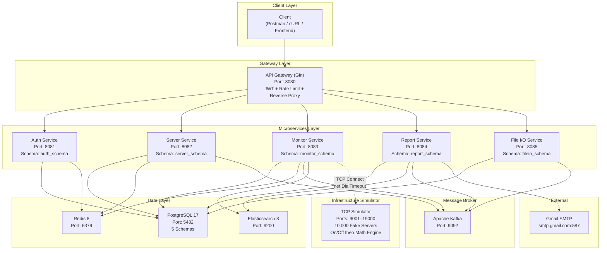
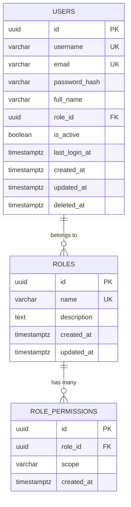
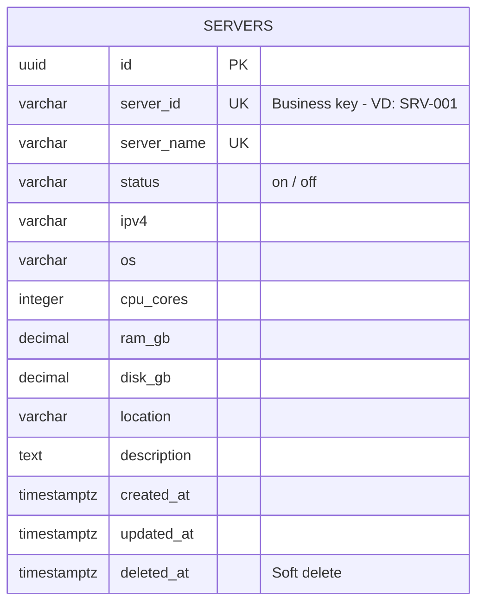
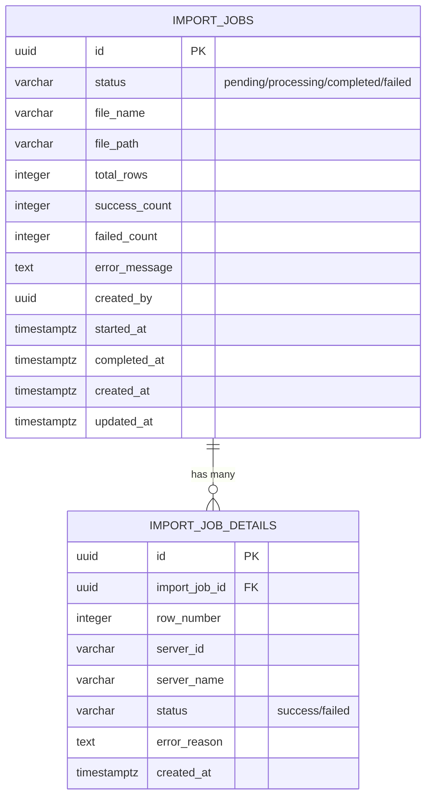
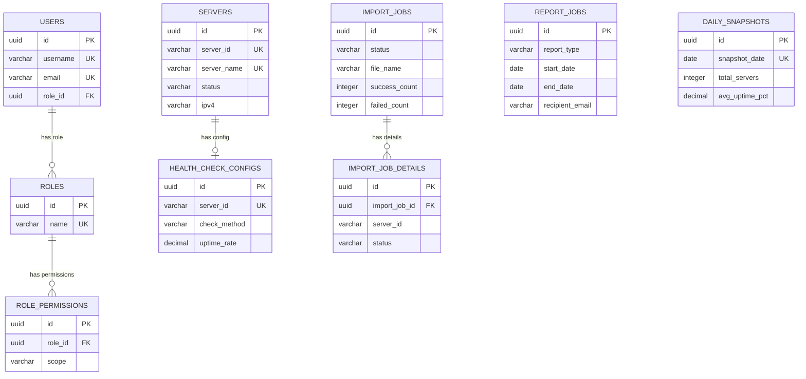
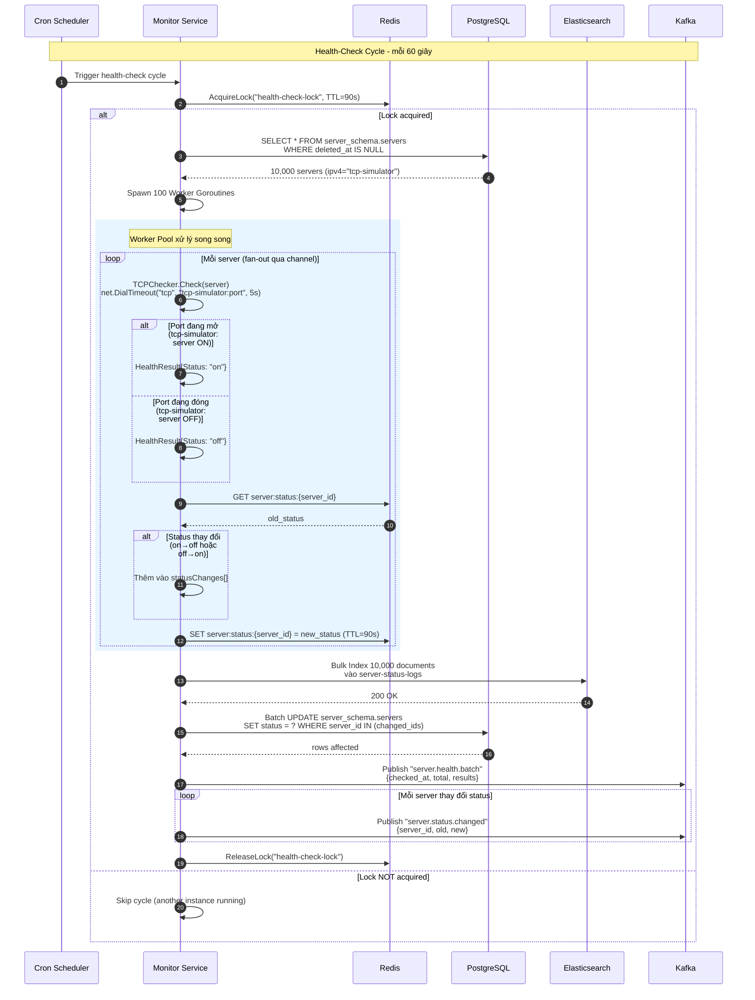
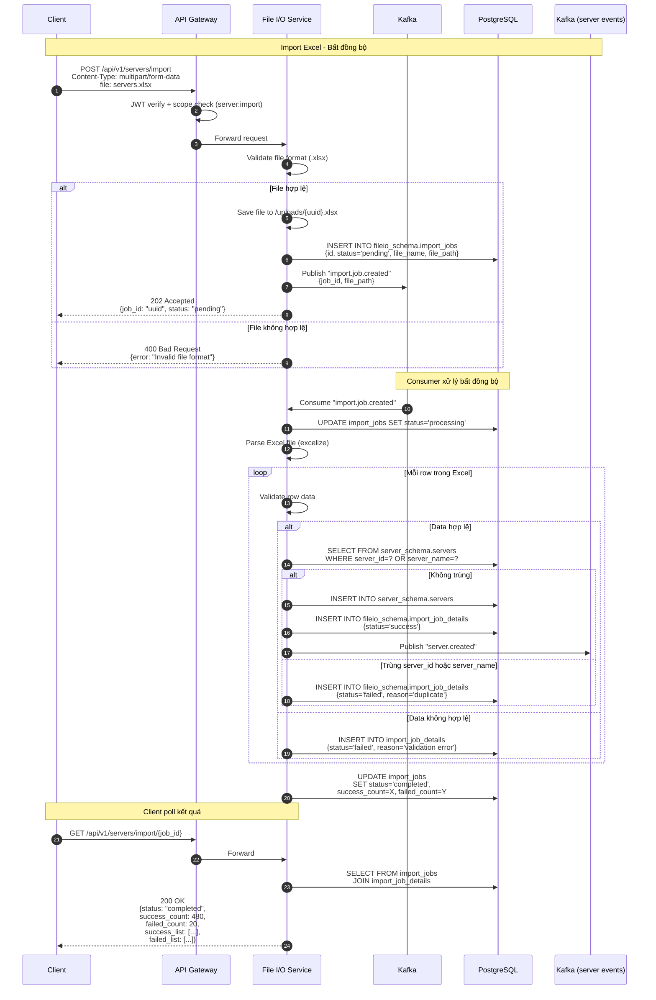
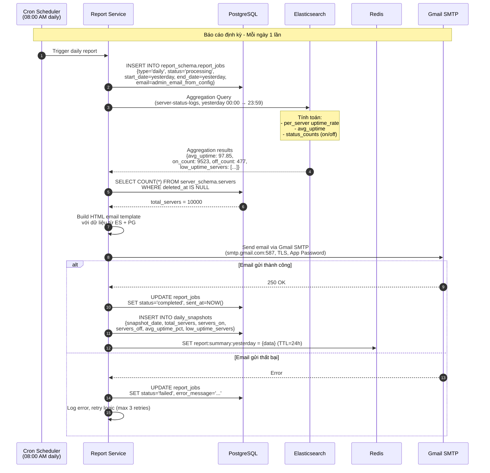
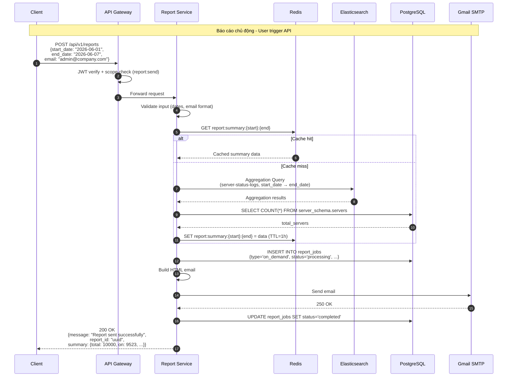
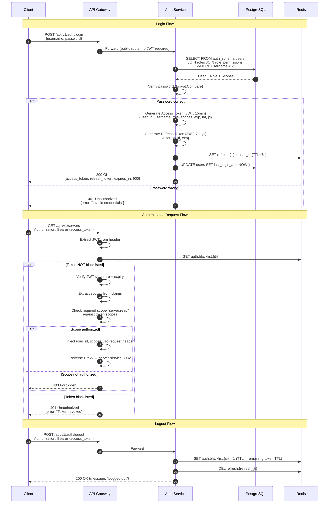

# 🧠 Brainstorm: VCS Server Management System (VCS-SMS) — Bản hoàn chỉnh

> [!IMPORTANT]
> **Tài liệu này đã được hoàn thiện** với 6 quyết định thiết kế đã chốt. Sẵn sàng chuyển sang phase triển khai.

---

## 📋 Mục lục

1. [Phân tích đề bài](#1-phân-tích-đề-bài)
2. [Quyết định thiết kế đã chốt](#2-quyết-định-thiết-kế-đã-chốt)
3. [Kiến trúc Microservice tổng quan](#3-kiến-trúc-microservice-tổng-quan)
4. [Mô tả chi tiết từng Service](#4-mô-tả-chi-tiết-từng-service)
5. [Database Schema chi tiết (Separate Schemas)](#5-database-schema-chi-tiết)
6. [Elasticsearch Index Mapping](#6-elasticsearch-index-mapping)
7. [Sequence Diagrams — Luồng Async phức tạp](#7-sequence-diagrams--luồng-async-phức-tạp)
8. [Kafka Topics & Events](#8-kafka-topics--events)
9. [Redis Cache Strategy](#9-redis-cache-strategy)
10. [API Design & OpenAPI](#10-api-design--openapi)
11. [Error Handling — Standard Response](#11-error-handling--standard-response)
12. [JWT Auth & RBAC](#12-jwt-auth--rbac)
13. [Logging & Logrotate](#13-logging--logrotate)
14. [Unit Test Strategy](#14-unit-test-strategy)
15. [Project Structure (Monorepo)](#15-project-structure-monorepo)
16. [Docker Compose Setup](#16-docker-compose-setup)
17. [Cấu hình .env](#17-cấu-hình-env)
18. [Technology Stack tổng kết](#18-technology-stack-tổng-kết)
19. [Lộ trình triển khai (Design First)](#19-lộ-trình-triển-khai)

---

## 1. Phân tích đề bài

### 1.1. Bối cảnh
- Quản lý **10.000 server** cho công ty VCS
- Hệ thống tập trung: theo dõi trạng thái (On/Off), CRUD, import/export, báo cáo
- Người dùng tương tác qua **REST API**

### 1.2. Tổng hợp điểm số & yêu cầu

| Nhóm | Chức năng | Điểm |
|------|-----------|------|
| **Chức năng** | Kiểm tra trạng thái định kỳ | 2.0 |
| | Tạo Server | 0.25 |
| | View Server (filter, sort, pagination) | 0.25 |
| | Update Server | 0.25 |
| | Delete Server | 0.25 |
| | Import Servers (Excel) | 0.5 |
| | Export Servers (Excel) | 0.5 |
| | Báo cáo định kỳ (Email) | 0.5 |
| | API Báo cáo chủ động | 0.5 |
| **Phi chức năng** | OpenAPI | 0.5 |
| | Unit Test ≥ 90% coverage | 0.5 |
| | Chống SQL Injection (ORM) | 0.5 |
| | Error handling rõ ràng | 0.5 |
| | Log ra file + logrotate | 0.5 |
| | JWT Auth + Scope | 0.5 |
| | Elasticsearch (Uptime) | 1.0 |
| | Postgres DB | - |
| | Redis Cache | 0.5 |
| | Công nghệ khác | 0.5 |
| | **Tổng** | **10.0** |

---

## 2. Quyết định thiết kế đã chốt

> [!NOTE]
> 6 quyết định thiết kế đã được xác nhận và sẽ áp dụng xuyên suốt dự án.

| # | Câu hỏi | Quyết định | Lý do |
|---|---------|------------|-------|
| 1 | **Health-check Method** | **TCP Simulator Pool** | 1 service Go (`tcp-simulator`) quản lý 10.000 TCP listeners, mở/đóng port động theo công thức toán học (uptime_rate + sin wave). Monitor Service dùng TCP Connect thật (`net.DialTimeout`) ping tới các port này. Kết hợp được cả dữ liệu trồi sụt realistic lẫn kiểm chứng TCP code thật |
| 2 | **API Gateway** | **Tự viết bằng Gin** | Full control JWT Middleware, Rate Limiting, Reverse Proxy. Hệ sinh thái gọn nhẹ, không phụ thuộc Kong/Traefik |
| 3 | **Email Provider** | **Gmail SMTP + App Password** | Gửi email thật, cấu hình qua `.env`, đủ quota cho demo, bảo mật App Password |
| 4 | **Repo Structure** | **Monorepo** | Quản lý tập trung, shared libs dễ dàng, 1 `docker-compose.yml` cho toàn bộ |
| 5 | **Database Strategy** | **Shared Instance, Separate Schemas** | 1 Postgres vật lý, mỗi service 1 schema riêng. Loose coupling + nhẹ máy |
| 6 | **Quy trình** | **Design First** | Hoàn thiện DB Schema → OpenAPI Spec → Sequence Diagrams → Code |

---

## 3. Kiến trúc Microservice tổng quan

### 3.1. System Architecture



### 3.2. Service Boundaries & Ownership

| Service | Schema | Owns Tables | Depends On |
|---------|--------|-------------|------------|
| **Auth Service** | `auth_schema` | `users`, `roles`, `role_permissions` | Redis |
| **Server Service** | `server_schema` | `servers` | Redis, Kafka |
| **Monitor Service** | `monitor_schema` | `health_check_configs` | Redis, Kafka, ES, TCP Simulator, (đọc `server_schema.servers`) |
| **Report Service** | `report_schema` | `report_jobs`, `daily_snapshots` | ES, Kafka, Gmail SMTP |
| **File I/O Service** | `fileio_schema` | `import_jobs`, `import_job_details` | Kafka, (đọc/ghi `server_schema.servers`) |
| **TCP Simulator** | _(không có schema)_ | _(không có bảng)_ | Standalone — chỉ mở/đóng TCP ports |

> [!WARNING]
> **Cross-schema access**: Monitor Service và File I/O Service cần đọc/ghi bảng `servers` thuộc `server_schema`. Trong môi trường microservice lý tưởng, nên giao tiếp qua API. Tuy nhiên, với Shared Instance approach, ta cho phép **cross-schema read** qua GRANT SELECT và ghi thông qua **Kafka event** → Server Service xử lý write. Điều này giữ write ownership tại Server Service.

---

## 4. Mô tả chi tiết từng Service

### 🚪 4.1. API Gateway (`api-gateway`)

**Trách nhiệm:** Entry point duy nhất. Routing, JWT validation, scope authorization, rate limiting, request logging, reverse proxy.

| Thành phần | Chi tiết |
|------------|---------|
| **Framework** | Gin (tự viết, full control) |
| **Middleware chain** | Recovery → Logger → CORS → Rate Limiter (Redis) → JWT Auth → Scope Check → Reverse Proxy |
| **Config** | Route map tới từng service backend, cấu hình qua `.env` |

**Luồng xử lý request:**

```
Client Request
  → [Recovery Middleware] — catch panic
  → [Request Logger] — log request_id, method, path, latency
  → [CORS Middleware] — allow origins
  → [Rate Limiter] — Redis sliding window (100 req/min per IP)
  → [JWT Middleware] — verify token, extract claims
  → [Scope Authorization] — check required scope cho route
  → [Reverse Proxy] — forward tới backend service
  → Response (with request_id header)
```

**Route Configuration:**

```go
// Cấu hình route map
var routeConfig = map[string]RouteTarget{
    "/api/v1/auth/*":           {Backend: "http://auth-service:8081",    Public: true},
    "/api/v1/servers/*":        {Backend: "http://server-service:8082",  Scope: "server:*"},
    "/api/v1/servers/import/*": {Backend: "http://fileio-service:8085",  Scope: "server:import"},
    "/api/v1/servers/export/*": {Backend: "http://fileio-service:8085",  Scope: "server:export"},
    "/api/v1/monitor/*":        {Backend: "http://monitor-service:8083", Scope: "server:read"},
    "/api/v1/reports/*":        {Backend: "http://report-service:8084",  Scope: "report:*"},
}
```

---

### 🔐 4.2. Auth Service (`auth-service`)

**Trách nhiệm:** Quản lý user, đăng nhập, đăng ký, cấp JWT token (access + refresh), phân quyền RBAC.

| Thành phần | Chi tiết |
|------------|---------|
| **Schema** | `auth_schema` — bảng `users`, `roles`, `role_permissions` |
| **Cache** | Redis — JWT blacklist (logout), refresh token store |
| **API** | Register, Login, Refresh, Logout, Get Profile |

**API Endpoints:**

| Method | Path | Auth | Scope | Mô tả |
|--------|------|------|-------|--------|
| POST | `/api/v1/auth/register` | ❌ Public | — | Đăng ký user mới |
| POST | `/api/v1/auth/login` | ❌ Public | — | Đăng nhập, trả JWT |
| POST | `/api/v1/auth/refresh` | ❌ Public | — | Refresh access token |
| POST | `/api/v1/auth/logout` | ✅ | — | Đưa token vào blacklist |
| GET | `/api/v1/auth/profile` | ✅ | — | Lấy thông tin user hiện tại |

---

### 🖥️ 4.3. Server Service (`server-service`)

**Trách nhiệm:** CRUD server, filter/sort/pagination, validate dữ liệu, publish event qua Kafka.

| Thành phần | Chi tiết |
|------------|---------|
| **Schema** | `server_schema` — bảng `servers` |
| **Cache** | Redis — cache server detail, cache list theo filter |
| **Kafka** | Publish: `server.created`, `server.updated`, `server.deleted` |

**API Endpoints:**

| Method | Path | Scope | Mô tả |
|--------|------|-------|--------|
| POST | `/api/v1/servers` | `server:create` | Tạo 1 server |
| GET | `/api/v1/servers` | `server:read` | List server (filter, sort, paging) |
| GET | `/api/v1/servers/:server_id` | `server:read` | Chi tiết 1 server |
| PUT | `/api/v1/servers/:server_id` | `server:update` | Cập nhật server (không được đổi server_id) |
| DELETE | `/api/v1/servers/:server_id` | `server:delete` | Soft delete server |

**Filter/Sort/Pagination Query:**

```
GET /api/v1/servers?status=on&server_name=web&ipv4=192.168&sort_by=created_at&sort_order=desc&page=1&page_size=20
```

---

### 📡 4.4. Monitor Service (`monitor-service`)

**Trách nhiệm:** Health-check định kỳ 10.000 server bằng TCP Connect thật, ghi trạng thái vào ES, cập nhật status trên PG.

> [!IMPORTANT]
> Đây là service **quan trọng nhất** (2.0 điểm). Sử dụng TCP Connect thật tới `tcp-simulator` service — nơi mở/đóng 10.000 port theo công thức toán học.

| Thành phần | Chi tiết |
|------------|---------|
| **Schema** | `monitor_schema` — bảng `health_check_configs` |
| **ES** | Ghi document vào index `server-status-logs` |
| **Cache** | Redis — cache status hiện tại, distributed lock |
| **Kafka** | Consume: `server.created/updated/deleted`. Publish: `server.status.changed`, `server.health.batch` |
| **Scheduler** | Cron job mỗi **60 giây** |
| **Health-check Target** | `tcp-simulator` service (10.000 TCP listeners trên port 9001–19000) |

**TCP Health-Check Strategy:**

> [!NOTE]
> Monitor Service **chỉ dùng TCP Connect** — không có Simulator mode nào trong code Monitor Service. Trạng thái On/Off được điều khiển bởi `tcp-simulator` service (mở/đóng port theo toán học). Monitor Service chỉ biết: "Nếu TCP connect thành công → ON, nếu bị refused → OFF".

```go
// TCP Connect Checker — check thật tới tcp-simulator
type TCPChecker struct {
    Timeout time.Duration // default: 5s
}

func (c *TCPChecker) Check(ctx context.Context, server *Server) *HealthResult {
    port := server.HealthCheckConfig.TCPPort  // 9001..19000
    addr := fmt.Sprintf("%s:%d", server.IPv4, port)
    // server.IPv4 = "tcp-simulator" (Docker DNS resolve)
    
    start := time.Now()
    conn, err := net.DialTimeout("tcp", addr, c.Timeout)
    elapsed := time.Since(start).Milliseconds()
    
    if err != nil {
        return &HealthResult{
            Status:         "off",
            ResponseTimeMs: 0,
            CheckMethod:    "tcp",
        }
    }
    defer conn.Close()
    return &HealthResult{
        Status:         "on",
        ResponseTimeMs: int(elapsed),
        CheckMethod:    "tcp",
    }
}
```

**Worker Pool cho 10.000 servers:**

```go
const (
    WorkerCount   = 100    // 100 goroutines
    BatchSize     = 100    // mỗi worker xử lý 100 servers
    CheckInterval = 60     // giây
)

func (s *MonitorService) RunHealthCheckCycle(ctx context.Context) error {
    // 1. Acquire distributed lock (Redis) — tránh overlap
    lock, err := s.redis.AcquireLock(ctx, "health-check-lock", 90*time.Second)
    if err != nil {
        return fmt.Errorf("another health-check cycle is running")
    }
    defer lock.Release(ctx)
    
    // 2. Lấy danh sách servers từ PG (cross-schema read)
    servers, err := s.serverRepo.GetAllActiveServers(ctx)
    
    // 3. Worker pool
    jobs := make(chan *Server, len(servers))
    results := make(chan *HealthResult, len(servers))
    
    var wg sync.WaitGroup
    for i := 0; i < WorkerCount; i++ {
        wg.Add(1)
        go func() {
            defer wg.Done()
            for server := range jobs {
                result := s.checker.Check(ctx, server)
                result.ServerID = server.ServerID
                result.ServerName = server.ServerName
                result.CheckedAt = time.Now().UTC()
                results <- result
            }
        }()
    }
    
    // 4. Fan-out jobs
    for _, srv := range servers {
        jobs <- srv
    }
    close(jobs)
    
    // 5. Collect results
    go func() { wg.Wait(); close(results) }()
    
    // 6. Batch process results
    var batch []*HealthResult
    var statusChanges []*StatusChangeEvent
    
    for result := range results {
        batch = append(batch, result)
        
        // Check if status changed (compare with Redis cached status)
        oldStatus, _ := s.redis.Get(ctx, "server:status:"+result.ServerID)
        if oldStatus != result.Status {
            statusChanges = append(statusChanges, &StatusChangeEvent{
                ServerID:  result.ServerID,
                OldStatus: oldStatus,
                NewStatus: result.Status,
            })
        }
        
        // Update Redis cache
        s.redis.Set(ctx, "server:status:"+result.ServerID, result.Status, 90*time.Second)
    }
    
    // 7. Batch write to Elasticsearch
    s.esRepo.BulkIndexStatusLogs(ctx, batch)
    
    // 8. Batch update status in PostgreSQL (chỉ server thay đổi status)
    s.serverRepo.BatchUpdateStatus(ctx, statusChanges)
    
    // 9. Publish events to Kafka
    s.kafka.Publish("server.health.batch", &HealthBatchEvent{
        CheckedAt:    time.Now().UTC(),
        TotalServers: len(servers),
        Results:      batch,
    })
    for _, change := range statusChanges {
        s.kafka.Publish("server.status.changed", change)
    }
    
    return nil
}
```

---

### 🖥️ 4.5. TCP Simulator Service (`tcp-simulator`)

**Trách nhiệm:** Giả lập 10.000 server vật lý bằng cách mở/đóng TCP port động theo công thức toán học. Đây là service hạ tầng hỗ trợ, **không nằm trong business logic** — chỉ phục vụ mục đích tạo ra môi trường để Monitor Service có thể ping TCP thật.

> [!IMPORTANT]
> Service này giải quyết bài toán: "Lấy đâu ra 10.000 IP/Port thật để test TCP?" bằng cách tạo 10.000 TCP listeners trong 1 container duy nhất.

| Thành phần | Chi tiết |
|------------|---------|
| **Ngôn ngữ** | Go (cùng stack với hệ thống) |
| **Port range** | 9001–19000 (10.000 ports) |
| **Tick interval** | 30 giây — đánh giá lại trạng thái On/Off mỗi server |
| **Logic On/Off** | Công thức toán học: `uptime_rate` + sin wave hourly + server-specific phase |
| **RAM** | ~100–256MB cho 10.000 listeners |
| **Docker hostname** | `tcp-simulator` (Docker DNS nội bộ) |

**Mapping Port:**
```
Server SRV-00001 → tcp-simulator:9001
Server SRV-00002 → tcp-simulator:9002
...
Server SRV-10000 → tcp-simulator:19000

Công thức: Port = 9000 + server_index
```

**Math Engine — Điều khiển On/Off theo toán học:**

```go
// math_engine.go — Quyết định server nên ON hay OFF tại thời điểm hiện tại

type MathEngine struct{}

func (e *MathEngine) ShouldBeOnline(uptimeRate float64, serverIndex int) bool {
    // 1. Base rate từ config (VD: 0.95 = 95%)
    baseRate := uptimeRate

    // 2. Hourly variation — sin wave tạo pattern trồi sụt theo giờ
    hour := float64(time.Now().Hour())
    hourlyVariation := math.Sin(hour * math.Pi / 12) * 0.05

    // 3. Server-specific offset — mỗi server có phase khác nhau
    //    để không phải tất cả cùng On/Off 1 lúc
    serverPhase := float64(serverIndex) * 0.1
    serverVariation := math.Sin((hour+serverPhase) * math.Pi / 24) * 0.02

    // 4. Tính effective rate
    effectiveRate := math.Max(0, math.Min(1, baseRate + hourlyVariation + serverVariation))

    // 5. Random roll — quyết định On hay Off
    return rand.Float64() < effectiveRate
}
```

**Listener Manager — Mở/Đóng Port Động:**

```go
// manager.go — Quản lý 10.000 TCP listeners

type SimulatorManager struct {
    servers     map[int]*FakeServer  // index -> listener
    mathEngine  *MathEngine
    basePort    int                  // 9000
    numServers  int                  // 10000
    tickInterval time.Duration       // 30s
}

type FakeServer struct {
    Index      int
    Port       int
    UptimeRate float64
    listener   net.Listener
    isOnline   bool
    mu         sync.Mutex
}

// Vòng lặp chính: cứ mỗi 30 giây, đánh giá lại trạng thái mỗi server
func (m *SimulatorManager) RunControlLoop(ctx context.Context) {
    ticker := time.NewTicker(m.tickInterval)
    defer ticker.Stop()
    
    // Khởi tạo lần đầu
    m.evaluateAllServers()

    for {
        select {
        case <-ctx.Done():
            m.shutdownAll()
            return
        case <-ticker.C:
            m.evaluateAllServers()
        }
    }
}

func (m *SimulatorManager) evaluateAllServers() {
    var wg sync.WaitGroup
    sem := make(chan struct{}, 200) // limit concurrent open/close

    for _, server := range m.servers {
        wg.Add(1)
        sem <- struct{}{}
        go func(s *FakeServer) {
            defer wg.Done()
            defer func() { <-sem }()

            shouldBeOn := m.mathEngine.ShouldBeOnline(s.UptimeRate, s.Index)

            if shouldBeOn && !s.isOnline {
                s.StartListening()    // Mở port → TCP ping sẽ thành công
            } else if !shouldBeOn && s.isOnline {
                s.StopListening()     // Đóng port → TCP ping sẽ fail (connection refused)
            }
        }(server)
    }
    wg.Wait()
}

// StartListening — mở TCP port, accept connections rồi đóng ngay
func (s *FakeServer) StartListening() {
    s.mu.Lock()
    defer s.mu.Unlock()

    ln, err := net.Listen("tcp", fmt.Sprintf(":%d", s.Port))
    if err != nil {
        return
    }
    s.listener = ln
    s.isOnline = true

    // Accept loop: chấp nhận rồi đóng ngay (đủ cho TCP health-check)
    go func() {
        for {
            conn, err := ln.Accept()
            if err != nil {
                return // listener closed
            }
            conn.Close()
        }
    }()
}

// StopListening — đóng TCP port → connection refused
func (s *FakeServer) StopListening() {
    s.mu.Lock()
    defer s.mu.Unlock()

    if s.listener != nil {
        s.listener.Close()
        s.listener = nil
    }
    s.isOnline = false
}
```

**Cách hoạt động tổng thể:**

```
┌─────────────────────────────────────────────────────────────┐
│  Docker Network: vcs-network                                 │
│                                                              │
│  ┌──────────────────┐     TCP Connect     ┌───────────────┐ │
│  │  Monitor Service │ ──────────────────▶ │ TCP Simulator │ │
│  │  (port 8083)     │  tcp-simulator:9001 │ Service       │ │
│  │                  │  tcp-simulator:9002 │               │ │
│  │  TCPChecker:     │  ...               │ 10.000        │ │
│  │  net.DialTimeout │  tcp-simulator:19000│ Listeners     │ │
│  │  ("tcp", addr,   │                    │ On/Off theo   │ │
│  │   5s)            │ ◀──────────────── │ Math Engine   │ │
│  │                  │  Accept ✅ / Refuse ❌│               │ │
│  └──────────────────┘                     └───────────────┘ │
│                                                              │
│  Math Engine (mỗi 30s):                                      │
│  effectiveRate = uptimeRate + sin(hour*π/12)*0.05            │
│                + sin((hour+phase)*π/24)*0.02                 │
│  shouldBeOn = random() < effectiveRate                       │
└─────────────────────────────────────────────────────────────┘
```

---

### 📊 4.6. Report Service (`report-service`)

**Trách nhiệm:** Tính toán uptime từ ES, tạo báo cáo, gửi email qua Gmail SMTP, cron daily report.

| Thành phần | Chi tiết |
|------------|---------|
| **Schema** | `report_schema` — bảng `report_jobs`, `daily_snapshots` |
| **ES** | Query aggregate uptime từ `server-status-logs` |
| **Kafka** | Consume: `server.health.batch`. Publish: — |
| **SMTP** | Gmail SMTP (smtp.gmail.com:587) + App Password |
| **Scheduler** | Cron job 1 lần/ngày (VD: 08:00 AM) |

**API Endpoints:**

| Method | Path | Scope | Mô tả |
|--------|------|-------|--------|
| POST | `/api/v1/reports` | `report:send` | Gửi báo cáo chủ động (input: start_date, end_date, email) |
| GET | `/api/v1/reports/summary` | `report:view` | Lấy summary báo cáo (input: start_date, end_date) |

**Tính Uptime bằng Elasticsearch Aggregation:**

```
Uptime(server) = (Số lần check status = "on") / (Tổng số lần check) × 100%
Uptime(trung bình) = AVG(Uptime của tất cả servers)
```

**Email Template (HTML):**

```
📊 BÁO CÁO TRẠNG THÁI SERVER - 07/06/2026

━━━━━━━━━━━━━━━━━━━━━━━━━━━━━━━━━━━
✅ Tổng số server:        10,000
🟢 Server Online:          9,523 (95.23%)
🔴 Server Offline:           477 (4.77%)
📈 Uptime trung bình:     97.85%
━━━━━━━━━━━━━━━━━━━━━━━━━━━━━━━━━━━

⚠️ Top 10 server có uptime thấp nhất:
┌────────────┬─────────────────┬──────────┐
│ Server ID  │ Server Name     │ Uptime   │
├────────────┼─────────────────┼──────────┤
│ SRV-4521   │ db-backup-03    │ 45.20%   │
│ SRV-1234   │ cache-node-07   │ 52.10%   │
│ ...        │ ...             │ ...      │
└────────────┴─────────────────┴──────────┘
```

---

### 📁 4.7. File I/O Service (`fileio-service`)

**Trách nhiệm:** Import/Export danh sách server từ/ra file Excel (.xlsx). Xử lý bất đồng bộ qua Kafka.

| Thành phần | Chi tiết |
|------------|---------|
| **Schema** | `fileio_schema` — bảng `import_jobs`, `import_job_details` |
| **Kafka** | Publish/Consume: `import.job.created` |
| **Library** | `excelize` (Go library cho Excel) |
| **Cross-schema** | Đọc/ghi `server_schema.servers` (GRANT) |

**API Endpoints:**

| Method | Path | Scope | Mô tả |
|--------|------|-------|--------|
| POST | `/api/v1/servers/import` | `server:import` | Upload file .xlsx để import |
| GET | `/api/v1/servers/import/:job_id` | `server:import` | Check trạng thái import job |
| POST | `/api/v1/servers/export` | `server:export` | Export server list ra file .xlsx |

**Excel Template (Import):**

| server_id | server_name | ipv4 | os | cpu_cores | ram_gb | disk_gb | location | description |
|-----------|-------------|------|----|-----------|--------|---------|----------|-------------|
| SRV-NEW-001 | web-new-01 | 10.0.1.100 | Ubuntu 22.04 | 8 | 16 | 500 | DC-HN | Web server |
| SRV-NEW-002 | db-new-01 | 10.0.1.101 | CentOS 9 | 16 | 64 | 2000 | DC-HCM | Database |

---

## 5. Database Schema chi tiết

> [!IMPORTANT]
> Sử dụng **Shared Instance, Separate Schemas**. 1 Postgres vật lý với 5 schema riêng biệt. Init script tạo tất cả schemas + GRANT permissions khi khởi tạo container.

### 5.0. Init Script — Tạo Schemas & Users

```sql
-- deployments/docker/postgres/init.sql

-- Tạo database
CREATE DATABASE vcs_sms;

\c vcs_sms;

-- ============================
-- Tạo 5 schemas
-- ============================
CREATE SCHEMA IF NOT EXISTS auth_schema;
CREATE SCHEMA IF NOT EXISTS server_schema;
CREATE SCHEMA IF NOT EXISTS monitor_schema;
CREATE SCHEMA IF NOT EXISTS report_schema;
CREATE SCHEMA IF NOT EXISTS fileio_schema;

-- ============================
-- Tạo DB users cho mỗi service
-- ============================
CREATE USER auth_user WITH PASSWORD 'auth_pass_secret';
CREATE USER server_user WITH PASSWORD 'server_pass_secret';
CREATE USER monitor_user WITH PASSWORD 'monitor_pass_secret';
CREATE USER report_user WITH PASSWORD 'report_pass_secret';
CREATE USER fileio_user WITH PASSWORD 'fileio_pass_secret';

-- ============================
-- GRANT quyền — mỗi user sở hữu schema riêng
-- ============================
-- Auth Service
GRANT ALL PRIVILEGES ON SCHEMA auth_schema TO auth_user;
GRANT ALL PRIVILEGES ON ALL TABLES IN SCHEMA auth_schema TO auth_user;
ALTER DEFAULT PRIVILEGES IN SCHEMA auth_schema GRANT ALL ON TABLES TO auth_user;

-- Server Service
GRANT ALL PRIVILEGES ON SCHEMA server_schema TO server_user;
GRANT ALL PRIVILEGES ON ALL TABLES IN SCHEMA server_schema TO server_user;
ALTER DEFAULT PRIVILEGES IN SCHEMA server_schema GRANT ALL ON TABLES TO server_user;

-- Monitor Service — sở hữu monitor_schema + READ trên server_schema
GRANT ALL PRIVILEGES ON SCHEMA monitor_schema TO monitor_user;
ALTER DEFAULT PRIVILEGES IN SCHEMA monitor_schema GRANT ALL ON TABLES TO monitor_user;
GRANT USAGE ON SCHEMA server_schema TO monitor_user;
GRANT SELECT ON ALL TABLES IN SCHEMA server_schema TO monitor_user;
ALTER DEFAULT PRIVILEGES IN SCHEMA server_schema GRANT SELECT ON TABLES TO monitor_user;

-- Report Service
GRANT ALL PRIVILEGES ON SCHEMA report_schema TO report_user;
ALTER DEFAULT PRIVILEGES IN SCHEMA report_schema GRANT ALL ON TABLES TO report_user;
GRANT USAGE ON SCHEMA server_schema TO report_user;
GRANT SELECT ON ALL TABLES IN SCHEMA server_schema TO report_user;

-- FileIO Service — sở hữu fileio_schema + READ/WRITE trên server_schema
GRANT ALL PRIVILEGES ON SCHEMA fileio_schema TO fileio_user;
ALTER DEFAULT PRIVILEGES IN SCHEMA fileio_schema GRANT ALL ON TABLES TO fileio_user;
GRANT USAGE ON SCHEMA server_schema TO fileio_user;
GRANT SELECT, INSERT ON ALL TABLES IN SCHEMA server_schema TO fileio_user;
ALTER DEFAULT PRIVILEGES IN SCHEMA server_schema GRANT SELECT, INSERT ON TABLES TO fileio_user;
```

---

### 5.1. Schema: `auth_schema`

```sql
-- auth_schema.users
CREATE TABLE auth_schema.users (
    id              UUID PRIMARY KEY DEFAULT gen_random_uuid(),
    username        VARCHAR(100)  NOT NULL UNIQUE,
    email           VARCHAR(255)  NOT NULL UNIQUE,
    password_hash   VARCHAR(255)  NOT NULL,
    full_name       VARCHAR(255),
    role_id         UUID          NOT NULL REFERENCES auth_schema.roles(id),
    is_active       BOOLEAN       NOT NULL DEFAULT TRUE,
    last_login_at   TIMESTAMPTZ,
    created_at      TIMESTAMPTZ   NOT NULL DEFAULT NOW(),
    updated_at      TIMESTAMPTZ   NOT NULL DEFAULT NOW(),
    deleted_at      TIMESTAMPTZ            -- soft delete (GORM)
);

CREATE INDEX idx_users_username ON auth_schema.users(username) WHERE deleted_at IS NULL;
CREATE INDEX idx_users_email ON auth_schema.users(email) WHERE deleted_at IS NULL;
CREATE INDEX idx_users_role_id ON auth_schema.users(role_id);

-- auth_schema.roles
CREATE TABLE auth_schema.roles (
    id              UUID PRIMARY KEY DEFAULT gen_random_uuid(),
    name            VARCHAR(50)   NOT NULL UNIQUE,  -- 'admin', 'operator', 'viewer'
    description     TEXT,
    created_at      TIMESTAMPTZ   NOT NULL DEFAULT NOW(),
    updated_at      TIMESTAMPTZ   NOT NULL DEFAULT NOW()
);

-- auth_schema.role_permissions (many-to-many: role ↔ scope)
CREATE TABLE auth_schema.role_permissions (
    id              UUID PRIMARY KEY DEFAULT gen_random_uuid(),
    role_id         UUID          NOT NULL REFERENCES auth_schema.roles(id) ON DELETE CASCADE,
    scope           VARCHAR(100)  NOT NULL, -- 'server:create', 'server:read', etc.
    created_at      TIMESTAMPTZ   NOT NULL DEFAULT NOW(),
    
    UNIQUE(role_id, scope)
);

CREATE INDEX idx_role_permissions_role_id ON auth_schema.role_permissions(role_id);

-- ============================
-- Seed data: Roles & Permissions
-- ============================
INSERT INTO auth_schema.roles (id, name, description) VALUES
    ('a0000000-0000-0000-0000-000000000001', 'admin',    'Full access to all resources'),
    ('a0000000-0000-0000-0000-000000000002', 'operator', 'Can read and update servers, view reports'),
    ('a0000000-0000-0000-0000-000000000003', 'viewer',   'Read-only access');

-- Admin scopes (full)
INSERT INTO auth_schema.role_permissions (role_id, scope) VALUES
    ('a0000000-0000-0000-0000-000000000001', 'server:create'),
    ('a0000000-0000-0000-0000-000000000001', 'server:read'),
    ('a0000000-0000-0000-0000-000000000001', 'server:update'),
    ('a0000000-0000-0000-0000-000000000001', 'server:delete'),
    ('a0000000-0000-0000-0000-000000000001', 'server:import'),
    ('a0000000-0000-0000-0000-000000000001', 'server:export'),
    ('a0000000-0000-0000-0000-000000000001', 'report:view'),
    ('a0000000-0000-0000-0000-000000000001', 'report:send'),
    ('a0000000-0000-0000-0000-000000000001', 'user:manage');

-- Operator scopes
INSERT INTO auth_schema.role_permissions (role_id, scope) VALUES
    ('a0000000-0000-0000-0000-000000000002', 'server:read'),
    ('a0000000-0000-0000-0000-000000000002', 'server:update'),
    ('a0000000-0000-0000-0000-000000000002', 'report:view');

-- Viewer scopes
INSERT INTO auth_schema.role_permissions (role_id, scope) VALUES
    ('a0000000-0000-0000-0000-000000000003', 'server:read'),
    ('a0000000-0000-0000-0000-000000000003', 'report:view');
```

**ERD: auth_schema**



---

### 5.2. Schema: `server_schema`

```sql
-- server_schema.servers
CREATE TABLE server_schema.servers (
    id              UUID PRIMARY KEY DEFAULT gen_random_uuid(),
    server_id       VARCHAR(100)  NOT NULL UNIQUE,  -- business key (VD: SRV-001)
    server_name     VARCHAR(255)  NOT NULL UNIQUE,
    status          VARCHAR(20)   NOT NULL DEFAULT 'off' CHECK (status IN ('on', 'off')),
    ipv4            VARCHAR(15)   NOT NULL,
    os              VARCHAR(100),
    cpu_cores       INTEGER       CHECK (cpu_cores > 0),
    ram_gb          DECIMAL(10,2) CHECK (ram_gb > 0),
    disk_gb         DECIMAL(10,2) CHECK (disk_gb > 0),
    location        VARCHAR(255),
    description     TEXT,
    created_at      TIMESTAMPTZ   NOT NULL DEFAULT NOW(),
    updated_at      TIMESTAMPTZ   NOT NULL DEFAULT NOW(),
    deleted_at      TIMESTAMPTZ            -- soft delete
);

-- Performance indexes
CREATE INDEX idx_servers_server_id ON server_schema.servers(server_id) WHERE deleted_at IS NULL;
CREATE INDEX idx_servers_server_name ON server_schema.servers(server_name) WHERE deleted_at IS NULL;
CREATE INDEX idx_servers_status ON server_schema.servers(status) WHERE deleted_at IS NULL;
CREATE INDEX idx_servers_ipv4 ON server_schema.servers(ipv4) WHERE deleted_at IS NULL;
CREATE INDEX idx_servers_created_at ON server_schema.servers(created_at) WHERE deleted_at IS NULL;

-- Composite index cho filter + sort phổ biến
CREATE INDEX idx_servers_status_created ON server_schema.servers(status, created_at DESC) WHERE deleted_at IS NULL;
```

**ERD: server_schema**



---

### 5.3. Schema: `monitor_schema`

```sql
-- monitor_schema.health_check_configs
-- Cấu hình health-check cho mỗi server (hoặc global)
CREATE TABLE monitor_schema.health_check_configs (
    id              UUID PRIMARY KEY DEFAULT gen_random_uuid(),
    server_id       VARCHAR(100)  NOT NULL UNIQUE, -- FK logic tới server_schema.servers.server_id
    check_method    VARCHAR(20)   NOT NULL DEFAULT 'tcp' CHECK (check_method IN ('tcp', 'simulator')),
    tcp_port        INTEGER       DEFAULT 80,
    tcp_timeout_ms  INTEGER       DEFAULT 5000,
    uptime_rate     DECIMAL(3,2)  DEFAULT 0.95 CHECK (uptime_rate >= 0 AND uptime_rate <= 1),
    is_enabled      BOOLEAN       NOT NULL DEFAULT TRUE,
    created_at      TIMESTAMPTZ   NOT NULL DEFAULT NOW(),
    updated_at      TIMESTAMPTZ   NOT NULL DEFAULT NOW()
);

CREATE INDEX idx_hc_configs_server_id ON monitor_schema.health_check_configs(server_id);
CREATE INDEX idx_hc_configs_enabled ON monitor_schema.health_check_configs(is_enabled) WHERE is_enabled = TRUE;
```

---

### 5.4. Seed Data — 10.000 Servers cho TCP Simulator

> [!NOTE]
> Script này tạo 10.000 server records trong DB với `ipv4 = 'tcp-simulator'` (Docker hostname) và `tcp_port` mapping tương ứng. Chạy sau khi init schemas.

```sql
-- deployments/docker/postgres/seed_10k_servers.sql
-- Tạo 10.000 servers trỏ tới tcp-simulator container

DO $$
DECLARE
    i INTEGER;
    uptime DECIMAL(3,2);
    categories TEXT[] := ARRAY['web', 'db', 'cache', 'api', 'worker', 'proxy', 'storage', 'monitor', 'queue', 'ml'];
    locations TEXT[] := ARRAY['DC-HN', 'DC-HCM', 'DC-DN', 'DC-HP', 'DC-CT'];
    os_list TEXT[] := ARRAY['Ubuntu 22.04', 'Ubuntu 24.04', 'CentOS 9', 'Debian 12', 'RHEL 9'];
BEGIN
    FOR i IN 1..10000 LOOP
        -- Uptime rate phân bố đa dạng:
        -- 70% servers: uptime 0.93-0.99 (tốt)
        -- 20% servers: uptime 0.80-0.93 (trung bình)
        -- 10% servers: uptime 0.50-0.80 (kém)
        IF i % 10 = 0 THEN
            uptime := 0.50 + (random() * 0.30);          -- 50-80%
        ELSIF i % 5 = 0 THEN
            uptime := 0.80 + (random() * 0.13);          -- 80-93%
        ELSE
            uptime := 0.93 + (random() * 0.06);          -- 93-99%
        END IF;

        -- Insert server
        INSERT INTO server_schema.servers
            (server_id, server_name, status, ipv4, os, cpu_cores, ram_gb, disk_gb, location, description)
        VALUES (
            'SRV-' || LPAD(i::TEXT, 5, '0'),
            categories[1 + (i % 10)] || '-' || LPAD(((i-1)/10 + 1)::TEXT, 4, '0'),
            'off',
            'tcp-simulator',   -- Docker hostname, TCP Simulator sẽ resolve
            os_list[1 + (i % 5)],
            CASE WHEN i % 3 = 0 THEN 16 WHEN i % 3 = 1 THEN 8 ELSE 4 END,
            CASE WHEN i % 3 = 0 THEN 64 WHEN i % 3 = 1 THEN 32 ELSE 16 END,
            CASE WHEN i % 3 = 0 THEN 2000 WHEN i % 3 = 1 THEN 1000 ELSE 500 END,
            locations[1 + (i % 5)],
            'Auto-generated server #' || i
        );

        -- Insert health check config
        INSERT INTO monitor_schema.health_check_configs
            (server_id, check_method, tcp_port, tcp_timeout_ms, uptime_rate)
        VALUES (
            'SRV-' || LPAD(i::TEXT, 5, '0'),
            'tcp',                       -- Dùng TCP mode
            9000 + i,                    -- Port mapping: SRV-00001 → 9001
            5000,
            uptime
        );
    END LOOP;
END $$;
```

**Phân bố Uptime Rate:**

| Nhóm | Tỷ lệ | Uptime Range | Ví dụ |
|------|--------|-------------|-------|
| Tốt | 70% (7.000 servers) | 93%–99% | Web servers, API gateways |
| Trung bình | 20% (2.000 servers) | 80%–93% | Dev servers, testing nodes |
| Kém | 10% (1.000 servers) | 50%–80% | Legacy systems, unstable nodes |

---

### 5.5. Schema: `report_schema`

```sql
-- report_schema.report_jobs
-- Lưu lịch sử các job báo cáo (cả định kỳ lẫn on-demand)
CREATE TABLE report_schema.report_jobs (
    id              UUID PRIMARY KEY DEFAULT gen_random_uuid(),
    report_type     VARCHAR(20)   NOT NULL CHECK (report_type IN ('daily', 'on_demand')),
    status          VARCHAR(20)   NOT NULL DEFAULT 'pending' CHECK (status IN ('pending', 'processing', 'completed', 'failed')),
    start_date      DATE          NOT NULL,
    end_date        DATE          NOT NULL,
    recipient_email VARCHAR(255)  NOT NULL,
    
    -- Kết quả báo cáo (snapshot)
    total_servers   INTEGER,
    servers_on      INTEGER,
    servers_off     INTEGER,
    avg_uptime_pct  DECIMAL(5,2),
    
    error_message   TEXT,
    sent_at         TIMESTAMPTZ,
    created_at      TIMESTAMPTZ   NOT NULL DEFAULT NOW(),
    updated_at      TIMESTAMPTZ   NOT NULL DEFAULT NOW()
);

CREATE INDEX idx_report_jobs_type ON report_schema.report_jobs(report_type);
CREATE INDEX idx_report_jobs_status ON report_schema.report_jobs(status);
CREATE INDEX idx_report_jobs_created ON report_schema.report_jobs(created_at);

-- report_schema.daily_snapshots
-- Lưu snapshot hàng ngày để query nhanh (thay vì query lại ES)
CREATE TABLE report_schema.daily_snapshots (
    id              UUID PRIMARY KEY DEFAULT gen_random_uuid(),
    snapshot_date   DATE          NOT NULL UNIQUE,
    total_servers   INTEGER       NOT NULL,
    servers_on      INTEGER       NOT NULL,
    servers_off     INTEGER       NOT NULL,
    avg_uptime_pct  DECIMAL(5,2)  NOT NULL,
    
    -- Chi tiết top server có uptime thấp (JSON)
    low_uptime_servers JSONB,
    
    created_at      TIMESTAMPTZ   NOT NULL DEFAULT NOW()
);

CREATE UNIQUE INDEX idx_daily_snapshots_date ON report_schema.daily_snapshots(snapshot_date);
```

---

### 5.6. Schema: `fileio_schema`

```sql
-- fileio_schema.import_jobs
CREATE TABLE fileio_schema.import_jobs (
    id              UUID PRIMARY KEY DEFAULT gen_random_uuid(),
    status          VARCHAR(20)   NOT NULL DEFAULT 'pending' CHECK (status IN ('pending', 'processing', 'completed', 'failed')),
    file_name       VARCHAR(255)  NOT NULL,
    file_path       VARCHAR(500)  NOT NULL,        -- đường dẫn file trên server
    total_rows      INTEGER       DEFAULT 0,
    success_count   INTEGER       DEFAULT 0,
    failed_count    INTEGER       DEFAULT 0,
    error_message   TEXT,
    created_by      UUID,                          -- user_id (từ JWT)
    started_at      TIMESTAMPTZ,
    completed_at    TIMESTAMPTZ,
    created_at      TIMESTAMPTZ   NOT NULL DEFAULT NOW(),
    updated_at      TIMESTAMPTZ   NOT NULL DEFAULT NOW()
);

CREATE INDEX idx_import_jobs_status ON fileio_schema.import_jobs(status);
CREATE INDEX idx_import_jobs_created_by ON fileio_schema.import_jobs(created_by);

-- fileio_schema.import_job_details
-- Chi tiết từng row trong job import (success/fail + reason)
CREATE TABLE fileio_schema.import_job_details (
    id              UUID PRIMARY KEY DEFAULT gen_random_uuid(),
    import_job_id   UUID          NOT NULL REFERENCES fileio_schema.import_jobs(id) ON DELETE CASCADE,
    row_number      INTEGER       NOT NULL,
    server_id       VARCHAR(100),
    server_name     VARCHAR(255),
    status          VARCHAR(20)   NOT NULL CHECK (status IN ('success', 'failed')),
    error_reason    TEXT,
    created_at      TIMESTAMPTZ   NOT NULL DEFAULT NOW()
);

CREATE INDEX idx_import_details_job_id ON fileio_schema.import_job_details(import_job_id);
CREATE INDEX idx_import_details_status ON fileio_schema.import_job_details(status);
```

**ERD: fileio_schema**



---

### 5.7. Tổng quan ERD toàn hệ thống



---

## 6. Elasticsearch Index Mapping

### 6.1. Index: `server-status-logs`

```json
{
  "mappings": {
    "properties": {
      "server_id": {
        "type": "keyword"
      },
      "server_name": {
        "type": "keyword"
      },
      "status": {
        "type": "keyword"
      },
      "checked_at": {
        "type": "date",
        "format": "strict_date_optional_time||epoch_millis"
      },
      "response_time_ms": {
        "type": "integer"
      },
      "check_method": {
        "type": "keyword"
      }
    }
  },
  "settings": {
    "number_of_shards": 3,
    "number_of_replicas": 0,
    "index.lifecycle.name": "server-logs-policy",
    "refresh_interval": "5s"
  }
}
```

### 6.2. Index Lifecycle Management (ILM)

```json
{
  "policy": {
    "phases": {
      "hot": {
        "min_age": "0ms",
        "actions": {
          "rollover": {
            "max_age": "7d",
            "max_size": "5gb"
          }
        }
      },
      "warm": {
        "min_age": "30d",
        "actions": {
          "readonly": {}
        }
      },
      "delete": {
        "min_age": "90d",
        "actions": {
          "delete": {}
        }
      }
    }
  }
}
```

### 6.3. Aggregation Query — Tính Uptime

```json
{
  "size": 0,
  "query": {
    "bool": {
      "filter": [
        {
          "range": {
            "checked_at": {
              "gte": "2026-06-07T00:00:00Z",
              "lt": "2026-06-08T00:00:00Z"
            }
          }
        }
      ]
    }
  },
  "aggs": {
    "per_server": {
      "terms": {
        "field": "server_id",
        "size": 10000
      },
      "aggs": {
        "total_checks": {
          "value_count": {
            "field": "status"
          }
        },
        "on_checks": {
          "filter": {
            "term": {
              "status": "on"
            }
          }
        },
        "uptime_rate": {
          "bucket_script": {
            "buckets_path": {
              "on": "on_checks._count",
              "total": "total_checks"
            },
            "script": "params.on / params.total * 100"
          }
        }
      }
    },
    "global_stats": {
      "stats_bucket": {
        "buckets_path": "per_server>uptime_rate"
      }
    },
    "avg_uptime": {
      "avg_bucket": {
        "buckets_path": "per_server>uptime_rate"
      }
    },
    "status_counts": {
      "terms": {
        "field": "status",
        "size": 2
      }
    }
  }
}
```

---

## 7. Sequence Diagrams — Luồng Async phức tạp

### 7.1. Health-Check Batch Cycle (mỗi 60s)



### 7.2. Import Excel — Async Flow



### 7.3. Export Excel

```mermaid
sequenceDiagram
    autonumber
    participant Client
    participant GW as API Gateway
    participant FileIO as File I/O Service
    participant PG as PostgreSQL

    Note over Client,PG: Export Excel - Đồng bộ (stream response)

    Client->>GW: POST /api/v1/servers/export<br/>{filter: {status: "on"}, sort_by: "server_name", sort_order: "asc"}
    GW->>GW: JWT verify + scope check (server:export)
    GW->>FileIO: Forward request

    FileIO->>PG: SELECT FROM server_schema.servers<br/>WHERE status='on' AND deleted_at IS NULL<br/>ORDER BY server_name ASC
    PG-->>FileIO: Result set (cursor/pagination)
    
    FileIO->>FileIO: Generate Excel file (excelize)<br/>- Header row: server_id, server_name, status, ipv4, ...<br/>- Data rows từ query result
    
    FileIO-->>Client: 200 OK<br/>Content-Type: application/vnd.openxmlformats...<br/>Content-Disposition: attachment; filename="servers_export_20260608.xlsx"<br/>[Binary Excel file]
```

### 7.4. Daily Report Email (Cron — 08:00 AM)



### 7.5. On-Demand Report API



### 7.6. JWT Authentication Flow



---

## 8. Kafka Topics & Events

### 8.1. Danh sách Topics

| Topic | Producer | Consumer | Partition | Mục đích |
|-------|----------|----------|-----------|----------|
| `server.created` | Server Service, FileIO | Monitor Service | 3 | Server mới → tạo health-check config |
| `server.updated` | Server Service | Monitor Service | 3 | Server thay đổi → cập nhật config |
| `server.deleted` | Server Service | Monitor Service | 3 | Server bị xóa → disable health-check |
| `server.status.changed` | Monitor Service | Report Service | 6 | Trạng thái thay đổi → tracking |
| `server.health.batch` | Monitor Service | Report Service | 3 | Batch kết quả health-check |
| `import.job.created` | FileIO Service | FileIO Service (workers) | 3 | Job import mới |
| `report.daily.trigger` | Cron (Report) | Report Service | 1 | Trigger báo cáo hàng ngày |

### 8.2. Event Schemas

```json
// server.created
{
  "event_id": "evt-uuid",
  "event_type": "server.created",
  "timestamp": "2026-06-08T10:00:00Z",
  "source": "server-service",
  "data": {
    "server_id": "SRV-001",
    "server_name": "web-server-01",
    "ipv4": "192.168.1.100",
    "status": "off"
  }
}

// server.status.changed
{
  "event_id": "evt-uuid",
  "event_type": "server.status.changed",
  "timestamp": "2026-06-08T10:01:00Z",
  "source": "monitor-service",
  "data": {
    "server_id": "SRV-001",
    "old_status": "on",
    "new_status": "off",
    "check_method": "tcp",
    "response_time_ms": 0
  }
}

// server.health.batch
{
  "event_id": "evt-uuid",
  "event_type": "server.health.batch",
  "timestamp": "2026-06-08T10:01:30Z",
  "source": "monitor-service",
  "data": {
    "cycle_id": "cycle-uuid",
    "checked_at": "2026-06-08T10:01:00Z",
    "total_servers": 10000,
    "servers_on": 9523,
    "servers_off": 477,
    "duration_ms": 4500,
    "changed_count": 12
  }
}

// import.job.created
{
  "event_id": "evt-uuid",
  "event_type": "import.job.created",
  "timestamp": "2026-06-08T10:05:00Z",
  "source": "fileio-service",
  "data": {
    "job_id": "job-uuid",
    "file_path": "/uploads/job-uuid.xlsx",
    "created_by": "user-uuid"
  }
}
```

---

## 9. Redis Cache Strategy

### 9.1. Tất cả Cache Keys

| Key Pattern | Data | TTL | Service | Lý do |
|-------------|------|-----|---------|-------|
| `server:detail:{server_id}` | Server JSON | 5 min | Server Service | Giảm DB read cho GET detail |
| `servers:list:{md5(query)}` | Paginated list JSON | 2 min | Server Service | Hot path: list endpoint |
| `server:status:{server_id}` | `"on"` / `"off"` | 90s | Monitor Service | So sánh status cũ vs mới |
| `report:summary:{start}:{end}` | Report summary JSON | 1 hour | Report Service | Tránh re-query ES |
| `auth:blacklist:{jti}` | `"1"` | = remaining token TTL | Auth Service / Gateway | Logout / revoke token |
| `auth:refresh:{jti}` | `user_id` | 7 days | Auth Service | Validate refresh token |
| `rate:limit:{ip}` | Request count | 1 min (sliding window) | API Gateway | Rate limiting 100 req/min |
| `health-check-lock` | `"1"` | 90s | Monitor Service | Distributed lock cho cron |

### 9.2. Cache Invalidation Strategy

| Trigger | Action |
|---------|--------|
| Create/Update/Delete server | Xóa `server:detail:{id}` + xóa tất cả `servers:list:*` |
| Health-check hoàn tất | Cập nhật `server:status:{id}` |
| Import hoàn tất | Xóa tất cả `servers:list:*` |
| Daily report xong | Cache `report:summary:{date}` |
| User logout | Set `auth:blacklist:{jti}` |

---

## 10. API Design & OpenAPI

### 10.1. Full API Endpoint Map

| # | Method | Path | Service | Scope | Mô tả |
|---|--------|------|---------|-------|--------|
| 1 | POST | `/api/v1/auth/register` | Auth | Public | Đăng ký |
| 2 | POST | `/api/v1/auth/login` | Auth | Public | Đăng nhập |
| 3 | POST | `/api/v1/auth/refresh` | Auth | Public | Refresh token |
| 4 | POST | `/api/v1/auth/logout` | Auth | Auth required | Đăng xuất |
| 5 | GET | `/api/v1/auth/profile` | Auth | Auth required | Profile |
| 6 | POST | `/api/v1/servers` | Server | `server:create` | Tạo server |
| 7 | GET | `/api/v1/servers` | Server | `server:read` | List servers |
| 8 | GET | `/api/v1/servers/:server_id` | Server | `server:read` | Detail server |
| 9 | PUT | `/api/v1/servers/:server_id` | Server | `server:update` | Update server |
| 10 | DELETE | `/api/v1/servers/:server_id` | Server | `server:delete` | Delete server |
| 11 | POST | `/api/v1/servers/import` | FileIO | `server:import` | Import Excel |
| 12 | GET | `/api/v1/servers/import/:job_id` | FileIO | `server:import` | Check import status |
| 13 | POST | `/api/v1/servers/export` | FileIO | `server:export` | Export Excel |
| 14 | GET | `/api/v1/reports/summary` | Report | `report:view` | Get summary |
| 15 | POST | `/api/v1/reports` | Report | `report:send` | Send report email |

### 10.2. OpenAPI Tool: `swaggo/swag`

Sử dụng Go annotations → auto-generate `swagger.json`:

```go
// @title VCS Server Management System API
// @version 1.0
// @description API for managing 10,000 servers
// @host localhost:8080
// @BasePath /api/v1
// @securityDefinitions.apikey BearerAuth
// @in header
// @name Authorization
// @description Enter "Bearer {token}"

// @Summary Create a new server
// @Description Create a server with full information
// @Tags Servers
// @Accept json
// @Produce json
// @Param request body CreateServerRequest true "Server information"
// @Success 201 {object} ApiResponse{data=ServerResponse}
// @Failure 400 {object} ApiErrorResponse
// @Failure 401 {object} ApiErrorResponse
// @Failure 409 {object} ApiErrorResponse
// @Security BearerAuth
// @Router /servers [post]
func (h *ServerHandler) CreateServer(c *gin.Context) { ... }
```

Kết quả: Swagger UI tại `http://localhost:8080/swagger/index.html`

---

## 11. Error Handling — Standard Response

### 11.1. Success Response Format

```json
{
  "status": "success",
  "code": 200,
  "message": "Servers retrieved successfully",
  "data": {
    "total": 150,
    "page": 1,
    "page_size": 20,
    "items": [...]
  },
  "meta": {
    "request_id": "req-550e8400-e29b",
    "timestamp": "2026-06-08T10:00:00Z"
  }
}
```

### 11.2. Error Response Format

```json
{
  "status": "error",
  "code": 422,
  "message": "Validation failed",
  "errors": [
    {
      "field": "ipv4",
      "code": "INVALID_FORMAT",
      "message": "IPv4 must be in format x.x.x.x"
    }
  ],
  "meta": {
    "request_id": "req-550e8400-e29b",
    "timestamp": "2026-06-08T10:00:00Z"
  }
}
```

### 11.3. Application Error Codes

| HTTP | App Code | Constant | Mô tả |
|------|----------|----------|--------|
| 200 | 200 | `SUCCESS` | Thành công |
| 201 | 201 | `CREATED` | Tạo thành công |
| 202 | 202 | `ACCEPTED` | Đã nhận yêu cầu (async) |
| 400 | 40001 | `BAD_REQUEST` | Request body không hợp lệ |
| 400 | 40002 | `INVALID_PARAMETER` | Query param không hợp lệ |
| 401 | 40101 | `UNAUTHORIZED` | Token missing/expired |
| 401 | 40102 | `TOKEN_REVOKED` | Token đã bị revoke |
| 403 | 40301 | `FORBIDDEN` | Không có scope cần thiết |
| 404 | 40401 | `NOT_FOUND` | Resource không tồn tại |
| 409 | 40901 | `DUPLICATE_SERVER_ID` | server_id đã tồn tại |
| 409 | 40902 | `DUPLICATE_SERVER_NAME` | server_name đã tồn tại |
| 422 | 42201 | `VALIDATION_ERROR` | Lỗi validation field |
| 429 | 42901 | `RATE_LIMIT_EXCEEDED` | Vượt quá rate limit |
| 500 | 50001 | `INTERNAL_ERROR` | Lỗi hệ thống |
| 500 | 50002 | `DB_ERROR` | Lỗi database |
| 500 | 50003 | `ES_ERROR` | Lỗi Elasticsearch |
| 500 | 50004 | `KAFKA_ERROR` | Lỗi Kafka |
| 500 | 50005 | `EMAIL_ERROR` | Lỗi gửi email |

---

## 12. JWT Auth & RBAC

### 12.1. Token Configuration

| Token | Expiry | Payload | Storage |
|-------|--------|---------|---------|
| **Access Token** | 15 phút | user_id, username, role, scopes, jti, iat, exp | Client (header) |
| **Refresh Token** | 7 ngày | user_id, jti, iat, exp | Client + Redis |

### 12.2. JWT Payload

```json
{
  "user_id": "550e8400-e29b-41d4-a716-446655440000",
  "username": "admin01",
  "role": "admin",
  "scopes": [
    "server:create",
    "server:read",
    "server:update",
    "server:delete",
    "server:import",
    "server:export",
    "report:view",
    "report:send",
    "user:manage"
  ],
  "jti": "unique-token-id",
  "iat": 1749369600,
  "exp": 1749370500
}
```

### 12.3. Roles & Scopes Matrix

| Scope | Admin | Operator | Viewer |
|-------|:-----:|:--------:|:------:|
| `server:create` | ✅ | ❌ | ❌ |
| `server:read` | ✅ | ✅ | ✅ |
| `server:update` | ✅ | ✅ | ❌ |
| `server:delete` | ✅ | ❌ | ❌ |
| `server:import` | ✅ | ❌ | ❌ |
| `server:export` | ✅ | ❌ | ❌ |
| `report:view` | ✅ | ✅ | ✅ |
| `report:send` | ✅ | ❌ | ❌ |
| `user:manage` | ✅ | ❌ | ❌ |

---

## 13. Logging & Logrotate

### 13.1. Library: `zerolog` + `lumberjack`

```go
import (
    "github.com/rs/zerolog"
    "gopkg.in/natefinish/lumberjack.v2"
)

func NewLogger(serviceName string) zerolog.Logger {
    // File writer with logrotate
    fileWriter := &lumberjack.Logger{
        Filename:   fmt.Sprintf("/var/log/vcs-sms/%s.log", serviceName),
        MaxSize:    100,  // MB — rotate khi đạt 100MB
        MaxBackups: 5,    // Giữ tối đa 5 file backup
        MaxAge:     30,   // Xóa file cũ hơn 30 ngày
        Compress:   true, // Nén file cũ (.gz)
    }
    
    // Multi-writer: stdout + file
    multi := zerolog.MultiLevelWriter(os.Stdout, fileWriter)
    
    return zerolog.New(multi).
        With().
        Timestamp().
        Str("service", serviceName).
        Logger()
}
```

### 13.2. Log Format (JSON structured)

```json
{
  "level": "info",
  "service": "server-service",
  "time": "2026-06-08T10:00:00Z",
  "request_id": "req-550e8400",
  "method": "POST",
  "path": "/api/v1/servers",
  "user_id": "user-uuid",
  "status_code": 201,
  "latency_ms": 45,
  "ip": "192.168.1.10",
  "message": "Server created successfully"
}
```

### 13.3. Log Levels & Usage

| Level | Khi nào dùng |
|-------|-------------|
| `debug` | Chi tiết nội bộ, chỉ bật khi dev |
| `info` | Request/response, business events |
| `warn` | Cache miss, retry, degraded performance |
| `error` | Lỗi có thể recover (DB timeout, API error) |
| `fatal` | Lỗi không recover (DB connection fail ở startup) |

---

## 14. Unit Test Strategy

### 14.1. Test Layers

| Layer | Mock what | Tool | Coverage target |
|-------|-----------|------|----------------|
| **Handler** | Service interface | `httptest` + `testify` | ≥ 90% |
| **Service** | Repository interface | `gomock` / `testify/mock` | ≥ 95% |
| **Repository** | Database | `sqlmock` | ≥ 85% |
| **Middleware** | Redis, JWT | `testify` | ≥ 90% |

### 14.2. Test Commands

```bash
# Run all tests with coverage
go test ./... -coverprofile=coverage.out -covermode=atomic -v

# View HTML report
go tool cover -html=coverage.out -o coverage.html

# Check total coverage (target ≥ 90%)
go tool cover -func=coverage.out | tail -1

# Run specific service tests
go test ./server-service/... -coverprofile=server-coverage.out -v
```

### 14.3. Test File Naming

```
{file}_test.go     — unit tests
{file}_integ_test.go — integration tests (optional, build tag)
```

---

## 15. Project Structure (Monorepo)

```
vcs-sms/
├── docker-compose.yml                   # Orchestrate toàn bộ
├── Makefile                             # Build, test, run shortcuts
├── README.md
├── .env.example                         # Template environment
├── .gitignore
│
├── api-gateway/                         # ── API Gateway ──
│   ├── Dockerfile
│   ├── go.mod / go.sum
│   ├── cmd/
│   │   └── main.go                      # Entry point
│   ├── config/
│   │   └── config.go                    # Viper config loader
│   └── internal/
│       ├── middleware/
│       │   ├── auth.go                  # JWT verify + scope check
│       │   ├── cors.go
│       │   ├── logger.go                # Request/response logging
│       │   ├── rate_limiter.go          # Redis sliding window
│       │   └── recovery.go
│       ├── proxy/
│       │   └── reverse_proxy.go         # httputil.ReverseProxy
│       └── router/
│           └── router.go               # Route → backend mapping
│
├── auth-service/                        # ── Auth Service ──
│   ├── Dockerfile
│   ├── go.mod / go.sum
│   ├── cmd/
│   │   └── main.go
│   ├── config/
│   │   └── config.go
│   └── internal/
│       ├── handler/
│       │   ├── auth_handler.go
│       │   └── auth_handler_test.go
│       ├── service/
│       │   ├── auth_service.go
│       │   └── auth_service_test.go
│       ├── repository/
│       │   ├── user_repository.go
│       │   └── user_repository_test.go
│       ├── model/
│       │   ├── user.go
│       │   └── role.go
│       └── dto/
│           ├── request.go
│           └── response.go
│
├── server-service/                      # ── Server Service ──
│   ├── Dockerfile
│   ├── go.mod / go.sum
│   ├── cmd/
│   │   └── main.go
│   ├── config/
│   │   └── config.go
│   ├── docs/                            # Swagger generated
│   │   ├── swagger.json
│   │   └── swagger.yaml
│   └── internal/
│       ├── handler/
│       │   ├── server_handler.go
│       │   └── server_handler_test.go
│       ├── service/
│       │   ├── server_service.go
│       │   └── server_service_test.go
│       ├── repository/
│       │   ├── server_repository.go
│       │   └── server_repository_test.go
│       ├── model/
│       │   └── server.go
│       └── dto/
│           ├── request.go               # CreateServerReq, UpdateServerReq
│           └── response.go              # ServerResponse, ListResponse
│
├── monitor-service/                     # ── Monitor Service ──
│   ├── Dockerfile
│   ├── go.mod / go.sum
│   ├── cmd/
│   │   └── main.go
│   ├── config/
│   │   └── config.go
│   └── internal/
│       ├── scheduler/
│       │   ├── health_check_scheduler.go
│       │   └── health_check_scheduler_test.go
│       ├── checker/
│       │   ├── checker.go               # HealthChecker interface
│       │   ├── tcp_checker.go           # TCP Connect impl
│       │   └── tcp_checker_test.go
│       ├── worker/
│       │   ├── pool.go                  # Worker pool pattern
│       │   └── pool_test.go
│       ├── repository/
│       │   ├── server_reader.go         # Cross-schema read
│       │   ├── config_repository.go
│       │   └── es_repository.go         # Elasticsearch bulk index
│       ├── model/
│       │   └── health_result.go
│       └── handler/
│           └── monitor_handler.go       # Manual trigger API (optional)
│
├── report-service/                      # ── Report Service ──
│   ├── Dockerfile
│   ├── go.mod / go.sum
│   ├── cmd/
│   │   └── main.go
│   ├── config/
│   │   └── config.go
│   └── internal/
│       ├── handler/
│       │   ├── report_handler.go
│       │   └── report_handler_test.go
│       ├── service/
│       │   ├── report_service.go
│       │   └── report_service_test.go
│       ├── repository/
│       │   ├── report_repository.go
│       │   ├── es_uptime_repository.go  # ES aggregation queries
│       │   └── es_uptime_repository_test.go
│       ├── email/
│       │   ├── smtp_sender.go           # Gmail SMTP client
│       │   ├── smtp_sender_test.go
│       │   └── templates/
│       │       └── daily_report.html    # Email HTML template
│       ├── scheduler/
│       │   └── daily_report_cron.go
│       ├── model/
│       │   ├── report_job.go
│       │   └── daily_snapshot.go
│       └── dto/
│           ├── request.go
│           └── response.go
│
├── fileio-service/                      # ── File I/O Service ──
│   ├── Dockerfile
│   ├── go.mod / go.sum
│   ├── cmd/
│   │   └── main.go
│   ├── config/
│   │   └── config.go
│   └── internal/
│       ├── handler/
│       │   ├── import_handler.go
│       │   ├── import_handler_test.go
│       │   ├── export_handler.go
│       │   └── export_handler_test.go
│       ├── service/
│       │   ├── import_service.go
│       │   ├── import_service_test.go
│       │   ├── export_service.go
│       │   └── export_service_test.go
│       ├── repository/
│       │   ├── import_job_repository.go
│       │   └── server_writer.go         # Cross-schema write
│       ├── excel/
│       │   ├── parser.go               # Parse .xlsx → []Server
│       │   ├── parser_test.go
│       │   ├── generator.go            # []Server → .xlsx
│       │   └── generator_test.go
│       ├── model/
│       │   ├── import_job.go
│       │   └── import_job_detail.go
│       └── dto/
│           └── response.go
│
├── tcp-simulator/                       # ── TCP Simulator Service ──
│   ├── Dockerfile
│   ├── go.mod / go.sum
│   ├── cmd/
│   │   └── main.go                      # Entry point
│   └── simulator/
│       ├── manager.go                   # Quản lý 10.000 listeners
│       ├── listener.go                  # FakeServer struct
│       ├── math_engine.go               # Công thức toán học On/Off
│       ├── math_engine_test.go
│       └── config.go                    # Load server configs
│
├── shared/                              # ── Shared Libraries ──
│   ├── go.mod
│   ├── kafka/
│   │   ├── producer.go                 # Kafka producer wrapper
│   │   ├── consumer.go                 # Kafka consumer wrapper
│   │   └── event.go                    # Base event struct
│   ├── response/
│   │   └── response.go                 # ApiResponse, ApiErrorResponse
│   ├── logger/
│   │   └── logger.go                   # zerolog + lumberjack setup
│   ├── middleware/
│   │   └── request_id.go              # Generate & inject request_id
│   ├── validator/
│   │   └── validator.go               # Custom validators (IPv4, etc.)
│   └── errors/
│       └── app_errors.go              # Error codes & constructors
│
├── deployments/                         # ── Deployment Configs ──
│   ├── docker/
│   │   ├── postgres/
│   │   │   ├── init.sql               # Create schemas + grants
│   │   │   └── seed_10k_servers.sql   # Seed 10.000 servers cho TCP Simulator
│   │   ├── elasticsearch/
│   │   │   └── mapping.json           # Index mapping
│   │   └── kafka/
│   │       └── create-topics.sh       # Auto-create topics
│   └── config/
│       ├── .env.example
│       └── logrotate.conf             # OS-level logrotate (optional)
│
├── migrations/                          # ── DB Migrations ──
│   ├── auth/
│   │   ├── 000001_create_roles.up.sql
│   │   ├── 000001_create_roles.down.sql
│   │   ├── 000002_create_users.up.sql
│   │   └── 000002_create_users.down.sql
│   ├── server/
│   │   ├── 000001_create_servers.up.sql
│   │   └── 000001_create_servers.down.sql
│   ├── monitor/
│   │   ├── 000001_create_health_check_configs.up.sql
│   │   └── 000001_create_health_check_configs.down.sql
│   ├── report/
│   │   ├── 000001_create_report_jobs.up.sql
│   │   └── 000001_create_report_jobs.down.sql
│   └── fileio/
│       ├── 000001_create_import_jobs.up.sql
│       └── 000001_create_import_jobs.down.sql
│
└── docs/                                # ── Documentation ──
    ├── architecture.md                  # System design doc
    ├── api-spec.yaml                    # OpenAPI merged spec
    └── user-guide.md                    # Usage guide with screenshots
```

---

## 16. Docker Compose Setup

```yaml
version: '3.8'

services:
  # ═══════════════════════════════════════
  # Infrastructure
  # ═══════════════════════════════════════
  
  postgres:
    image: postgres:17-alpine
    container_name: vcs-sms-postgres
    environment:
      POSTGRES_USER: ${POSTGRES_USER:-vcs_admin}
      POSTGRES_PASSWORD: ${POSTGRES_PASSWORD:-postgres_secret}
      POSTGRES_DB: ${POSTGRES_DB:-vcs_sms}
    ports:
      - "${POSTGRES_PORT:-5432}:5432"
    volumes:
      - postgres_data:/var/lib/postgresql/data
      - ./deployments/docker/postgres/init.sql:/docker-entrypoint-initdb.d/01-init.sql
    healthcheck:
      test: ["CMD-SHELL", "pg_isready -U ${POSTGRES_USER:-vcs_admin} -d ${POSTGRES_DB:-vcs_sms}"]
      interval: 10s
      timeout: 5s
      retries: 5
    networks:
      - vcs-network

  redis:
    image: redis:8-alpine
    container_name: vcs-sms-redis
    command: redis-server --requirepass ${REDIS_PASSWORD:-redis_secret} --maxmemory 256mb --maxmemory-policy allkeys-lru
    ports:
      - "${REDIS_PORT:-6379}:6379"
    volumes:
      - redis_data:/data
    healthcheck:
      test: ["CMD", "redis-cli", "-a", "${REDIS_PASSWORD:-redis_secret}", "ping"]
      interval: 10s
      timeout: 5s
      retries: 5
    networks:
      - vcs-network

  elasticsearch:
    image: docker.elastic.co/elasticsearch/elasticsearch:8.12.0
    container_name: vcs-sms-elasticsearch
    environment:
      - discovery.type=single-node
      - xpack.security.enabled=false
      - "ES_JAVA_OPTS=-Xms512m -Xmx512m"
      - cluster.name=vcs-sms-cluster
    ports:
      - "${ES_PORT:-9200}:9200"
    volumes:
      - es_data:/usr/share/elasticsearch/data
    healthcheck:
      test: ["CMD-SHELL", "curl -f http://localhost:9200/_cluster/health || exit 1"]
      interval: 15s
      timeout: 10s
      retries: 5
    networks:
      - vcs-network

  kafka:
    image: apache/kafka:3.9.0
    container_name: vcs-sms-kafka
    ports:
      - "${KAFKA_PORT:-9092}:9092"
    environment:
      # KRaft mode (no Zookeeper)
      KAFKA_NODE_ID: 1
      KAFKA_PROCESS_ROLES: broker,controller
      KAFKA_CONTROLLER_QUORUM_VOTERS: 1@kafka:9093
      KAFKA_LISTENERS: PLAINTEXT://kafka:29092,CONTROLLER://kafka:9093,PLAINTEXT_HOST://0.0.0.0:9092
      KAFKA_ADVERTISED_LISTENERS: PLAINTEXT://kafka:29092,PLAINTEXT_HOST://localhost:9092
      KAFKA_LISTENER_SECURITY_PROTOCOL_MAP: CONTROLLER:PLAINTEXT,PLAINTEXT:PLAINTEXT,PLAINTEXT_HOST:PLAINTEXT
      KAFKA_CONTROLLER_LISTENER_NAMES: CONTROLLER
      KAFKA_INTER_BROKER_LISTENER_NAME: PLAINTEXT
      KAFKA_OFFSETS_TOPIC_REPLICATION_FACTOR: 1
      KAFKA_AUTO_CREATE_TOPICS_ENABLE: "false"
      CLUSTER_ID: "VCS-SMS-Kafka-Cluster-001"
    healthcheck:
      test: ["CMD-SHELL", "/opt/kafka/bin/kafka-broker-api-versions.sh --bootstrap-server localhost:9092 || exit 1"]
      interval: 15s
      timeout: 10s
      retries: 5
    networks:
      - vcs-network

  kafka-init:
    image: apache/kafka:3.9.0
    depends_on:
      kafka:
        condition: service_healthy
    entrypoint: ["/bin/sh", "-c"]
    command: |
      "
      echo 'Creating Kafka topics...'
      /opt/kafka/bin/kafka-topics.sh --create --if-not-exists --bootstrap-server kafka:29092 --partitions 3 --replication-factor 1 --topic server.created
      /opt/kafka/bin/kafka-topics.sh --create --if-not-exists --bootstrap-server kafka:29092 --partitions 3 --replication-factor 1 --topic server.updated
      /opt/kafka/bin/kafka-topics.sh --create --if-not-exists --bootstrap-server kafka:29092 --partitions 3 --replication-factor 1 --topic server.deleted
      /opt/kafka/bin/kafka-topics.sh --create --if-not-exists --bootstrap-server kafka:29092 --partitions 6 --replication-factor 1 --topic server.status.changed
      /opt/kafka/bin/kafka-topics.sh --create --if-not-exists --bootstrap-server kafka:29092 --partitions 3 --replication-factor 1 --topic server.health.batch
      /opt/kafka/bin/kafka-topics.sh --create --if-not-exists --bootstrap-server kafka:29092 --partitions 3 --replication-factor 1 --topic import.job.created
      /opt/kafka/bin/kafka-topics.sh --create --if-not-exists --bootstrap-server kafka:29092 --partitions 1 --replication-factor 1 --topic report.daily.trigger
      echo 'Topics created!'
      /opt/kafka/bin/kafka-topics.sh --list --bootstrap-server kafka:29092
      "
    networks:
      - vcs-network

  # ═══════════════════════════════════════
  # Application Services
  # ═══════════════════════════════════════

  api-gateway:
    build:
      context: .
      dockerfile: api-gateway/Dockerfile
    container_name: vcs-sms-gateway
    ports:
      - "${GATEWAY_PORT:-8080}:8080"
    env_file:
      - .env
    depends_on:
      redis:
        condition: service_healthy
      auth-service:
        condition: service_started
      server-service:
        condition: service_started
      monitor-service:
        condition: service_started
      report-service:
        condition: service_started
      fileio-service:
        condition: service_started
    volumes:
      - ./logs/gateway:/var/log/vcs-sms
    networks:
      - vcs-network

  # ═══════════════════════════════════════
  # TCP Simulator (Fake 10.000 Servers)
  # ═══════════════════════════════════════

  tcp-simulator:
    build:
      context: .
      dockerfile: tcp-simulator/Dockerfile
    container_name: vcs-sms-tcp-simulator
    networks:
      - vcs-network
    environment:
      - SIMULATOR_BASE_PORT=9001
      - SIMULATOR_NUM_SERVERS=10000
      - SIMULATOR_TICK_INTERVAL=30s
      - SIMULATOR_DEFAULT_UPTIME_RATE=0.95
    deploy:
      resources:
        limits:
          memory: 256M
          cpus: '1.0'
    healthcheck:
      test: ["CMD", "nc", "-z", "localhost", "9001"]
      interval: 10s
      timeout: 5s
      retries: 5

  auth-service:
    build:
      context: .
      dockerfile: auth-service/Dockerfile
    container_name: vcs-sms-auth
    ports:
      - "${AUTH_PORT:-8081}:8081"
    env_file:
      - .env
    depends_on:
      postgres:
        condition: service_healthy
      redis:
        condition: service_healthy
    volumes:
      - ./logs/auth:/var/log/vcs-sms
    networks:
      - vcs-network

  server-service:
    build:
      context: .
      dockerfile: server-service/Dockerfile
    container_name: vcs-sms-server
    ports:
      - "${SERVER_PORT:-8082}:8082"
    env_file:
      - .env
    depends_on:
      postgres:
        condition: service_healthy
      redis:
        condition: service_healthy
      kafka:
        condition: service_healthy
    volumes:
      - ./logs/server:/var/log/vcs-sms
    networks:
      - vcs-network

  monitor-service:
    build:
      context: .
      dockerfile: monitor-service/Dockerfile
    container_name: vcs-sms-monitor
    ports:
      - "${MONITOR_PORT:-8083}:8083"
    env_file:
      - .env
    depends_on:
      postgres:
        condition: service_healthy
      redis:
        condition: service_healthy
      elasticsearch:
        condition: service_healthy
      kafka:
        condition: service_healthy
      tcp-simulator:
        condition: service_healthy
    volumes:
      - ./logs/monitor:/var/log/vcs-sms
    networks:
      - vcs-network

  report-service:
    build:
      context: .
      dockerfile: report-service/Dockerfile
    container_name: vcs-sms-report
    ports:
      - "${REPORT_PORT:-8084}:8084"
    env_file:
      - .env
    depends_on:
      postgres:
        condition: service_healthy
      elasticsearch:
        condition: service_healthy
      kafka:
        condition: service_healthy
    volumes:
      - ./logs/report:/var/log/vcs-sms
    networks:
      - vcs-network

  fileio-service:
    build:
      context: .
      dockerfile: fileio-service/Dockerfile
    container_name: vcs-sms-fileio
    ports:
      - "${FILEIO_PORT:-8085}:8085"
    env_file:
      - .env
    depends_on:
      postgres:
        condition: service_healthy
      kafka:
        condition: service_healthy
    volumes:
      - ./logs/fileio:/var/log/vcs-sms
      - ./uploads:/app/uploads
    networks:
      - vcs-network

volumes:
  postgres_data:
  redis_data:
  es_data:

networks:
  vcs-network:
    driver: bridge
```

---

## 17. Cấu hình .env

```bash
# ═══════════════════════════════════════
# VCS-SMS Environment Configuration
# ═══════════════════════════════════════

# ── Application ──
APP_ENV=development
APP_DEBUG=true

# ── API Gateway ──
GATEWAY_PORT=8080
GATEWAY_RATE_LIMIT=100          # requests per minute per IP

# ── Service Ports ──
AUTH_PORT=8081
SERVER_PORT=8082
MONITOR_PORT=8083
REPORT_PORT=8084
FILEIO_PORT=8085

# ── PostgreSQL ──
POSTGRES_HOST=postgres
POSTGRES_PORT=5432
POSTGRES_USER=vcs_admin
POSTGRES_PASSWORD=postgres_secret
POSTGRES_DB=vcs_sms

# Service-specific DB users
AUTH_DB_USER=auth_user
AUTH_DB_PASSWORD=auth_pass_secret
AUTH_DB_SCHEMA=auth_schema

SERVER_DB_USER=server_user
SERVER_DB_PASSWORD=server_pass_secret
SERVER_DB_SCHEMA=server_schema

MONITOR_DB_USER=monitor_user
MONITOR_DB_PASSWORD=monitor_pass_secret
MONITOR_DB_SCHEMA=monitor_schema

REPORT_DB_USER=report_user
REPORT_DB_PASSWORD=report_pass_secret
REPORT_DB_SCHEMA=report_schema

FILEIO_DB_USER=fileio_user
FILEIO_DB_PASSWORD=fileio_pass_secret
FILEIO_DB_SCHEMA=fileio_schema

# ── Redis ──
REDIS_HOST=redis
REDIS_PORT=6379
REDIS_PASSWORD=redis_secret
REDIS_DB=0

# ── Elasticsearch ──
ES_HOST=http://elasticsearch
ES_PORT=9200
ES_INDEX_STATUS_LOGS=server-status-logs

# ── Kafka ──
KAFKA_BROKERS=kafka:29092
KAFKA_GROUP_ID_PREFIX=vcs-sms

# ── JWT ──
JWT_SECRET=your-super-secret-jwt-key-change-this-in-production
JWT_ACCESS_EXPIRY=15m
JWT_REFRESH_EXPIRY=168h            # 7 days

# ── Gmail SMTP ──
SMTP_HOST=smtp.gmail.com
SMTP_PORT=587
SMTP_USERNAME=your-email@gmail.com
SMTP_PASSWORD=your-gmail-app-password    # App Password, NOT account password
SMTP_FROM=VCS-SMS <your-email@gmail.com>
SMTP_ADMIN_EMAIL=admin@company.com       # Default recipient for daily reports

# ── Monitor Service ──
MONITOR_CHECK_INTERVAL=60          # seconds
MONITOR_WORKER_COUNT=100
MONITOR_TCP_TIMEOUT=5000           # ms

# ── TCP Simulator ──
SIMULATOR_BASE_PORT=9001
SIMULATOR_NUM_SERVERS=10000
SIMULATOR_TICK_INTERVAL=30s        # đánh giá lại trạng thái On/Off mỗi 30s
SIMULATOR_DEFAULT_UPTIME_RATE=0.95 # 0.0 ~ 1.0

# ── Report Service ──
REPORT_DAILY_CRON=0 8 * * *       # 08:00 AM daily

# ── Logging ──
LOG_LEVEL=info                     # debug, info, warn, error
LOG_DIR=/var/log/vcs-sms
LOG_MAX_SIZE=100                   # MB
LOG_MAX_BACKUPS=5
LOG_MAX_AGE=30                     # days
LOG_COMPRESS=true
```

---

## 18. Technology Stack tổng kết

| Công nghệ | Version | Mục đích |
|------------|---------|----------|
| **Go** | 1.22+ | Ngôn ngữ chính |
| **Gin** | v1.9+ | HTTP framework |
| **GORM** | v2 | ORM (chống SQL Injection) |
| **PostgreSQL** | 17 | Database chính (5 schemas) |
| **Redis** | 8 | Cache, rate limit, distributed lock, JWT blacklist |
| **Elasticsearch** | 8.12 | Status logs, uptime aggregation |
| **Apache Kafka** | 3.9 (KRaft, no Zookeeper) | Event-driven messaging giữa services |
| **Docker & Compose** | 3.8 | Containerization |
| **TCP Simulator** | Custom (Go) | Giả lập 10.000 server bằng TCP listeners, On/Off theo Math Engine |
| **swaggo/swag** | latest | OpenAPI/Swagger auto-gen |
| **excelize** | v2 | Excel import/export (.xlsx) |
| **zerolog** | latest | Structured JSON logging |
| **lumberjack** | v2 | Log rotation |
| **golang-jwt** | v5 | JWT token management |
| **bcrypt** | (stdlib) | Password hashing |
| **Viper** | latest | Config management (.env) |
| **testify** | v1 | Test assertions + mocking |
| **gomock** | latest | Interface mock generation |
| **sqlmock** | latest | Database mock cho tests |
| **golang-migrate** | v4 | Database migrations |
| **go-redis** | v9 | Redis client |
| **sarama** (IBM) | latest | Kafka client |
| **elastic/go-elasticsearch** | v8 | Elasticsearch client |
| **gomail** | v2 | SMTP email sender |

---

## 19. Lộ trình triển khai (Design First)

> [!IMPORTANT]
> Quy trình: **Design First** → DB Schema → OpenAPI → Sequence Diagrams → Code → Test → Deploy

### Phase 0: Foundation & Design (Tuần 1)
- [x] Brainstorm & quyết định thiết kế ← **ĐÃ XONG**
- [ ] Hoàn thiện DB schema SQL scripts (init.sql + migrations)
- [ ] Viết seed script 10.000 servers (seed_10k_servers.sql)
- [ ] Viết OpenAPI spec (swagger.yaml) đầy đủ cho 15 endpoints
- [ ] Vẽ sequence diagrams (đã có trong brainstorm)
- [ ] Setup monorepo structure + docker-compose.yml
- [ ] Setup shared module (logger, response, kafka, errors)
- [ ] Setup TCP Simulator service (tcp-simulator/)

### Phase 1: Auth + Server Service (Tuần 2)
- [ ] Auth Service: register, login, refresh, logout, JWT
- [ ] Server Service: CRUD, filter/sort/pagination
- [ ] API Gateway: routing, JWT middleware, rate limiting
- [ ] Unit tests cho Phase 1 (target ≥ 90%)

### Phase 2: Monitor Service + TCP Simulator (Tuần 3)
- [ ] TCP Simulator: math engine, listener manager, control loop
- [ ] Monitor Service: health-check scheduler, worker pool
- [ ] TCP Connect checker (ping tới tcp-simulator)
- [ ] Elasticsearch bulk indexing
- [ ] Kafka producer/consumer integration
- [ ] Unit tests cho Phase 2

### Phase 3: Report Service (Tuần 4)
- [ ] Report Service: ES uptime aggregation
- [ ] Gmail SMTP email sender
- [ ] Daily cron job
- [ ] On-demand report API
- [ ] Unit tests cho Phase 3

### Phase 4: File I/O Service (Tuần 5)
- [ ] FileIO Service: import Excel (async via Kafka)
- [ ] Export Excel (sync stream)
- [ ] Import job tracking (status, details)
- [ ] Unit tests cho Phase 4

### Phase 5: Polish & Documentation (Tuần 6)
- [ ] Swagger UI integration
- [ ] Tổng unit test coverage check (≥ 90%)
- [ ] Seed 10,000 servers data
- [ ] Docker compose test end-to-end
- [ ] Viết tài liệu: architecture.md, user-guide.md
- [ ] Screenshots cho user guide
- [ ] Push to GitHub

---

> [!TIP]
> **Bước tiếp theo**: Bắt đầu Phase 0 — setup monorepo, tạo `docker-compose.yml`, init DB scripts, và shared module. Brainstorm đã đủ chi tiết để bắt đầu code!
